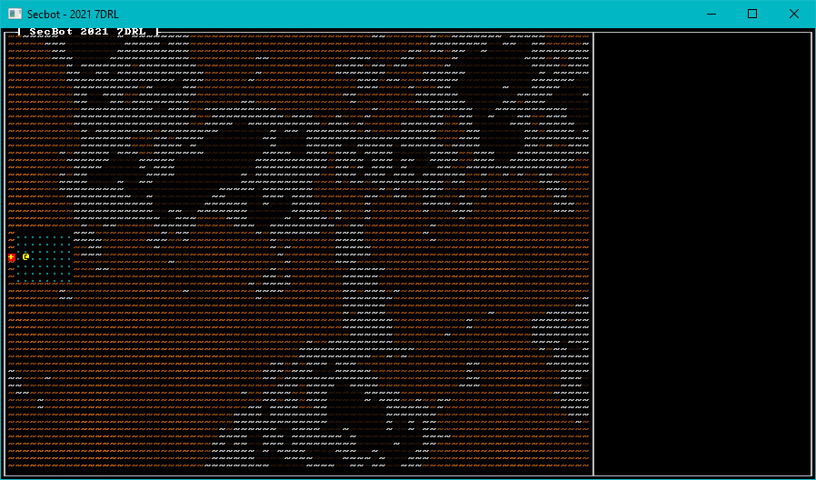

# Building an Asteroid

I knew that SecBot was landing on an asteroid outpost, a mining colony run by the not-so-pleasant *Bracket Corporation* (I like making myself the bad guy in games!). The landscape is interesting: it needs to be pretty, because you can see it out of the window. It also doesn't *do* anything beyond looking pretty. Fortunately, I had an idea for making it quickly.

## Simplex Noise

I love noise functions. I implemented Auburn's FastNoise library in Rust as part of `bracket-lib`, simply because I use noise functions so much. Simplex Noise is a *great* way to get a height-map that looks a lot like a landscape, with very little effort. [I wrote a tutorial on how to build a globe](https://bracketproductions.com/posts/minituts/spherical_noise/) a while back, and shamelessly borrowed some of my code from there.

Simplex noise takes some parameters, and gives you a set of density or altitude numbers for given coordinates. In this case, I went with the number representing altitude. I wanted large numbers to be brighter, indicating high ground. Low numbers are darker, and really low numbers render as a deep maroon. Open `map/tile.rs` and add a new tile constructor to the implementation block:

~~~rust
pub fn alien_landscape(height: f32) -> Self {
    let fg = if height < 0.0 {
        if height < -0.25 {
            (40, 20, 0)
        } else {
            GRAY
        }
    } else {
        (
            (height * 128.0) as u8 + 128,
            ((height * 128.0) as u8 + 128) / 2,
            0
        )
    };

    Self {
        glyph: to_cp437('~'),
        color: ColorPair::new(fg, BLACK),
        blocked: false,
        opaque: false,
    }
}
~~~

I played around with this until I liked the results. I encourage you to do the same.

Now open `map/layerbuilder/entrance.rs` and add a call to a new function to the builder routine:

~~~rust
all_space(&mut layer);
add_landscape(&mut layer, ecs);
add_docking_capsule(&mut layer, ecs);
~~~

`add_landscape` is actually quite straightforward if you are familiar with noise functions:

~~~rust
fn add_landscape(map: &mut Layer, ecs: &mut World) {
    let mut rng_lock = crate::RNG.lock();
    let rng = rng_lock.as_mut().unwrap();
    let mut noise = FastNoise::seeded(rng.next_u64());
    noise.set_noise_type(NoiseType::SimplexFractal);
    noise.set_fractal_type(FractalType::FBM);
    noise.set_fractal_octaves(10);
    noise.set_fractal_gain(0.5);
    noise.set_fractal_lacunarity(3.5);
    noise.set_frequency(0.02);

    for y in 0..HEIGHT {
        for x in 0..WIDTH {
            let h = noise.get_noise(x as f32, y as f32);
            let idx = map.point2d_to_index(Point::new(x, y));
            map.tiles[idx] = Tile::alien_landscape(h);
        }
    }
}
~~~

It starts by obtaining a lock on the `RNG` mutex. Again, I wish I'd used `parking_lot` - instead of two lines, it could just be `let mut rng = crate::RNG.lock()`. It's not too bad to use two lines of code, I guess.

The function then generates a seeded `FastNoise` structure, using a random seed. It sets the noise type to `SimplexFractal` - which generates continuous noise (you can zoom in), using the simplex noise system - which basically merges gradients to give smoothly transitioning scenery. I coped the parameters from the world building example. It then iterates the whole map, grabs a noise value for the map coordinate and sets that tile to `alien_landscape` with the generated height.

Since the remainder of the level is generated *after* the landscape, I let it cover the whole map - and then overwrite the parts that will be used for gameplay.

## Give it a Spin

If you run the program now, you have generated an asteroid surface:

> You can find the source code for `hello_asteroid` [here](https://github.com/thebracket/secbot-2021-7drl/tree/tutorial/tutorial/hello_asteroid/).

# Up Next

Next, we'll add some walls around SecBot's capsule. We'll add windows and a field-of-view system to let SecBot peek out the window to see the world.
