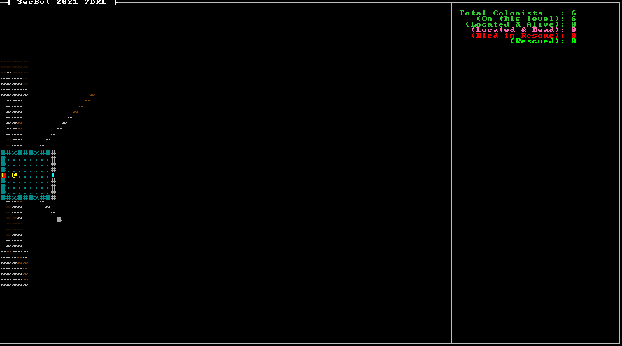

{{#include header.md}}

# Colonist Chat

One of the core ideas when I was imaging what SecBot would look like included the colonists saying useless - but flavorful - things to you as you encounter them. Seeing a green smiley face is great; having the smiley face tell you something adds a layer of immersion at little cost to the game.

I wanted colonists to have the option of saying more than one thing, to allow them to build a narrative. I also didn't want to overdo it; speech everywhere can get cumbersome.

## Adding a Dialog Component

The first step was to make a `Dialog` component. (You may notice in the git source that I went with "dialogue" a few times at first; I sometimes forget whether I'm speaking UK or US English. Sorry!)

Make a new file: `src/components/dialog.rs`. It contains a vector of strings for things the colonist can say:

~~~rust
pub struct Dialog {
    pub lines : Vec<String>
}
~~~

As with all new components, you need to add `mod dialog; pub use dialog::*;` to your `components/mod.rs` file to tell Rust that it is part of your project.

## Adding a Speech Component

I also wanted to make a *second* component, which I named `Speech`. Why have both a `Speech` and a `Dialog` component? My idea was that `Dialog` contains everything the entity *can* say, and `Speech` indicates that they are *currently saying it*.

Make another new component file, `src/components/speech.rs`:

~~~rust
pub struct Speech {
    pub lifetime: u32,
}
~~~

A lifetime field? My idea was that speech would appear when the colonist says it, and stay on the screen for a limited period of time (so as to not obscure the map). So when a colonist starts speaking, a new entity is made with a `Description` holding the current line of speech - and a `Speech` indicating how long it should remain on the screen.

## Modify the First Colonist

Let's change the first colonist we encounter (who will always be in the first room) a bit. Open `src/map/layerbuilder/colonists.rs` and add a new function:

~~~rust
pub fn spawn_first_colonist(ecs: &mut World, location: Point, layer: u32) {
    ecs.push((
        Colonist{ path: None },
        Position::with_pt(location, layer),
        Glyph{ glyph: to_cp437('☺'), color: ColorPair::new( LIME_GREEN, BLACK ) },
        Description("A squishy friend. You are here to rescue your squishies.".to_string()),
        ColonistStatus::Unknown,
        Dialog{lines: vec![
            "Bracket Corp is going to save us?".to_string(),
            "I'll head to your ship.".to_string(),
            "Comms are down, power is iffy.".to_string(),
            "No idea where the others are.".to_string()
            ]
        }
    ));
}
~~~

This creates a new colonist. They are mostly the same as previous colonists, but they have a big list of dialog entries. Let's also modify `spawn_random_colonist` to make default colonists polite:

~~~rust
pub fn spawn_random_colonist(ecs: &mut World, location: Point, layer: u32) {
    ecs.push((
        Colonist{ path: None },
        Position::with_pt(location, layer),
        Glyph{ glyph: to_cp437('☺'), color: ColorPair::new( LIME_GREEN, BLACK ) },
        Description("A squishy friend. You are here to rescue your squishies.".to_string()),
        ColonistStatus::Unknown,
        Dialog{lines: vec![
            "Thanks, SecBot!".to_string()
            ]
        }
    ));
}
~~~

Again, the only change is adding a `Dialog` component - in this case with a single line of available text, *"Thanks, SecBot!"*.

Now open up `src/map/layerbuilder/entrance.rs` and we'll modify it to spawn the first colonist in the first room. Add a `use super::colonists::*` entry to make it easy to pull in colonist spawn code. In `populate_rooms`, change the following code:

~~~rust
// The first room always contains a single colonist, who must be alive.
spawn_first_colonist(ecs, rooms[0].center(), 0);
~~~

## Spawning Speech

Now that the colonists know what to say, we need to make them speak. Open `src/game/colonists.rs`. You want to add `Dialog` to the list of queried components - which means including it in the `filter` and `for_each` calls as well:

~~~rust
use crate::components::*;
use bracket_lib::prelude::{Algorithm2D, a_star_search};
use legion::{*, systems::CommandBuffer};
use crate::map::Map;

pub fn colonists_turn(ecs: &mut World, map: &mut Map) {
    let mut commands = CommandBuffer::new(ecs);

    let mut colonists = <(Entity, &mut Colonist, &mut ColonistStatus, &mut Position, &mut Dialog)>::query();
    colonists
        .iter_mut(ecs)
        .filter(|(_, _, status, _, _)| **status == ColonistStatus::Alive)
        .for_each(|(entity, colonist, status, pos, dialog)| {
~~~

The next section is unchanged:

~~~rust
            // Check basics like "am I dead?"

            // Am I at the exit? If so, I can change my status to "rescued"

            // Am I at a level boundary? If so, go up it!

            // Since I'm activated, I should move towards the exit
            let current_map = map.get_layer(pos.layer as usize);
            if let Some(path) = &mut colonist.path {
                if !path.is_empty() {
                    let next_step = path[0];
                    path.remove(0);
                    if !current_map.tiles[next_step].blocked {
                        pos.pt = current_map.index_to_point2d(next_step);
                    }
                } else {
                    // We've arrived - status update
                    if pos.layer == 0 {
                        *status = ColonistStatus::Rescued;
                        commands.remove_component::<Glyph>(*entity);
                        commands.remove_component::<Description>(*entity);
                    }
                }
            } else {
                let start = current_map.point2d_to_index(pos.pt);
                let end = current_map.point2d_to_index(current_map.colonist_exit);
                let finder = a_star_search(start, end, current_map);
                if finder.success {
                    colonist.path = Some(finder.steps);
                } else {
                    println!("Failed to find the path");
                }

            }
~~~

Immediately after path-finding, add a dialog spawner. It checks to see if there are any dialog lines remaining, grabs the first one and removes it from the list. It then creates a new entity with a `Speech`, `Position` (the location of the colonist) and `Description` component. The `Description` contains the line of speech to emit.

~~~rust
            // If the actor has dialogue, emit it
            if !dialog.lines.is_empty() {
                let line = dialog.lines[0].clone();
                dialog.lines.remove(0);
                commands.push((
                    Speech{lifetime: 20},
                    pos.clone(),
                    Description(line)
                ));
            }
        }
    );

    // Execute the command buffer
    commands.flush(ecs);
}
~~~

## Rendering Speech

Now that we have `Speech` entities, we need to render them. In `main.rs`, add an import for the code we are about to write:

~~~rust
use render::speech::render_speech;
~~~

Now find your render code, and add a call to `render_speech`:

~~~rust
render::render_colonist_panel(ctx, &self.ecs, self.map.current_layer);
self.map.render(ctx);
render::render_glyphs(ctx, &self.ecs, &self.map);
render::speech::render_speech(ctx, &mut self.ecs, &self.map); // This is new
~~~

Open `render/mod.rs` and add an import for the speech module we're going to create:

~~~rust
pub mod speech;
~~~

Finally, we can write the render code! Create a new file, `src/game/speech.rs` and add the following to it:

~~~rust
use crate::{components::*, map::Map, map::WIDTH};
use bracket_lib::prelude::*;
use legion::*;

pub fn render_speech(ctx: &mut BTerm, ecs: &mut World, map: &Map) {
    let mut commands = legion::systems::CommandBuffer::new(ecs);
    let mut query = <(Entity, &mut Speech, &Position, &Description)>::query();
    query.for_each_mut(ecs, |(entity, speech, pos, desc)| {
        if pos.layer == map.current_layer as u32 {
            let x = if pos.pt.x < WIDTH as i32 / 2 {
                pos.pt.x - 1
            } else {
                pos.pt.x + 1
            };

            ctx.print_color(x, pos.pt.y - 2, GREEN, BLACK, &desc.0);

            speech.lifetime -= 1;
            if speech.lifetime == 0 {
                commands.remove(*entity);
            }
        }
    });
    commands.flush(ecs);
}
~~~

This creates a `CommandBuffer` and then queries all entities that have a `Speech`, `Position` and `Description` component. If they are on the current layer, it prints the speech to the screen. It then decrements the lifetime, and removes the entity if `lifetime` has reached zero.

## Try it Out

> You can find the source code for `pathing_colonists_chat` [here](https://github.com/thebracket/secbot-2021-7drl/tree/tutorial/tutorial/pathing_colonists_chat/).

## Up Next

Next, we'll add a monster and let you target it.