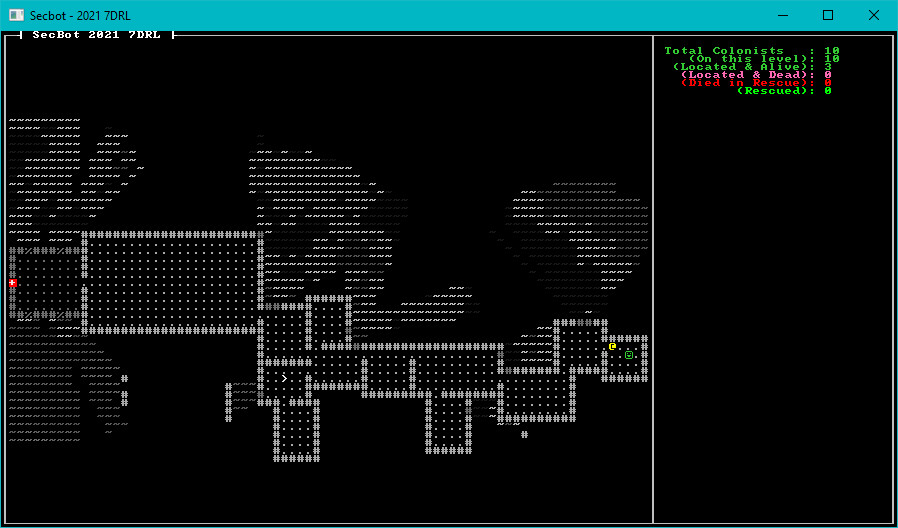

# Finding Colonists

Having colonists on the map is a great start. Being able to find them (and adjust the counter to show that you've located them) would be a logical next step.

We want the player to spot the colonist, and mark them as found. We'll be building a more complicated system in a bit, but this serves as a good start. Open `game/player.rs` and amend `update_fov`:

~~~rust
fn update_fov(new_state: &NewState, ecs: &mut World, map: &mut Map) {
    if *new_state != NewState::Wait {
        return;
    }

    let mut visible = None;

    // Build the player FOV
    let mut query = <(&Player, &Position, &mut FieldOfView)>::query();
    query.for_each_mut(ecs, |(_, pos, fov)| {
        fov.visible_tiles = field_of_view_set(pos.pt, fov.radius, map.get_current());
        let current_layer = map.get_current_mut();
        current_layer.clear_visible();
        fov.visible_tiles.iter().for_each(|pt| {
            if current_layer.in_bounds(*pt) {
                let idx = current_layer.point2d_to_index(*pt);
                current_layer.revealed[idx] = true;
                current_layer.visible[idx] = true;
            }
        });
        visible = Some(fov.visible_tiles.clone());
    });

    if let Some(vt) = visible {
        let mut colonists_on_layer = <(&Colonist, &mut ColonistStatus, &Position)>::query();
        colonists_on_layer.for_each_mut(ecs, |(_, status, pos)| {
            if pos.layer == map.current_layer as u32 &&
                vt.contains(&pos.pt)
                {
                    // TODO: All the other possibilities including being dead
                    match *status {
                        ColonistStatus::Unknown => *status = ColonistStatus::Alive,
                        _ => {}
                    }
                }
        });
    }
}
~~~

Whew, that's a long function. Let's go through it in steps:

1. We create a new variable called `visible`. It's an `Option` - we set it to none.
2. Once we've obtained the field-of-view, we set `visible` to `Some(fov.visible_tiles.clone)` - a copy of the visible tiles list.
3. If the visible tiles list has been retrieved:
    1. Run a query of colonists (entities with `Colonist`, `ColonistStatus` and `Position`). Mark `ColonistStatus` as *mutable* - we want to be able to change it.
    2. If the colonist is on the current layer and their position is in the visible tile set...
    3. Change the colonist's status to `ColonistStatus::Alive`.

## Give it a Go

That's all we need to mark colonists as "alive" when we see them. Run the program now, and when you spot a colonist your colonist located counter goes up.

> You can find the source code for `hello_colonist_finder` [here](https://github.com/thebracket/secbot-2021-7drl/tree/tutorial/tutorial/hello_colonist_finder/).

## Up Next

In the next section, we'll teach SecBot to rescue colonists.
