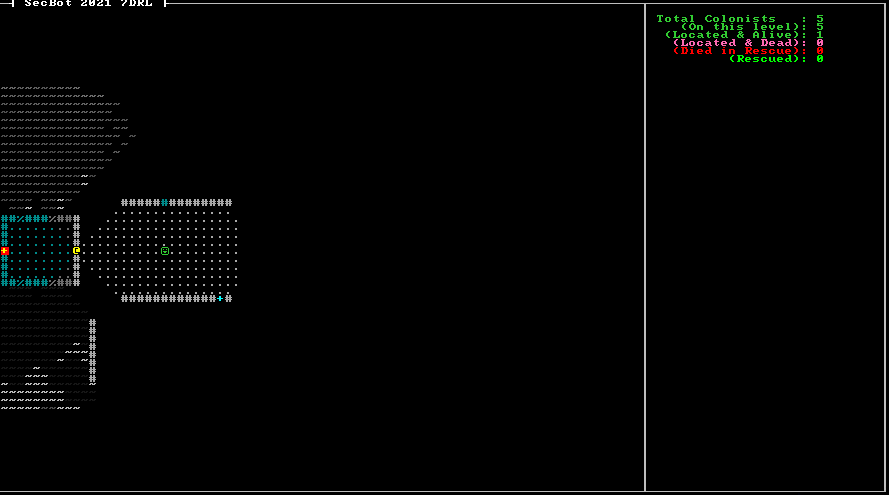

# Rescuing Colonists

It's time to make the colonists do something! Now that you've found them, it's time to make them path to the exit. If they make it, they becomes "rescued" - and you can start achieving your objective of rescuing all of them.

## Giving the Colonists a Path to Follow

We're going to expand the `Colonist` component a bit to include a navigation path to the exit.

Delete `Colonist` from `components/tags.rs` - it isn't a tag component anymore, and I like to keep things somewhat consistent. Then create `components/colonist.rs` and add the following expanded component:

~~~rust
use bracket_lib::prelude::Point;

pub struct Colonist {
    pub path: Option<Vec<usize>>,
}
~~~

The `path` is an option - by default, there won't be one. It's there for when the colonist needs to generate a path; rather than run a full path-finding query every turn, we'll have them follow whatever path they found.

Don't forget to open `components/mod.rs` and add `mod colonist;` and `pub use colonist::*;` to it.

## Adjusting the Colonist Spawner

Since we've changed the Colonist component, we need to adjust the colonist spawner to include the new data. Open `src/map/layerbuilder/colonists.rs` and ament `spawn_random_colonist`:

~~~rust
pub fn spawn_random_colonist(ecs: &mut World, location: Point, layer: u32) {
    ecs.push((
        Colonist{ path: None },
        Position::with_pt(location, layer),
        Glyph{ glyph: to_cp437('☺'), color: ColorPair::new( LIME_GREEN, BLACK ) },
        Description("A squishy friend. You are here to rescue your squishies.".to_string()),
        ColonistStatus::Unknown,
    ));
}
~~~

All that changed there was adding `path` to the `Colonist` component. There is no path defined when the colonist spawns, so it is set to `None`.

## Updating the Map

I realized that I needed a way to gain access to map layers other than the current one. Colonists might be trying to path to the exit, having been activated and then left to do their own thing - and they may not be on the same level as the player. Open `src/map/map.rs` and add two functions to the implementation of `Map`:

~~~rust
impl Map {
    ...

    pub fn get_layer(&self, layer: usize) -> &Layer {
        &self.layers[layer]
    }

    pub fn get_layer_mut(&mut self, layer: usize) -> &mut Layer {
        &mut self.layers[layer]
    }
}
~~~

These are pretty simple: they return a reference or mutable reference to a layer, accessed by index. Returning mutable references always requires a bit of borrow-checker care and feeding - so be careful using `get_layer_mut`. I was *thrilled* to see that this works without introducing lifetime parameters; when I got started with Rust, this would have at least one ugly `'a` or similar in there. No need for that, anymore!

I also realized that I needed each layer to document the exit to which colonists should navigate. This isn't always the same as the starting point; SecBot starts a few tiles away from the actual exit on the first layer. On other layers, this will generally be the "up" staircase. Open up `src/map/layer.rs` and add a new field to `Layer`:

~~~rust
pub colonist_exit: Point,
~~~

You also need to add this to Layer's default constructor:

~~~rust
is_door: vec![false; TILES],
colonist_exit: Point::zero()
~~~

## Mark the Colony Exit

Now that we support a `colonist_exit` on layers, we should amend the entrance level to include it. Open `src/map/layerbuilder/entrance.rs`. In the start of the `add_game_exit` function, add a new line:

~~~rust
fn add_game_exit(map: &mut Layer, ecs: &mut World, pt: Point) {
    let exit_idx = map.point2d_to_index(pt);
    map.tiles[exit_idx] = Tile::game_over();
    map.colonist_exit = pt;
~~~

This sets the layer exit to the point we chose for the exit tile.

## Add a Colonist Turn Function

We've gathered a bunch of useful data/places to store it. We know where the colonist wants to go on each level. We have a place to store their path if they are traveling. So now it's time to give the colonists the beginings of some intelligence. They aren't going to be super-smart, but smart enough to make the game function.

Create a new file, `src/game/colonists.rs`. In `src/game/mod.rs` you need to tell Rust to include the new module. Immediately after `pub use player::player_turn`, add:

~~~rust
pub mod colonists;
pub use colonists::colonists_turn;
~~~

Now we dive into the Colonist AI. There's a lot of comments describing future functionality in this code. Add the following to your new `colonists.rs` file:

~~~rust
use crate::components::*;
use bracket_lib::prelude::{Algorithm2D, a_star_search};
use legion::{*, systems::CommandBuffer};
use crate::map::Map;

pub fn colonists_turn(ecs: &mut World, map: &mut Map) {
    let mut commands = CommandBuffer::new(ecs);
~~~

We start by making a `CommandBuffer`. These store batches of changes for Legion to make to the ECS, and apply them all when `flush` is called. It's both more efficient to batch changes, and avoids borrow checker issues. The borrow-checker makes it tricky to nest queries together, so as we add functionality we'll use the buffer to make changes rather than trying to finagle the borrow-checker to let us mutably access some parts of the world while we query other parts.

~~~rust
    let mut colonists = <(Entity, &mut Colonist, &mut ColonistStatus, &mut Position)>::query();
~~~

Now we add an ECS query. We want to retrieve the `Entity` hosting matching components, and only access entities that have a `Colonist`, `ColonistStatus` and `Position` component attached to them. We request mutable access to these components, so we can change them.

~~~rust
    colonists
        .iter_mut(ecs)
        .filter(|(_, _, status, _)| **status == ColonistStatus::Alive)
        .for_each(|(entity, colonist, status, pos)| {
~~~

Then we mutably iterate the colonists, and filter out any colonists who aren't in the `Alive` status. Then we use `for_each` to run code on each matching colonist.

~~~rust
            // Check basics like "am I dead?"

            // Am I at the exit? If so, I can change my status to "rescued"

            // Am I at a level boundary? If so, go up it!
~~~

I call these "aspirational comments" - they define a roadmap for where I think this system will go in the future. Its up to you if you keep these comments! I find it helpful when I'm working on important functionality to write down what I *think* it will do in the future.

The next step is some path-finding. It's a little convoluted, so I'll go through it in blocks.

~~~rust
            // Since I'm activated, I should move towards the exit
            let current_map = map.get_layer(pos.layer as usize);
~~~

Use the new `get_layer` to obtain a reference to the map layer on which the colonist is currently standing. Storing the reference once is easier to read than lots of `get_layer().do_something...` calls.

~~~rust
            if let Some(path) = &mut colonist.path {
                if !path.is_empty() {
                    let next_step = path[0];
                    path.remove(0);
                    if !current_map.tiles[next_step].blocked {
                        pos.pt = current_map.index_to_point2d(next_step);
                    }
                } else {
                    // We've arrived - status update
                    if pos.layer == 0 {
                        *status = ColonistStatus::Rescued;
                        commands.remove_component::<Glyph>(*entity);
                        commands.remove_component::<Description>(*entity);
                    }
                }
~~~

If the `Colonist` component contains a path, we check to see if it contains any steps. If the path isn't empty, then we retrieve the first entry from the path - and remove it from the path vector. If the path isn't blocked (it shouldn't be!), we set the `Position` component to match the next step on the path.

If that path *is* empty, but still exists - then there used to be a path, and we've reached the end of it. If the colonist is on layer 0, then congratulations; the colonist has been rescued. We change their status to "Rescued", and remove their `Glyph` and `Description` so they won't render or appear in a giant stack of tooltips at the exit.

If no path exists, then we need to make one:
~~~rust
            } else {
                let start = current_map.point2d_to_index(pos.pt);
                let end = current_map.point2d_to_index(current_map.colonist_exit);
                let finder = a_star_search(start, end, current_map);
                if finder.success {
                    colonist.path = Some(finder.steps);
                } else {
                    println!("Failed to find the path");
                }

            }
        }
    );
~~~

This uses *A-Star* pathing. We set the starting point to the colonists' current position, and the end point to the layer exit (the `colonist_exit` you made earlier). Running `a_star_search` uses `bracket-lib`'s built-in A-star system to generate a path. It will use the `get_available_exits` code we built earlier to determine which ways it can go. [A Star](https://www.redblobgames.com/pathfinding/a-star/introduction.html) works by evaluating each exit from a position, and repeating that evaluation for each tile along the way until the exit is reached. It adds a layer of efficiency by keeping an "open list" of untried tiles and a "closed list" of places it's already evaluated - so it won't repeatedly evaluate the same tile. It also sorts the "open list" by distance from the destination; it will try the most direct paths first. It will return a very-close-to-optimal path to the final destination.

Once we've run `a_star_search`, if the path-finding succeeded - we set the `Colonist` path to the path it generated. If it failed, we print a warning to the console. *This should never happen* - but will warn you that you messed up your `Algorithm2D`, `BaseMap` exit-finding, or map generation.

~~~rust
    // Execute the command buffer
    commands.flush(ecs);
}
~~~

Finally, we execute any commands we queued up.

The AI code won't run until we call it, so let's add it to the turn structure.

## Setup the Scheduler

Open up `main.rs`. Find the `let new_state = match &self.turn` block, and amend the `EnemyTurn` handler to call the colonist logic:

~~~rust
let new_state = match &self.turn {
    TurnState::Modal { title, body } => render::modal(ctx, title, body),
    TurnState::WaitingForInput => game::player_turn(ctx, &mut self.ecs, &mut self.map),
    TurnState::EnemyTurn => {
        game::colonists_turn(&mut self.ecs, &mut self.map);
        NewState::Wait
    }
    TurnState::GameOverLeft => render::game_over_left(ctx),
    _ => NewState::NoChange,
};
~~~

You are now calling the new logic.

## Try it Out

Run the game now (`cargo run`). When you find a colonist, their status changes to `Alive` - and the HUD updates. The colonist then begins to path to the layer exit, and becomes `Rescued` when they reach it. One core game mechanic is now working!

> You can find the source code for `pathing_colonists_flat` [here](https://github.com/thebracket/secbot-2021-7drl/tree/tutorial/tutorial/pathing_colonists_flat/).

## Next Up

Next up, we'll give the colonists soem lines to speak as you find them. This isn't strictly necessary, but it can really help build up the mood of the game.
