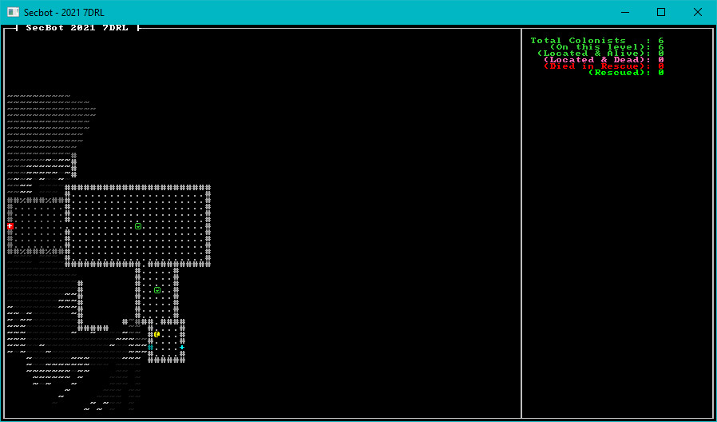

{{#include header.md}}

# Tracking Colonists

It would help the player to know how many colonists need rescue (as well as how many have been rescued, found dead, etc.). It would also help to have more than one colonist - otherwise, it's a rather easy game.

## Colonist Status

> Note that I ended up changing this a little towards the end. It'll serve for now, but this isn't final code.

Create a new file: `components/colonist_status.md`. In this file, we'll add an enum to act as the colonists' current status. (You can add `enum` types as components in Legion, that's nifty!) The status looks like this:

~~~rust
#[derive(Debug, Clone, Copy, PartialEq)]
pub enum ColonistStatus {
    Unknown,
    Alive,
    StartedDead,
    DiedAfterStart,
    Rescued
}
~~~

In `components/mod.rs` add `mod colonist_status;` and `pub use colonist_status::*;` to activate the new component type.

## Extending Colonists

Open up `map/layerbuilder/colonists.rs`. In the list of components that you add to the colonist, add a new one:

~~~rust
ecs.push((
    Colonist{},
    Position::with_pt(location, layer),
    Glyph{ glyph: to_cp437('☺'), color: ColorPair::new( LIME_GREEN, BLACK ) },
    Description("A squishy friend. You are here to rescue your squishies.".to_string())
    ColonistStatus::Unknown,
));
~~~

This marks the colonist as being "unknown" - you haven't found them yet, and aren't sure of their status. However, for the purpose of totals - they exist.

## Spawn More Colonists

Open up `map/layerbuilder/entrance.rs` and go to the `populate_rooms` function you added in the previous section. Extend it to add colonists to roughly 1 in 5 rooms:

~~~rust
fn populate_rooms(rooms: &Vec<Rect>, map: &mut Layer, ecs: &mut World) {
    let mut rng_lock = crate::RNG.lock();
    let rng = rng_lock.as_mut().unwrap();

    // The first room always contains a single colonist
    spawn_random_colonist(ecs, rooms[0].center(), 0);

    // Each room after that can be random. This is an initial, very boring spawn to get
    // the colonist functionality going.
    rooms
        .iter()
        .skip(1)
        .for_each(|r| {
            if rng.range(0, 5) == 0 {
                spawn_random_colonist(ecs, r.center(), 0);
            }
        }
    );
}
~~~

If you play the game now, you'll find colonists all over the place.

## An Initial Colonist UI

Open `main.rs`, and in the `tick` function find where you call `render_ui_skeleton`. Add another call beneath it:

~~~rust
render::render_colonist_panel(ctx, &self.ecs, self.map.current_layer);
~~~

Now add a new file to `src/render`, named `src/render/colonist_panel.rs`. The file contains the following code:

~~~rust
use bracket_lib::prelude::*;
use legion::*;
use crate::components::{Colonist, Position, ColonistStatus};

use super::WIDTH;

pub fn render_colonist_panel(ctx: &mut BTerm, ecs: &World, current_layer: usize) {
    let mut query = <(&Colonist, &Position, &ColonistStatus)>::query();
    let mut total_colonists = 0;
    let mut colonists_on_layer = 0;
    let mut located_alive = 0;
    let mut located_dead = 0;
    let mut died_in_rescue = 0;
    let mut rescued = 0;

    query.for_each(ecs, |(_, pos, status)| {
        total_colonists += 1;
        if pos.layer == current_layer as u32 && *status != ColonistStatus::Rescued {
            colonists_on_layer += 1;
        }
        match *status {
            ColonistStatus::Alive => located_alive += 1,
            ColonistStatus::StartedDead => located_dead += 1,
            ColonistStatus::DiedAfterStart => died_in_rescue += 1,
            ColonistStatus::Rescued => rescued += 1,
            _ => {}
        }
    });

    let x = WIDTH + 3;
    let mut y = 2;
    ctx.print_color(x, y, LIME_GREEN, BLACK, format!("Total Colonists   : {}", total_colonists));
    y += 1;
    ctx.print_color(x, y, LIME_GREEN, BLACK, format!("   (On this level): {}", colonists_on_layer));
    y += 1;
    ctx.print_color(x, y, LIME_GREEN, BLACK, format!(" (Located & Alive): {}", located_alive));
    y += 1;
    ctx.print_color(x, y, HOT_PINK, BLACK,   format!("  (Located & Dead): {}", located_dead));
    y += 1;
    ctx.print_color(x, y, RED, BLACK,        format!("  (Died in Rescue): {}", died_in_rescue));
    y += 1;
    ctx.print_color(x, y, GREEN, BLACK,      format!("         (Rescued): {}", rescued));
}
~~~

In `src/render/mod.rs` add `pub mod colonist_panel; pub use colonist_panel::*;` to include it in your project.

This function works as follows:

1. Create a query that finds entities with `Colonist`, `Position` and `ColonistStatus`.
2. Set several variables to 0.
3. Iterate the query.
    1. Add one to `total_colonists` - the colonist counts, regardless of their status.
    2. If the colonist is on the current map layer, add one to `colonists_on_layer`.
    3. Match on the status, incrementing `located_alive`, `located_dead`, `died_in_rescue` or `rescued` depending upon the colonist's status.
4. Set `x` to the left-hand side of the UI panel (to the right of the map). `let x = WIDTH + 3`.
5. Print status lines for each of the variables we have calculated.

## Try it Out

Run the program now, and there are colonists all over the place! The UI shows the beginnings of a real colonist counter. You can't actually find or save anyone yet, but the counter is in place. That's a good start.

> You can find the source code for `hello_colonists` [here](https://github.com/thebracket/secbot-2021-7drl/tree/tutorial/tutorial/hello_colonists/).

## Up Next

In the next section, we'll be adding more colonists - and adding some UI to count them, and categorize their status.
