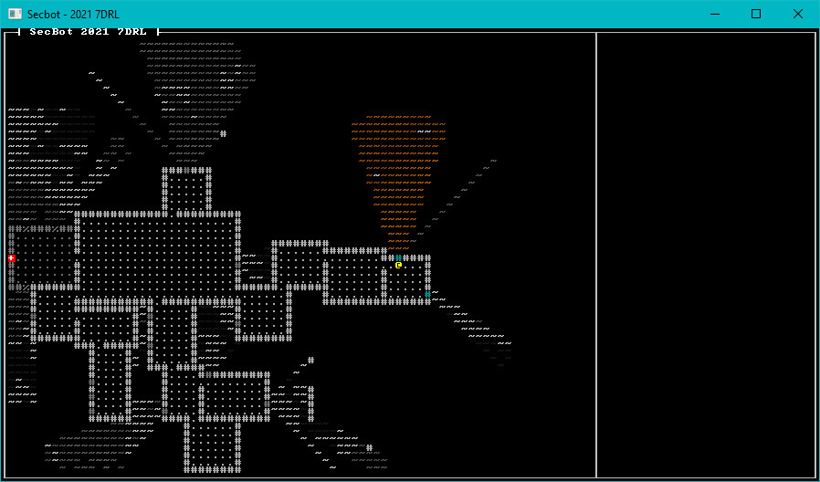

{{#include header.md}}

# Building the Colony

I had some definite ideas for how I wanted the mining colony to work. I wanted it to look like modules, bolted together - separated by bulkheads and walls. That made sense to me: you're on a hostile world, you build your base to withstand sections failing. That also implied that I *didn't* want corridors everywhere - why build fragile umbilicals between buildings? That seems like it's asking for trouble.

### Introducing TileType

At this point, I realized that I needed a little more information about my tiles. A tile might be alien landscape, but checking to see if its glyph was a `~` symbol is unwieldy. I might want walls to have different appearances - but they are still a wall. So in `map/tile.rs` I added a new enum:

~~~rust
#[derive(Clone, Copy, PartialEq, Eq, Debug)]
pub enum TileType {
    Empty,
    Capsule,
    Wall,
    Floor,
    Outside,
}
~~~

I extended the `Tile` type to include it:

~~~rust
#[derive(Clone)]
pub struct Tile {
    pub glyph: FontCharType,
    pub color: ColorPair,
    pub blocked: bool,
    pub opaque: bool,
    pub tile_type: TileType,
}
~~~

I then went through every tile constructor ensuring that they set a `TileType`:

~~~rust
impl Tile {
    pub fn default() -> Self {
        Self {
            glyph: to_cp437('.'),
            color: ColorPair::new(GREY, BLACK),
            blocked: false,
            opaque: false,
            tile_type: TileType::Floor,
        }
    }

    pub fn empty() -> Self {
        Self {
            glyph: to_cp437('#'),
            color: ColorPair::new(DARK_GRAY, BLACK),
            blocked: true,
            opaque: false,
            tile_type: TileType::Empty,
        }
    }

    pub fn floor() -> Self {
        Self {
            glyph: to_cp437('.'),
            color: ColorPair::new(DARK_GRAY, BLACK),
            blocked: false,
            opaque: false,
            tile_type: TileType::Floor,
        }
    }

    pub fn wall() -> Self {
        Self {
            glyph: to_cp437('#'),
            color: ColorPair::new(DARK_GRAY, BLACK),
            blocked: true,
            opaque: true,
            tile_type: TileType::Wall,
        }
    }

    pub fn window() -> Self {
        Self {
            glyph: to_cp437('#'),
            color: ColorPair::new(DARK_CYAN, BLACK),
            blocked: true,
            opaque: false,
            tile_type: TileType::Wall,
        }
    }

    pub fn capsule_floor() -> Self {
        Self {
            glyph: to_cp437('.'),
            color: ColorPair::new(DARK_CYAN, BLACK),
            blocked: false,
            opaque: false,
            tile_type: TileType::Capsule,
        }
    }

    pub fn capsule_wall() -> Self {
        Self {
            glyph: to_cp437('#'),
            color: ColorPair::new(DARK_CYAN, BLACK),
            blocked: true,
            opaque: true,
            tile_type: TileType::Capsule,
        }
    }

    pub fn capsule_window() -> Self {
        Self {
            glyph: to_cp437('%'),
            color: ColorPair::new(DARK_CYAN, BLACK),
            blocked: true,
            opaque: false,
            tile_type: TileType::Capsule,
        }
    }

    pub fn game_over() -> Self {
        Self {
            glyph: to_cp437('+'),
            color: ColorPair::new(YELLOW, RED),
            blocked: false,
            opaque: false,
            tile_type: TileType::Capsule,
        }
    }

    pub fn alien_landscape(height: f32) -> Self {
        let fg = if height < 0.0 {
            if height < -0.25 {
                (40, 20, 0)
            } else {
                GRAY
            }
        } else {
            (
                (height * 128.0) as u8 + 128,
                ((height * 128.0) as u8 + 128) / 2,
                0,
            )
        };

        Self {
            glyph: to_cp437('~'),
            color: ColorPair::new(fg, BLACK),
            blocked: height <= -0.255,
            opaque: false,
            tile_type: TileType::Outside,
        }
    }
}
~~~

Add a `use crate::map::TileType;` to `map/layerbuilder/entrance.rs` to import the type. You'll need it later.

## Adding a door into the colony

The game is going to have a lot of doors, but I wanted them to be low-friction for the player. Walk into a door, and it opens. Some games add a separate "open" command - and while that's realistic, I didn't want to add to the complexity of the game with separate commands.

### Door Components

The first step was to designate a new tag component, the `Door`. Open `components/tags.rs` and add a single-line structure:

~~~rust
pub struct Door;
~~~

You're already including `tags`, so no need to add any `mod` or `use` statements. Save yourself a little pain, however. Add `use crate::components::*` to the top of `layerbuilder/entrance.rs`. You'll use a *lot* of components there.

### Storing Doors

In `map/layer.rs`, add another vector to the layer:

~~~rust
pub struct Layer {
    pub tiles: Vec<Tile>,
    pub revealed: Vec<bool>,
    pub visible: Vec<bool>,
    pub starting_point: Point,
    pub is_door: Vec<bool>,
}
~~~

And don't forget to initialize it in `new`:

~~~rust
impl Layer {
    pub fn new(depth: usize, ecs: &mut World) -> Self {
        let layer = match depth {
            0 => build_entrance(ecs),
            _ => Self {
                tiles: vec![Tile::default(); TILES],
                starting_point: Point::new(WIDTH / 2, HEIGHT / 2),
                visible: vec![false; TILES],
                revealed: vec![false; TILES],
                is_door: vec![false; TILES],
            },
        };
        layer
    }
~~~

> I went with this approach so I could render doors differently. With hindsight, it wasn't the greatest idea. This gets changed around a bit on a later develoment day.

### Building a Door

Open `map/layerbuilder/entrance.rs` and add a new function:

~~~rust
fn add_door(map: &mut Layer, ecs: &mut World, pt: Point) {
    let idx = map.point2d_to_index(pt);
    ecs.push((
        Position::with_pt(pt, 0),
        Description("A heavy, steel door.".to_string()),
        Glyph {
            glyph: to_cp437('+'),
            color: ColorPair::new(CYAN, BLACK),
        },
        Door {},
    ));
    map.tiles[idx] = Tile::wall();
    map.is_door[idx] = true;
}
~~~

This is nice and generic. It sets the door tile to be a wall, and then adds a component with a `+` glyph and a description to represent the door.

The `add_docking_capsule` function needs to always add a door into the main colony. Before `map.starting_point = `, add the following:

~~~rust
// Start adding in building complex features
add_door(map, ecs, Point::new(RIGHT + 1, MIDDLE));
~~~

If you play the game now, you'll see a door - but you can't open it.

### Opening Doors

When the player tries to move onto a door, we want it to transform into a floor - the door is now permanently open. I imagine that SecBot pries it open and leaves a mess. Open `game/player.rs` and replace the `try_move` function:

~~~rust
// At the top
use legion::systems::CommandBuffer;
use std::collections::HashSet;

// The function
fn try_move(ecs: &mut World, map: &mut Map, delta_x: i32, delta_y: i32) -> NewState {
    let mut find_player = <(&Player, &mut Position)>::query();
    let mut result = NewState::Wait;
    let mut doors_to_delete = HashSet::new();
    find_player.iter_mut(ecs).for_each(|(_, pos)| {
        let new_pos = pos.pt + Point::new(delta_x, delta_y);
        let new_idx = map.get_current().point2d_to_index(new_pos);
        if !map.get_current().tiles[new_idx].blocked {
            pos.pt = new_pos;
            result = NewState::Enemy;
        } else if map.get_current().is_door[new_idx] {
            map.get_current_mut().is_door[new_idx] = false;
            map.get_current_mut().tiles[new_idx].blocked = false;
            map.get_current_mut().tiles[new_idx].opaque = false;
            map.get_current_mut().tiles[new_idx].glyph = to_cp437('.');
            doors_to_delete.insert(map.get_current().index_to_point2d(new_idx));
        }
    });

    if !doors_to_delete.is_empty() {
        let mut commands = CommandBuffer::new(ecs);
        let mut q = <(Entity, &Position, &Door)>::query();
        q.for_each(ecs, |(entity, pos, _)| {
            if pos.layer == map.current_layer as u32 && doors_to_delete.contains(&pos.pt) {
                commands.remove(*entity);
            }
        });
        commands.flush(ecs);
    }

    result
}
~~~

The movement portion remains the same, but we create a new vector named `doors_to_delete`. If a tile is blocked, we check to see if it is a door. If it is, we transform the tile into a floor and insert the door's location into `doors_to_delete`. Then at the end of the function, if `doors_to_delete` isn't empty we iterate it - finding entities that match the door's location (and are doors) and delete them.

I used Legion's `CommandBuffer` system for this. *Hands-on Rust* teaches you to use them. They provide a means to queue up changes to the ECS and apply them all at once. It also nicely works around borrow checker issues - you aren't trying to use the ECS more than once at a time, so it's borrow-checker friendly.

You can now open the door into the wider world - but still not go anywhere, because there is nowhere go go.

## Building the base's entryway

I started the base's entry way system (in `map/layerbuilder/entrance.rs`) with a pattern that should be familiar to *Hands-on Rust* readers: a list of rooms. Immediately after the call to `add_door`, I added the following function call:

~~~rust
let start_room = add_entryway(map, ecs, Point::new(RIGHT + 1, MIDDLE));
~~~

Then at the bottom of the file, I added a the `add_entryway` function:

~~~rust
fn add_entryway(map: &mut Layer, _ecs: &mut World, entrance: Point) -> Rect {
    let room = Rect::with_size(entrance.x + 1, entrance.y - 5, 20, 10);
    fill_room(map, &room);

    room
}
~~~

This in turn calls a function called `fill_room` - so I added that, too:

~~~rust
// Function
fn fill_room(map: &mut Layer, room: &Rect) {
    room.for_each(|pt| {
        if map.in_bounds(pt) {
            let idx = map.point2d_to_index(pt);
            map.tiles[idx] = Tile::floor();
        }
    });
    for x in i32::max(0, room.x1 - 1)..=i32::min(WIDTH as i32 - 1, room.x2 + 1) {
        try_wall(map, Point::new(x, room.y1 - 1));
        try_wall(map, Point::new(x, room.y2 + 1));
    }
    for y in i32::max(room.y1, 0)..=i32::min(room.y2, HEIGHT as i32 - 1) {
        try_wall(map, Point::new(room.x1 - 1, y));
        try_wall(map, Point::new(room.x2 + 1, y));
    }
}
~~~

The `fill_room` function sets every tile *inside* the rectangle representing the room to be a floor, and then sets every tile surrounding the room to be a wall. I didn't want to overrwrite existing doors - or write beyond the bounds of the map, so I added a `try_wall` function:

~~~rust
fn try_wall(map: &mut Layer, pt: Point) {
    if map.in_bounds(pt) {
        let idx = map.point2d_to_index(pt);
        if !map.is_door[idx] {
            map.tiles[idx] = Tile::wall();
        }
    }
}
~~~

If the wall point is within the bounds of the map, and isn't a door - it places a wall.

Running the game now presents a usable door, leading into a boring rectangular room. It's a start.

## Just Add Rooms

Going back to my `add_entryway` call, I then created a list of existing rooms:

~~~rust
let mut rooms = vec![start_room];
~~~

I'd like to keep going until I have 24 rooms. (Note that I didn't keep that number - its too many). So I added a loop immediately afterwards:

~~~rust
 while rooms.len() < 24 {
    try_random_room(map, ecs, &mut rooms);
}
~~~

Finally, I called a new function called `edge_filler` to ensure that there are no unintended ways to leave the map:

~~~rust
// Fill in the edges
edge_filler(map);
~~~

Add this to the end of `entrance.rs`:

~~~rust
fn edge_filler(map: &mut Layer) {
    for y in 0..HEIGHT {
        let idx = map.point2d_to_index(Point::new(0, y));
        if map.tiles[idx].tile_type == TileType::Floor {
            map.tiles[idx] = Tile::wall();
        }
        let idx = map.point2d_to_index(Point::new(WIDTH - 1, y));
        if map.tiles[idx].tile_type == TileType::Floor {
            map.tiles[idx] = Tile::wall();
        }
    }
    for x in 0..WIDTH {
        let idx = map.point2d_to_index(Point::new(x, 0));
        if map.tiles[idx].tile_type == TileType::Floor {
            map.tiles[idx] = Tile::wall();
        }
        let idx = map.point2d_to_index(Point::new(x, HEIGHT - 1));
        if map.tiles[idx].tile_type == TileType::Floor {
            map.tiles[idx] = Tile::wall();
        }
    }
}
~~~

### Add Some Rooms

Now that we're calling `try_random_room`, we need to write it. Add the following overly-large function to `map/layerbuilder/entrance.rs`:

~~~rust
fn try_random_room(map: &mut Layer, ecs: &mut World, rooms: &mut Vec<Rect>) {
    let mut rng_lock = crate::RNG.lock();
    let rng = rng_lock.as_mut().unwrap();
    if let Some(parent_room) = rng.random_slice_entry(&rooms) {
        let x;
        let y;
        let next_x;
        let next_y;

        // Decide where to consider an exit
        if rng.range(0, 2) == 0 {
            // Take from the horizontal walls
            x = parent_room.x1 + rng.range(0, parent_room.width() + 1);
            next_x = x;
            if rng.range(0, 2) == 0 {
                // Take from the north side
                y = parent_room.y1 - 1;
                next_y = y - 1;
            } else {
                // Take from the south side
                y = parent_room.y2 + 1;
                next_y = y + 1;
            }
        } else {
            // Take from the vertical walls
            y = parent_room.y1 + rng.range(0, parent_room.height() + 1);
            next_y = y;
            if rng.range(0, 2) == 0 {
                x = parent_room.x1 - 1;
                next_x = x - 1;
            } else {
                x = parent_room.x2 + 1;
                next_x = x + 1;
            }
        }
        let dx = next_x - x;
        let dy = next_y - y;

        // Try to place it
        let next_pt = Point::new(next_x, next_y);
        if !map.in_bounds(next_pt) {
            return;
        }
        let next_idx = map.point2d_to_index(next_pt);
        if map.tiles[next_idx].tile_type == TileType::Outside {
            let new_room = if dx == 1 {
                Rect::with_size(x + 1, y, rng.range(4, 10), rng.range(3, 6))
            } else if dy == 1 {
                Rect::with_size(x, next_y, rng.range(3, 6), rng.range(4, 10))
            } else if dx == -1 {
                let w = 5;
                Rect::with_size(x - w, y, rng.range(4, 10), rng.range(3, 6))
            } else {
                let h = 5;
                Rect::with_size(x, y - h, rng.range(3, 6), rng.range(4, 10))
            };

            let mut can_add = true;
            new_room.for_each(|p| {
                if map.in_bounds(p) {
                    let idx = map.point2d_to_index(p);
                    if map.tiles[idx].tile_type != TileType::Outside {
                        can_add = false;
                    }
                } else {
                    can_add = false;
                }
            });

            if can_add {
                add_door(map, ecs, Point::new(x, y));
                fill_room(map, &new_room);
                rooms.push(new_room);
            }
        }
    }
}
~~~

It's not pretty: I was writing on a time deadline, and dinner was calling my name! The algorithm works as follows:

1. Obtain the RNG.
2. Pick a random room from the rooms list, using `random_slice` to pick a vector entry at random. This is the parent room.
3. Flip some coins to determine to which wall we will try and add a door. It picks one of the four walls, and sets `x` and `y` to a random wall tile that might be a door candidate. It also sets `next_x` and `next_y` to the location you'd reach if you went through the door. So if we're adding to the east, it's one tile east of the door candidate. If we were going north, it would be one tile north of the door candidate.
4. If the `next_x/next_y` location is out of the map, bail out.
5. Check that the new tile is outside (unclaimed landscape).
6. Build a `Rect` representing where we'd like to put the new room. This will continue in the direction we are traveling, and aim to be longer in the axis we are traveling than it is wide.
7. Check that the entirety of the new rectangle is outside. If it isn't bail out.
8. If it's addable, create the door and push the new room to the rooms list.

As with all procedural generation, I had to run this through quite a few iterations before I was happy with it.

## Adding some Windows

I wanted more windows onto the surface - so the colonists could enjoy the view, too. After the call to `edge_filler` in `map/layerbuilder/entrance.rs`, add another function call:

~~~rust
add_windows(map);
~~~

The rules for adding a window are simple: it must be an exterior wall that isn't a door, and one adjacent tile must be on the asteroid's surface (rather than inside a room or bulkhead). Not every tile that meets these criteria should get a window. Add the following function to your `layerbuilder/entrance.rs` file:

~~~rust
fn add_windows(map: &mut Layer) {
    let mut rng_lock = crate::RNG.lock();
    let rng = rng_lock.as_mut().unwrap();

    for y in 1..HEIGHT-1 {
        for x in 1..WIDTH-1 {
            let pt = Point::new(x, y);
            let idx = map.point2d_to_index(pt);
            if map.tiles[idx].tile_type == TileType::Wall {
                if map.tiles[idx-1].tile_type == TileType::Outside ||
                    map.tiles[idx+1].tile_type == TileType::Outside ||
                    map.tiles[idx-WIDTH].tile_type == TileType::Outside ||
                    map.tiles[idx-WIDTH].tile_type == TileType::Outside 
                {
                    if rng.range(0, 10) == 0 {
                        map.tiles[idx] = Tile::window();
                    }
                }
            }
        }
    }
}
~~~

This iterates every tile, and determines if its elible for a window. If it is, it rolls a dice - and with a 1:10 chance might add a window by setting the tile type to `Tile::window()`.

## Add an exit to the next layer

I wanted one room in the colony to contain a staircase to the next level. I didn't really mind where it appeared; rescuing colonists gives you a reason to explore the whole level anyway. The first thing to do was to support down stairs as a tile type. In `map/tile.rs`, modify the `TileType` enum:

~~~rust
#[derive(Clone, Copy, PartialEq, Eq, Debug)]
pub enum TileType {
    Empty,
    Capsule,
    Wall,
    Floor,
    Outside,
    StairsDown,
}
~~~

I also added a constructor type to `Tile`'s implementation:

~~~rust
pub fn stairs_down() -> Self {
    Self {
        glyph: to_cp437('>'),
        color: ColorPair::new(YELLOW, BLACK),
        blocked: false,
        opaque: false,
        tile_type: TileType::StairsDown,
    }
}
~~~

Now open `layerbuilder/entrance.rs`. After the call to `edge_filler`, add another function call:

~~~rust
add_exit(&mut rooms, map, ecs);
~~~

As you probably guessed, you need to insert `add_exit` to the end of your `entrance.rs` file:

~~~rust
fn add_exit(rooms: &mut Vec<Rect>, map: &mut Layer, ecs: &mut World) {
    let mut rng_lock = crate::RNG.lock();
    let rng = rng_lock.as_mut().unwrap();
    let room = rng.random_slice_entry(&rooms).unwrap();
    let exit_location = room.center();
    let idx = map.point2d_to_index(exit_location);
    map.tiles[idx] = Tile::stairs_down();

    ecs.push((
        Position::with_pt(exit_location, 0),
        Description("Stairs further into the complex".to_string()),
    ));
}
~~~

This randomly picks a room from the rooms list, finds it middle point and turns that tile into an exit.

## Giving Windows Tooltips

I decided that windows should include a snarky comment about the wisdom of adding windows to a bulkhead structure on a hostile world. Amend the `add_windows` function as follows:

~~~rust
if rng.range(0, 10) == 0 {
    map.tiles[idx] = Tile::window();
    ecs.push((
        Position::with_pt(Point::new(x, y), 0),
        Description("A window. Not sure who thought that was a good idea.".to_string())
    ));
}
~~~

You also need to amend the function signature to read:

~~~rust
fn add_windows(map: &mut Layer, ecs: &mut World) {
~~~

And change the call to the function to include the new parameter:

~~~rust
add_windows(map, ecs);
~~~

Escape pod windows should have comments, too. In the `add_docking_capsule` function, add the following code (right after you add the last `capsule_window`):

~~~rust
ecs.push((
    Position::with_pt(Point::new(x_middle - 2, TOP - 1), 0),
    Description("A window. It doesn't look fun outside.".to_string())
));
ecs.push((
    Position::with_pt(Point::new(x_middle - 2, BOTTOM + 1), 0),
    Description("A window. It doesn't look fun outside.".to_string())
));
ecs.push((
    Position::with_pt(Point::new(x_middle + 2, TOP - 1), 0),
    Description("A window. It doesn't look fun outside.".to_string())
));
ecs.push((
    Position::with_pt(Point::new(x_middle + 2, BOTTOM + 1), 0),
    Description("A window. It doesn't look fun outside.".to_string())
));
~~~

## Bug-Time: Overly Revealing Tooltips

Playing at this point revealed a bug. Tooltips were showing me more than they should. I could hover the mouse around and learn about the base without visiting it!

Open `render/tooltips.rs` and find the `if pos.layer == ...` part. Amend that to read:

~~~rust
let mut query = <(&Position, &Description)>::query();
query.for_each(ecs, |(pos, desc)| {
    if pos.layer == map.current_layer as u32 && pos.pt.x == map_x && pos.pt.y == map_y {
        let idx = map.get_current().point2d_to_index(pos.pt);
        if map.get_current().visible[idx] {
            lines.push(desc.0.clone());
        }
    }
});
~~~

You will no longer be able to spy on the rest of the level without seeing it.

## Another Bug: Rendering Invisible Entities

Open up `render/mod.rs` and replace `render_glyphs`:

~~~rust
pub fn render_glyphs(ctx: &mut BTerm, ecs: &World, map: &Map) {
    let mut query = <(&Position, &Glyph)>::query();
    query.for_each(ecs, |(pos, glyph)| {
        if pos.layer == map.current_layer as u32 {
            let idx = map.get_current().point2d_to_index(pos.pt);
            if map.get_current().visible[idx] {
                ctx.set(
                    pos.pt.x + 1,
                    pos.pt.y + 1,
                    glyph.color.fg,
                    glyph.color.bg,
                    glyph.glyph,
                );
            }
        }
    });
}
~~~

That's better! We no longer show all the entities on the map when we land.

## Give it a Spin

If you run the program now, you can wander around a base and peek out of windows.

> You can find the source code for `hello_colony` [here](https://github.com/thebracket/secbot-2021-7drl/tree/tutorial/tutorial/hello_colony/).

## Onwards!

That concluded my first day of development. I was ready for a big nap, some food and family time. The next part will walk you through the second day of jamming.
