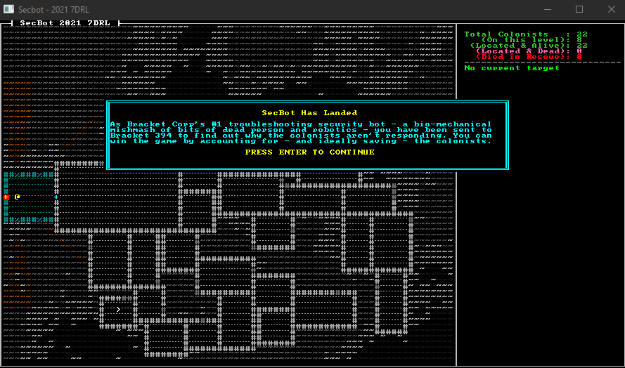

# Colonist Cross-Layer Navigation

In this sprint, we'll give colonists the ability to path upwards and exit the game---even if you discover them on later map levels. This is important to the overall game-play: you need to be able to rescue colonists you encounter on deeper map layers.

## Cleaner Targeting

I was finding the big targeting lines annoying. They were great for debugging the targeting system, but giant yellow lines everywhere was really distracting. So I opened up `src/render/mod.rs` and adjusted the `render_glyphs` function to instead add brackets around a target:

I replaced the code:

```rust
if let Some(pt) = target_pt {
        line2d_bresenham(player_point, pt)
            .iter()
            .skip(1)
            .for_each(|pt| {
                ctx.set_bg(pt.x + 1, pt.y + 1, GOLD);
            });
        ctx.set(pt.x, pt.y + 1, DARK_RED, BLACK, to_cp437('['));
        ctx.set(pt.x + 2, pt.y + 1, DARK_RED, BLACK, to_cp437(']'));
        ctx.set_bg(pt.x + 1, pt.y + 1, GOLD);
    }
```

With:

```rust
if let Some(pt) = target_pt {
    ctx.set(pt.x, pt.y + 1, RED, BLACK, to_cp437('['));
    ctx.set(pt.x + 2, pt.y + 1, RED, BLACK, to_cp437(']'));
    //ctx.set_bg(pt.x + 1, pt.y + 1, GOLD);
```

There's some issues when the targeting glyph is off-screen, but these get resolved later. The result looks quite a bit nicer---definitely less distracting.

## Add Some Colonists to the Mine Top

It's not easy to create/debug cross-layer navigation if there is nobody to rescue on the lower levels! So I opened up `src/map/layerbuilder/mine_top.rs` and replaced the `layer` return with the following:

```rust
    edge_filler(&mut layer);
    std::mem::drop(rng);

    rooms.iter().for_each(|r| {
        spawn_random_colonist(ecs, r.center(), 1);
    });

    layer
}
```

This adds a random colonist to each room. Now you have test colonists, ready to try out the cross-layer pathfinding for you. Why the `drop` on `rng`? I needed to ensure that it was unlocked before the random colonists function acquires its own lock on the RNG. Not the most efficient way to do things, but it got the job done. 

At the top of `mine_top.rs`, add `edge_filler` to the list of imports from `super`:

```rust
use super::{all_wall, colonists::spawn_first_colonist, spawn_face_eater, spawn_random_colonist, edge_filler};
```

If you run the game now, you'll find colonists on the lower levels---but they don't know how to escape. Let's fix that.

## Adding a Wait Action

In `src/game/player.rs` add a wait action---press space to do nothing. This lets you sit and wait while colonists path home, to see if the pathing code works.

```rust
            VirtualKeyCode::T | VirtualKeyCode::Tab => cycle_target(ecs),
            VirtualKeyCode::Comma => go_up(ecs, map),
            VirtualKeyCode::Period => go_down(ecs, map),
+           VirtualKeyCode::Space => NewState::Player, // Wait action
            _ => NewState::Wait,
        }
    } else {
```

## Pathing Colonists

Now for the tricky bit! Our colonist AI right now is a decent start---you can activate a colonist and they path to the exit on the same level. That's a good start, but we need to add a couple of things to it: pathing to the exit on the current level (and then keeping going), and removing themselves when they reach the exit. The latter is how you "win" the game, getting colonists to safety. The "saved colonist" count really is the player's score.

Open `/src/game/colonists.rs`. Around line 21, you'll find `let idx = map.get_layer(pos.layer as usize).point2d_to_index(pos.pt);`. Delete that line, and replace it with:

```rust
let mut should_move = true;
```

We'll use this flag to determine if the colonist should abort their movement for some reason. After the "check basics like..." comment block, we need to handle the colonist being on an exit point:

```rust
let mut should_move = true;
// Am I at a level boundary? If so, go up it!
if pos.pt == map.get_layer(pos.layer as usize).colonist_exit {
    should_move = false;
    if pos.layer == 0 {
        *status = ColonistStatus::Rescued;
        commands.remove_component::<Glyph>(*entity);
        commands.remove_component::<Description>(*entity);
    } else {
        pos.layer = pos.layer - 1;
        pos.pt = map.get_layer(pos.layer as usize).find_down_stairs();
        colonist.path = None;
    }
}
```

This works by checking to see if the colonists' position is the same as the layer's exit boundary. If it is, and the colonist is on layer 0---then they've reached the escape pod. Their status becomes rescued, and we remove their glyph and description components. They won't be rendered anymore, but still exist because we need to count them as a success. If the colonist *isn't* on the top level, we move them up a layer---and set their position to the new layer's downwards staircase (because they just came up it). We also remove their path, so they will calculate a new exit path next turn.

Next, we replace the activated movement code. We're caching the path to the exit so we don't have to generate it each turn. The following code (replacing the existing code) is as follows:

```rust
// Since I'm activated, I should move towards the exit
    if should_move {
        let current_map = map.get_layer(pos.layer as usize);
        if let Some(path) = &mut colonist.path {
            if !path.is_empty() {
                let next_step = path[0];
                path.remove(0);
                pos.pt = current_map.index_to_point2d(next_step);
            }
        } else {
            let start = current_map.point2d_to_index(pos.pt);
            let end = current_map.point2d_to_index(current_map.colonist_exit);
            let finder = a_star_search(start, end, current_map);
            if finder.success {
                colonist.path = Some(finder.steps);
            } else {
                println!("Failed to find the path");
            }
        }

        // If the actor has dialogue, emit it
        if !dialog.lines.is_empty() {
            let line = dialog.lines[0].clone();
            dialog.lines.remove(0);
            commands.push((Speech { lifetime: 20 }, pos.clone(), Description(line)));
        }
    }
});
```

## Ignoring Doors

Colonists really should be able to handle doors. The doors are mostly there to keep the player guessing about the contents of each room---they don't do much. Open up `src/map/layer.rs` and change the `test_exit` function to allow doors to be traversed:

```rust
fn test_exit(&self, pt: Point, delta: Point, exits: &mut SmallVec<[(usize, f32); 10]>) {
    let dest_pt = pt + delta;
    if self.in_bounds(dest_pt) {
        let dest_idx = self.point2d_to_index(pt + delta);
        if !self.tiles[dest_idx].blocked || self.is_door[dest_idx] {
            exits.push((dest_idx, 1.0));
        }
    }
}
```

## A Little Bit of Test Code

It's easier to test this code if you make two changes. You'll want to undo them before you proceed. In `map/layers.rs`, change the map to reveal everything:

```rust
revealed: vec![true; TILES],
```

And then in the colonist spawner in `map/layerbuilder/colonists.rs` add `Active` to the list of components added instead of `CanBeActivated`. This makes the colonists immediately active, and you can sit and wait while they all go to the escape pod.

## Wrap-Up

Now you can activate colonists and watch them go to the escape pod. That's a *huge* portion of game-play working.



> You can find the source code for `stairs2` [here](https://github.com/thebracket/secbot-2021-7drl/tree/tutorial/tutorial/stairs2/).

Don't forget to disable the test code before you proceed! Next up, we'll give colonists names and make things a little prettier.
