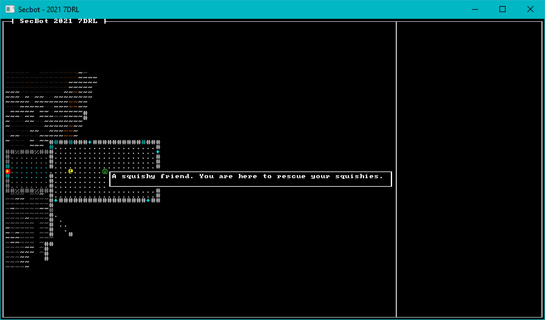

{{#include header.md}}

# Adding a colonist

A central theme of *SecBot* is locating the colonists who live in and around the mining facility. That makes adding them a top priority! So I started day #2 by trying to do just that.

## Create a Colonist Tag

There needs to be a way to indicate that an Entity is a Colonist. The easy way to accomplish this is with another tag component - a component that doesn't contain data, but just indicates a flag is set by existing.

Open `components/tag.rs` and add the following tag component:

~~~rust
pub struct Colonist;
~~~

## Spawning Colonists

We're going to be adding colonists all over the map. We'll eventually have some variation in colonists, too. Let's create a new module to hold the colonist spawning logic. Create a new file: `src/map/layerbuilder/colonists.rs`. Paste the following into it:

~~~rust
use bracket_lib::prelude::*;
use legion::*;
use crate::components::*;

pub fn spawn_random_colonist(ecs: &mut World, location: Point, layer: u32) {
    ecs.push((
        Colonist{},
        Position::with_pt(location, layer),
        Glyph{ glyph: to_cp437('☺'), color: ColorPair::new( LIME_GREEN, BLACK ) },
        Description("A squishy friend. You are here to rescue your squishies.".to_string())
    ));
}
~~~

This should look familar. It pushes a new entity, and gives them a `Colonist` tag as well as a `Position` (where they are on the map), a `Glyph` (how to render them), and a `Description` for tool-tips.

Activate the module and make it available by adding `mod colonists; use colonists::*;` to `src/map/layerbuilder/mod.rs`.

### Adding the First Colonist

Open `layerbuilder/entrance.rs`. Add an import for the `spawn_random_colonist` function, modifying the previous `use super::all_space` import.

~~~rust
use super::{all_space, spawn_random_colonist};
~~~

Now scroll down to where we call `add_exit` in the `add_docking_capsule` function. Immediately after `add_exit(...)`, add the following:

~~~rust
// Populate rooms
populate_rooms(&mut rooms, map, ecs);
~~~

Then, at the end of `entrance.rs` add the following function:

~~~rust
fn populate_rooms(rooms: &mut Vec<Rect>, map: &mut Layer, ecs: &mut World) {
    // The first room always contains a single colonist
    spawn_random_colonist(ecs, rooms[0].center(), 0);

    // Each room after that can be random
}
~~~

## Give it a Go

The entry room now contains a colonist! They don't *do* anything other than exist and have a tool-tip, but it's good to see that the entity/component system we setup is working.

> You can find the source code for `hello_colonist` [here](https://github.com/thebracket/secbot-2021-7drl/tree/tutorial/tutorial/hello_colonist/).

## Up Next

In the next section, we'll be adding more colonists - and adding some UI to count them, and categorize their status.
