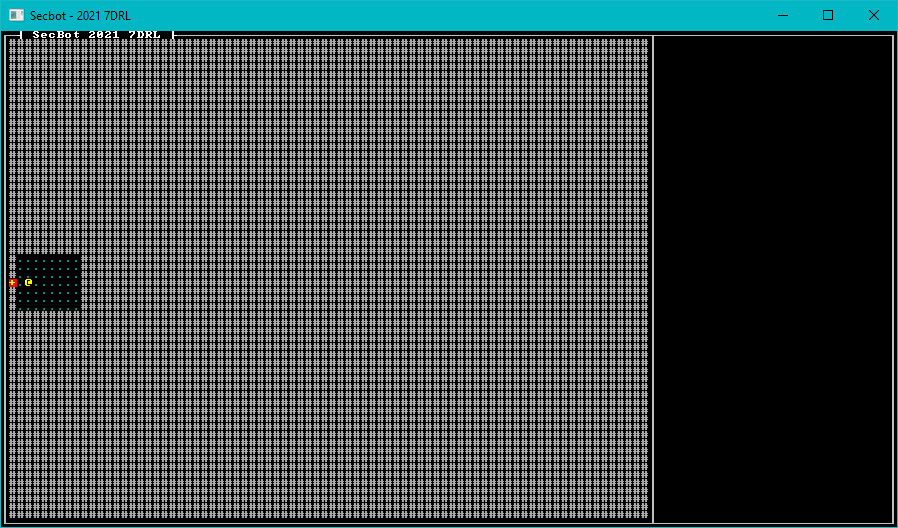

# Initial Mapping

Now that you have a field of open space and a player entity, let's make something more interesting for SecBot to stand on.

## The Layer Builder Module

Open up `src/map/mod.rs` and uncomment `mod layerbuilder`. Then make a directory, `src/map/layerbuilder` and create a new `mod.rs` file in it. It's very much a skeleton for all the builders to reside in:

~~~rust
mod entrance;
use super::{Layer, Tile};
pub use entrance::build_entrance;

fn all_space(layer: &mut Layer) {
    layer.tiles.iter_mut().for_each(|t| {
        *t = Tile::empty();
    });
}
~~~

I added a helper function, `all_space` that iterates an existing layer and turns every tile into an empty tile. You'll implement the `empty` funtion next.

## Add Some Tiles

Open `map/tiles.rs` and create a bunch of constructors for different tile types we'll need:

~~~rust
impl Tile {
    pub fn default() -> Self {
        Self {
            glyph: to_cp437('.'),
            color: ColorPair::new(GREY, BLACK),
            blocked: false,
            opaque: false,
        }
    }

    pub fn empty() -> Self {
        Self {
            glyph: to_cp437('#'),
            color: ColorPair::new(DARK_GRAY, BLACK),
            blocked: true,
            opaque: false,
        }
    }

    pub fn capsule_floor() -> Self {
        Self {
            glyph: to_cp437('.'),
            color: ColorPair::new(DARK_CYAN, BLACK),
            blocked: true,
            opaque: false,
        }
    }

    pub fn game_over() -> Self {
        Self {
            glyph: to_cp437('+'),
            color: ColorPair::new(YELLOW, RED),
            blocked: true,
            opaque: false,
        }
    }
}
~~~

This is pretty tedious, but I find it helpful when designing a map to have a nicely named function for whatever it is that I'm making. The functions are:

* `default` and `empty` both make an open space. I changed the color slightly so I could see if I'd remembered to use `empty`.
* `capsule_floor` makes a cyan floor. This will form floor tiles in SecBot's spaceship.
* `game_over` draws a red plus sign with a yellow background. This will be the game's exit. Entering this tile will end the game and show you how far you progressed.

## Make SecBot's Ship

Back in `map/layerbuilder` make a new file, `entrance.rs`. This is where we will construct the first game level - layer zero. Start by using various things we're likely to need:

~~~rust
use super::all_space;
use crate::{
    components::{Description, Position},
    map::{Layer, Tile, HEIGHT, TILES, WIDTH},
};
use bracket_lib::prelude::*;
use legion::*;
~~~

Now create a public function called `build_entrance` to initialize the layer:

~~~rust
pub fn build_entrance(ecs: &mut World) -> Layer {
    let mut layer = Layer::new(std::usize::MAX, ecs); // Gets a default layer

    all_space(&mut layer);
    add_docking_capsule(&mut layer, ecs);

    layer
}
~~~

We'll get to the functions it calls in a moment, first you need to pop back into `map/layer.rs` and extend it to use the layer builder:

~~~rust
use super::{layerbuilder::*, Tile, HEIGHT, TILES, WIDTH};
use bracket_lib::prelude::*;
use legion::*;

pub struct Layer {
    pub tiles: Vec<Tile>,
    pub starting_point: Point,
}

impl Layer {
    pub fn new(depth: usize, ecs: &mut World) -> Self {
        let layer = match depth {
            0 => build_entrance(ecs),
            _ => Self {
                tiles: vec![Tile::default(); TILES],
                starting_point: Point::new(WIDTH / 2, HEIGHT / 2),
            },
        };
        layer
    }
    ...
~~~

If `depth` comes into the layer constructor as zero, it will call the `build_entrance` function in the layer builder. Otherwise, it makes a default map.

## Building SecBot's Docking Bay

The `build_entrance` function starts by making a new layer. Note that it calls it with the "depth" set to the maximum `usize` value:

~~~rust
let mut layer = Layer::new(std::usize::MAX, ecs); // Gets a default layer
~~~

This prevents the layer from calling `build_entrance` - crashing the program when the stack overflows because the two functions are calling each other over and over.

It then calls `all_space` to set the entire map to open space. You don't *really* need this (initializing the layer clears it) - but I find it clearer to be explicit about it.

The next function it calls is `add_docking_capsule`. Add the following function to `entrance.rs`:

~~~rust
fn add_docking_capsule(map: &mut Layer, ecs: &mut World) {
    const MIDDLE: usize = HEIGHT / 2;
    const TOP: usize = MIDDLE - 3;
    const BOTTOM: usize = MIDDLE + 3;
    const LEFT: usize = 1;
    const RIGHT: usize = 8;

    for y in TOP..=BOTTOM {
        for x in LEFT..=RIGHT {
            let idx = map.point2d_to_index(Point::new(x, y));
            map.tiles[idx] = Tile::capsule_floor();
        }
    }

    // Spawn the game exit
    add_game_exit(map, ecs, Point::new(LEFT - 1, MIDDLE));

    map.starting_point = Point::new(LEFT + 1, MIDDLE);
}
~~~

This starts by doing a little constant math (calculated at compile time). The `y` axis middle of the map, and the position of the docking capsule. There's nothing random here; it will always be the same. Armed with these constants, it fills the region defined by these coordinates with `capsule_floor` tiles.

### Adding the exit

The docking capsule function calls another function. Let's add it:

~~~rust
fn add_game_exit(map: &mut Layer, ecs: &mut World, pt: Point) {
    let exit_idx = map.point2d_to_index(pt);
    map.tiles[exit_idx] = Tile::game_over();

    ecs.push((
        Position::with_pt(pt, 0),
        Description(
            "Exit to SecBot's Ship. Leave through here when you are ready to call it game over."
                .to_string(),
        ),
    ));
}
~~~

This adds the exit tile to the map, and creates a new entity to display a tool-tip (when we have that in!) to show you that the tile represents an exit.

Next, open up `mod.rs` and uncomment the line that imports `layerbuilder`.

You'll notice that the game still doesn't compile. That's because we used `point2d_to_index` - which is provided by `bracket-lib`'s trait system.

# Trait Implementation

Open `map/layer.rs`, and we'll cover all of the boilerplate required to use `bracket_lib`'s map helpers. We'll be using these a *lot* during development, so it's worth the effort. We'll go ahead and make the changes required for path-finding while we're here.

## Defining Algorithm2D

At the bottom of the `layer.rs` file, add an implemenetation for `Algorithm2D`:

~~~rust
impl Algorithm2D for Layer {
    fn dimensions(&self) -> Point {
        Point::new(WIDTH, HEIGHT)
    }

    fn in_bounds(&self, pos: Point) -> bool {
        pos.x >= 0 && pos.x < WIDTH as i32 && pos.y > 0 && pos.y < HEIGHT as i32
    }
}
~~~

`dimensions` specifies the size of the layer. `in_bounds` checks that a tile is within those boundaries. This is straight out of *Hands-On Rust* and is a good starting point for all of `bracket-lib`'s mapping algorithms. Implementing these provides `point2d_to_index` and the reciprocal `index_to_point2d`. We're not trying anything clever with our map tile striding, so these work perfectly for our needs.

## Testing Exits

Inside the implementation of `Layer`, add a function:

~~~rust
impl Layer {
    ...
    fn test_exit(&self, pt: Point, delta: Point, exits: &mut SmallVec<[(usize, f32); 10]>) {
        let dest_pt = pt + delta;
        if self.in_bounds(dest_pt) {
            let dest_idx = self.point2d_to_index(pt + delta);
            if !self.tiles[dest_idx].blocked {
                exits.push((dest_idx, 1.0));
            }
        }
    }
}
~~~

This function takes a point and a delta (desired movement) and checks that the reuslt is on the map. If the tile is on the map, and isn't blocked, it adds the exit to the exits list with a cost of `1`.

## Implement BaseMap

You now have everything you need to make `BaseMap` work. `BaseMap` is a handy trait. It's enough to make Dijkstra maps, A-Star searches and Field-of-View queries work. Add the following to the bottom of `layer.rs`:

~~~rust
impl BaseMap for Layer {
    fn is_opaque(&self, idx: usize) -> bool {
        self.tiles[idx].opaque
    }

    fn get_available_exits(&self, idx: usize) -> SmallVec<[(usize, f32); 10]> {
        let mut exits = SmallVec::new();
        let pt = self.index_to_point2d(idx);
        self.test_exit(pt, Point::new(-1, 0), &mut exits);
        self.test_exit(pt, Point::new(1, 0), &mut exits);
        self.test_exit(pt, Point::new(0, -1), &mut exits);
        self.test_exit(pt, Point::new(0, 1), &mut exits);
        exits
    }
}
~~~

# Wrap-Up

If you run the program now, you'll see a docking capsule (without walls!) sitting on a field of open space. 

> You can find the source code for `hello_capsule` [here](https://github.com/thebracket/secbot-2021-7drl/tree/tutorial/tutorial/hello_capsule/).

Next up - adding some more elements that I'll need throughout development.
