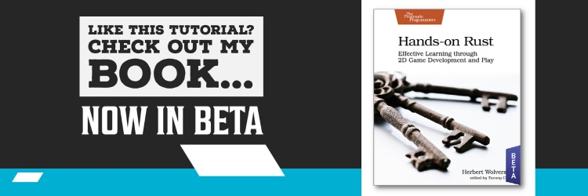

*This tutorial is free and open source, and all code uses the MIT license - so you are free to do with it as you like. My hope is that you will enjoy the tutorial, and make great games!*

*If you enjoy this and would like me to keep writing, please consider supporting [my Patreon](https://www.patreon.com/blackfuture).*

-----