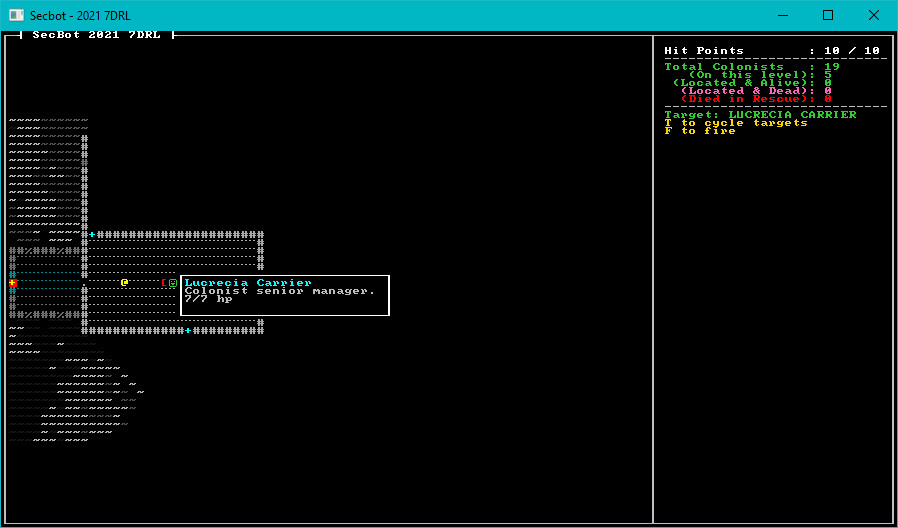

# Hit Points

In preparation for getting combat working, we need a way to track if entities are injured/dead. The traditional approach in most RPGs and roguelikes is the venerable hit point---run out of hit points, and you die.

## Health Component

The first thing we need is a component to represent current health status. We need to track both the maximum and the current level of hit points---that way, if we add healing later we know the ceiling at which to cap improvements. We can also use it as a range when displaying health bars.

Create a new file named `src/components/health.rs`. Add the new component to it:

```rust
pub struct Health {
    pub max: i32,
    pub current: i32
}
```

The component file won't do anything until we include it in the project. Open `src/components/mod.rs` and add the two lines highlighted with plus symbols:

```rust
mod tags;
mod targeting;
mod tile_trigger;
+mod health;

pub use colonist::*;
pub use colonist_status::*;
pub use speech::*;
pub use tags::*;
pub use targeting::*;
pub use tile_trigger::*;
+pub use health::*;
```

The health component is now part of the component system, so it's time to start giving entities some hit points.

## Giving the Player Some Health

Open `src/main.rs` and find the code that sets up the player entity. At the end of the component `push`, add the following:

```rust
Health{max: 10, current: 10},
```

The player now has a health component.

## Giving Colonists Health

We also want colonists to have some health. Open `src/map/layerbuilder/colonists.rs`. Now we run into a problem. Legion's `push` command doesn't make it easy to add a large number of components at once, so I had to work around it by using commands to add more to the basic entity. The following code block shows you where to add the new code (marked with + symbols):

```rust
fn build_base_colonist(ecs: &mut World, location: Point, layer: u32) -> Entity {
    let name_lock = NAMES.lock();
    let name = name_lock.unwrap().random_human_name();
+   let entity = ecs.push((
        ...
    )); // Add here

+   let mut rng = RandomNumberGenerator::new();
+   let hp = rng.roll_dice(1, 6) + 3;
+   let mut commands = CommandBuffer::new(ecs);
+   commands.add_component(entity, Health{max: hp, current: hp});
+   commands.flush(ecs);

    entity
}
```

All base colonists now have a random number of hit points. About this time, I took a quick detour and decided to change the description of the first colonist. Since we're in the file already, let's do that. Find the `spawn_first_colonist` function, and add a new description.

```rust
commands.add_component(entity, Description("Colonist senior manager.".to_string()));
commands.flush(ecs);
}
```
Now that colonists have hit points, let's give some to the monsters too.

## Monstrous Health

Monsters are created in `src/map/layerbuilder/monsters.rs`, so open that file. In the list of components given to face eaters (`spawn_face_eater` function) add:

```rust
Health{max: 3, current: 3},
```

Now that monsters, colonists and the player all have hit points---we need to update the user interface to show this.

## UI Updates

We're going to be adding more lines to the UI panel, so first we need to make a quick change to `colonist_panel`. Adjust the function signature to take `mut y: i32` as a parameter, and remove `let mut y=2` from the function. Open `src/render/colonist_panel.rs` and make the following changes:

```rust
pub fn render_colonist_panel(ctx: &mut BTerm, ecs: &World, current_layer: usize, mut y: i32) -> i32 {
    ..
    // let mut y = 2;
```

### A New Status Panel

We want to show SecBot's hit points, and not look too incredibly ugly doing it. Open `src/render/mod.rs` and add two new lines:

```rust
pub mod status_panel;
pub use status_panel::*;
```

Now that we've told Rust to use our new file, create a new file named `src/render/status_panel.rs`.

```rust
use bracket_lib::prelude::*;
use legion::*;
use crate::components::*;
use crate::map::WIDTH;

pub fn render_status(ctx: &mut BTerm, ecs: &World, mut y: i32) -> i32 {
    let x = WIDTH + 3;
    let mut hp_query = <(&Player, &Health)>::query();
    hp_query.for_each(ecs, |(_, hp)| {
        ctx.print_color(x, y, WHITE, BLACK, format!{"Hit Points        : {} / {}", hp.current, hp.max});
        y += 1;
    });
    ctx.print_color(x, y, GREY, BLACK, "----------------------------");
    y += 1;
    y
}
```

This is pretty straightforward: we display the player's health and a separator, and update the panel's `y` position.

### Tooltips that Show Health

Now open `src/render/tooltips.rs`. We're going to add a health display to the tooltips. At the top, change the components import to `components::*`. It makes life easier, even if it slightly slower to compile. Then find the `let map_y = my - 1` line, and adjust the entity details query a bit:

```rust
 let map_y = my - 1;
if map_x >= 0 && map_x < WIDTH as i32 && map_y >= 0 && map_y < HEIGHT as i32 {
    let mut lines = Vec::new();
    let mut query = <(Entity, &Position, &Description, &Name)>::query();
    query.for_each(ecs, |(entity, pos, desc, name)| {
        if pos.layer == map.current_layer as u32 && pos.pt.x == map_x && pos.pt.y == map_y {
            let idx = map.get_current().point2d_to_index(pos.pt);
            if map.get_current().visible[idx] {
                lines.push((CYAN, name.0.clone()));
                lines.push((GRAY, desc.0.clone()));
                if let Ok(er) = ecs.entry_ref(*entity) {
                    if let Ok(hp) = er.get_component::<Health>() {
                        lines.push((GRAY, format!("{}/{} hp", hp.current, hp.max)));
                    }
                }
            }
        }
    });
```

See how we now retrieve the `Entity` as part of the query? Not everything has health, so we don't just require a `Health` component. Then we check to see if the entity has a `Health` component, and print the hit points details if they are present.

We've slightly changed the format of the line information. It's now a tuple, containing color and text---rather than just the text. We need to adjust the `width` calculation for each line:

```rust
        if !lines.is_empty() {
            let height = lines.len() + 1;
            let width = lines.iter().map(|s| s.1.len()).max().unwrap() + 2;
            let tip_x = if map_x < WIDTH as i32 / 2 {
                mx + 1
            } else {
```

Finally, we tweak the render code a little:

```rust
            } else {
                my
            };
            ctx.draw_box(tip_x, tip_y- (lines.len()/2) as i32, width, height, WHITE, BLACK);
            let mut y = tip_y + 1 - (lines.len()/2) as i32;
            lines.iter().for_each(|s| {
                ctx.print_color(tip_x + 1, y, s.0, BLACK, &s.1);
                y += 1;
            });
        }
```

### Calling the new code

In `src/main.rs`, we need to adjust our code that calls the UI rendering to make use of the new `y` calculation:

```rust
fn tick(&mut self, ctx: &mut BTerm) {
        ctx.cls();
        render::render_ui_skeleton(ctx);
+       let y = render::render_status(ctx, &self.ecs, 2);
+       let y = render::render_colonist_panel(ctx, &self.ecs, self.map.current_layer, y);
        let (_y, target_pt) =
            render::render_targeting_panel(y, ctx, &self.ecs, self.map.current_layer);
        self.map.render(ctx);
```


## Wrap-Up

If you play the game now, colonists have hit points and nicer looking tooltips---and SecBot's health is visible in the status panel.



> You can find the source code for `hit_points` [here](https://github.com/thebracket/secbot-2021-7drl/tree/tutorial/tutorial/hit_points/).

Next up: shooting things!