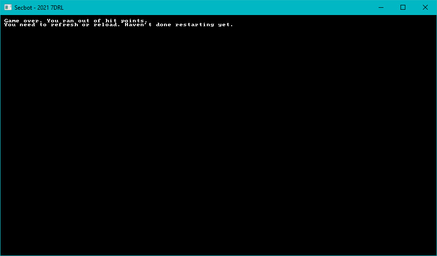

# Killing SecBot

In the previous session, monsters learned how to damage you. You can see it in action - stand next to a face eater and watch your health go down. Unfortunately, your health hits zero---and the game keeps going. Losing the game is a very important part of any roguelike, so let's implement a "game over" state for when SecBot inevitably suffers his demise.


## Add a new state

Game over states are a global game state: it just displays the overall state. Open `src/main.rs`, the source of our current states. Find the `TurnState` declaration, and add a new state---`GameOverDead---to the list.

```rust
enum TurnState {
    WaitingForInput,
    PlayerTurn,
    EnemyTurn,
    Modal { title: String, body: String },
    GameOverLeft,
    GameOverDead
}
```

You'll also need to add it as an option in `NewState`, the type we use to handle transitions between states:

```rust
pub enum NewState {
    NoChange,
    Wait,
    Player,
    Enemy,
    LeftMap,
    Dead,
}
```

Now that the states exist, let's add them to the transition logic.

### Query the player status

The `TurnState::PlayerTurn` option in `tick` has been a placeholder for a few days now. You want to replace the following line:

```rust
TurnState::PlayerTurn => NewState::Enemy, // Placeholder
```

With the following:

```rust
            TurnState::PlayerTurn => {
                use components::{Player, Health};
                let mut is_dead = false;
                <(&Player, &Health)>::query().for_each(&self.ecs, |(_, hp)| if hp.current == 0 { is_dead = true; });
                if is_dead {
                    NewState::Dead
                } else {
                    NewState::Enemy
                }
            }
```

This code queries to find the player health in the ECS, and sets `is_dead` to true if SecBot has met an untimely demise. If `SecBot` is dead, then the game immediately transitions to `Dead`---otherwise, it keeps on chugging.

### New state matcher:

We just updated `NewState`, so we also need to handle `new_state` changing to `Dead`. This is quite straightforward:

```rust
match new_state {
    NewState::NoChange => {}
    NewState::LeftMap => self.turn = TurnState::GameOverLeft,
    NewState::Player => self.turn = TurnState::PlayerTurn,
    NewState::Dead => self.turn = TurnState::GameOverDead,
}
```

Dying now triggers the new state. We still need to do something with the new state.

### State selector:

Still in `src/main.rs`, find the `match` starting with:

```rust
let new_state = match &self.turn {
    TurnState::Modal { title, body } => render::modal(ctx, title, body),
```

And add the following match arm, right above the `_ =>` default:

```rust
TurnState::GameOverDead => render::game_over_dead(ctx),
```

The game won't compile yet, because it's looking for `game_over_dead`---so let's write it.

## Render state

Open `src/render/mod.rs` and add the following function:

```rust
pub fn game_over_dead(ctx: &mut BTerm) -> NewState {
    ctx.cls();
    ctx.print(
        1,
        1,
        "Game over. You ran out of hit points.",
    );
    ctx.print(
        1,
        2,
        "You need to refresh or reload. Haven't done restarting yet.",
    );
    NewState::NoChange
}
```

That's it! SecBot can now die and the game ends.



## Wrap-Up

That's a very simple, short sprint---just the way I like it. The next one will be short, too. We're going to try to add a little sentiment to murdering colonists.

> You can find the source code for `killing_secbot` [here](https://github.com/thebracket/secbot-2021-7drl/tree/tutorial/tutorial/killing_secbot/).
