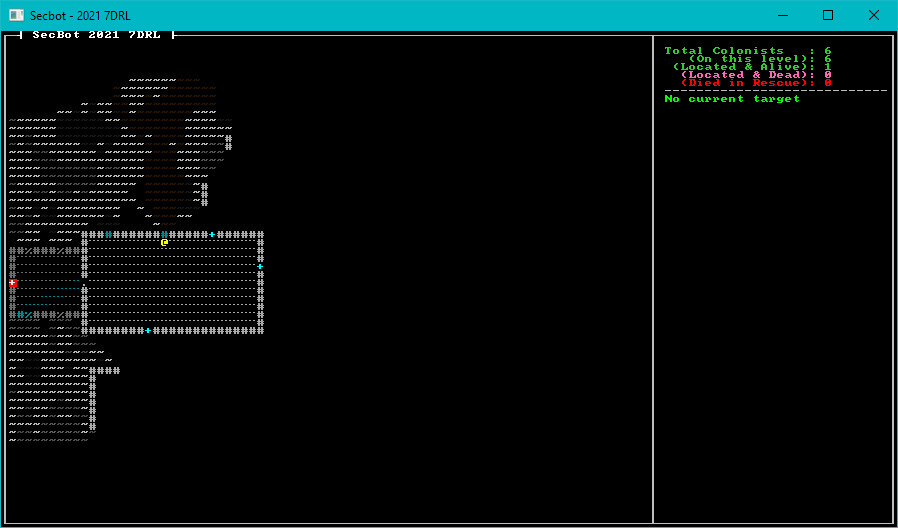
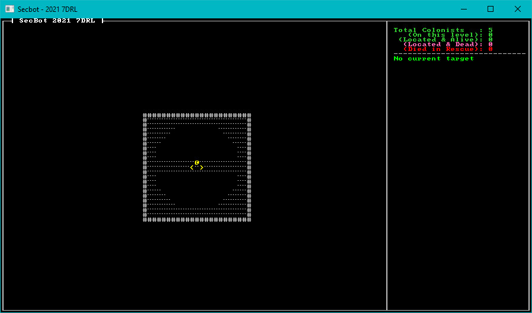

# Mapping the Mine pt 1

I visualized the mining colony as having several layers. We've built the top layer - a series of habitation and work modules. My thoughts for the second layer were a mine shaft surrounded by work areas. The next layer down was meant to be a more active mine - a central shaft and winding tunnels. Then the bottom was meant to be a surprise - the miners had breached a series of underground caverns, the source of the monster problem.

## Setup Placeholders

We're going to be fleshing out the layer construction system, so let's put some placeholders in to solidify the skeleton of what we're doing. We want to add two layers, so we'll add them to the layer constructor. Open `src/map/layer.rs` and change the `new` function to include `build_mine_top` and `build_mine_middle`:

~~~rust
impl Layer {
    pub fn new(depth: usize, ecs: &mut World) -> Self {
        let layer = match depth {
            0 => build_entrance(ecs),
            1 => build_mine_top(ecs),
            2 => build_mine_middle(ecs),
            _ => Self {
                tiles: vec![Tile::default(); TILES],
                ...
~~~

Obviously, this won't compile yet - but it serves as an outline for what we're doing. Next up, we want to create the new functions we referenced. Create a new file, `src/map/layerbuilder/mine_top.rs`. Paste in a basic skeleton:

~~~rust
use super::{all_wall, colonists::spawn_first_colonist, spawn_face_eater, spawn_random_colonist};
use crate::{
    components::{Description, Door, Glyph, Position, TileTrigger},
    map::{tile::TileType, Layer, Tile, HEIGHT, WIDTH},
};
use bracket_lib::prelude::*;
use legion::*;

pub fn build_mine_top(ecs: &mut World) -> Layer {
    let mut layer = Layer::new(std::usize::MAX, ecs); // Gets a default layer
    all_wall(&mut layer);
    let center_pt : Point = Point::new(WIDTH/2, HEIGHT/2);
    layer
}
~~~

Now that you've created the framework for `mine_top`, create another file named `src/map/layerbuilder/mine_middle.rs`. Paste in a similar skeleton:

~~~rust
use super::{all_wall, colonists::spawn_first_colonist, spawn_face_eater, spawn_random_colonist};
use crate::{
    components::{Description, Door, Glyph, Position, TileTrigger},
    map::{tile::TileType, Layer, Tile, HEIGHT, WIDTH},
};
use bracket_lib::prelude::*;
use legion::*;

pub fn build_mine_middle(ecs: &mut World) -> Layer {
    let mut layer = Layer::new(std::usize::MAX, ecs); // Gets a default layer
    all_wall(&mut layer);
    let center_pt : Point = Point::new(WIDTH/2, HEIGHT/2);
    layer
}
~~~

These don't produce a useful map yet (it's all walls) - but it serves as a framework on which we can build. The last bit of the framework is to include the new files in the project. Open `src/map/layerbuilder/mod.rs` and add the following to the top:

~~~rust
mod mine_top;
mod mine_middle;
pub use mine_top::build_mine_top;
pub use mine_middle::build_mine_middle;
pub use monsters::*;
~~~

Let's also add a convenience function to the same file. `all_wall` replaces the whole map with solid walls:

~~~rust
fn all_wall(layer: &mut Layer) {
    layer.tiles.iter_mut().for_each(|t| {
        *t = Tile::wall();
    });
}
~~~

## Starting on Other Layers (For Debugging)

While we're developing our new maps, it would be helpful to start the game on the new levels instead of having to navigate the entire top level just to see our progress each time we run the game. Open `src/map/map.rs`. In the constructor, change `current_layer` to the level on which you wish to start; 0 for the planet surface, 1 for the mine top, 2 for the mine middle.

~~~rust
Self {
    current_layer: 1, // REMEMBER TO CHANGE THIS BACK
    layers,
}
~~~

### Fixing a Bug

It was at this point I noticed that I'd described *five* layers in the code - and only planned to make four. It's a quick fix. Open `src/map/mod.rs` and adjust `NUM_LAYERS`:

~~~rust
pub const NUM_LAYERS: usize = 4;
~~~

There's no point in building levels that will never be used. With that in place, let's adjust some tile types ready for the actual map generation.

You also need to open `src/main.rs` and find `Position::with_pt(self.map.get_current().starting_point, 0),` in the player creation code. Replace that with:

~~~rust
Position::with_pt(self.map.get_current().starting_point, self.map.current_layer as u32),
~~~

This allows the player to spawn on later levels while we debug the game.

## Adjusting Tile Types

At this point, I wanted to make a few adjustments to the overall look/feel of the game - and add some tile types that will be used on later levels. All changes in this section take place in `src/map/tile.rs`, so open it up. 

### Empty Tiles

The first change was changing `empty` tiles to display as blank space, rather than a `#` symbol. Empty tiles aren't a wall - and making them look like open space gives a much better overall appearance. In the `empty` function, adjust the `glyph`:

~~~rust
pub fn empty() -> Self {
    Self {
        glyph: to_cp437(' '),
        color: ColorPair::new(DARK_GRAY, BLACK),
        ...
~~~

### Floor Tiles

I didn't really like using `.` for floors. It's towards the bottom of the tile, making it harder to judge exactly where the tile boundaries are. I replaced it with `∙` - a centered dot. In  the`floor` function, adjust the glyph:

~~~rust
pub fn floor() -> Self {
    Self {
        glyph: to_cp437('∙'),
        color: ColorPair::new(DARK_GRAY, BLACK),
        ...
~~~

Repeat the change in the `capsule_floor` function:

~~~rust
pub fn capsule_floor() -> Self {
    Self {
        glyph: to_cp437('∙'),
        color: ColorPair::new(DARK_CYAN, BLACK),
        ...
~~~

### Upwards Stairs

We already added down stairs - time to add the reciprocal, stairs going up. Create a new function:

~~~rust
pub fn stairs_up() -> Self {
    Self {
        glyph: to_cp437('<'),
        color: ColorPair::new(YELLOW, BLACK),
        blocked: false,
        opaque: false,
        tile_type: TileType::StairsDown,
    }
}
~~~

Yes, that should read `StairsUp` - but that's not defined yet, so we'll fix it later. Running the program now gives a slightly improved look:

Now for the fun part - designing some maps.

## Building the Mine Top

The idea behind the mine top is to have a central mine head, surrounded by somewhat orderly - but still chaotic - work areas. The work areas have been carved out of already-mined rock, so they are regular - but irregularly spaced. Open `src/map/layerbuilder/mine_top.rs` and we'll start fleshing out the builder.

We'll start with a circular section defining the mine head itself, with floor tiles across the middle:

~~~rust
pub fn build_mine_top(ecs: &mut World) -> Layer {
    let mut layer = Layer::new(std::usize::MAX, ecs); // Gets a default layer
    all_wall(&mut layer);
    let center_pt : Point = Point::new(WIDTH/2, HEIGHT/2);

    // Start by building a platform with a mining hole around it
    for y in center_pt.y-10..=center_pt.y+10 {
        for x in center_pt.x-10..=center_pt.x+10 {
            let pt = Point::new(x,y);
            let idx = layer.point2d_to_index(pt);
            layer.tiles[idx] = Tile::empty();
            let d = DistanceAlg::Pythagoras.distance2d(center_pt, pt);
            if d >= 9.0 {
                layer.tiles[idx] = Tile::floor();
            }

            if y == center_pt.y || y == center_pt.y+1 || y == center_pt.y - 1 {
                layer.tiles[idx] = Tile::floor();
            }
        }
    }
~~~

This provides a decent start. It would be a good idea to have access to the level, so let's place some stairs:

~~~rust
// Place the up and down stairs
    let up_pt = center_pt + Point::new(-1, 0);
    let down_pt = center_pt + Point::new(1, 0);
    let up_idx = layer.point2d_to_index(up_pt);
    let down_idx = layer.point2d_to_index(down_pt);
    layer.tiles[up_idx] = Tile::stairs_up();
    layer.tiles[down_idx] = Tile::stairs_down();
    layer.starting_point = up_pt;
    layer.colonist_exit = down_pt;
~~~

Let's finish up the builder with a placeholder for room generation:

~~~rust
// Start building rooms and corridors
    let mut rooms = vec![Rect::with_size((WIDTH/2)-10, (HEIGHT/2)-10, 20, 20)];

    layer
}
~~~

Run the game now, and we're off to a great start - the mine head is built:

## Building the Mine Middle

The middle mine layer starts out pretty much the same as the mine-head. Fill out the `src/map/layerbuilder/mine_middle.rs` file:

~~~rust
pub fn build_mine_middle(ecs: &mut World) -> Layer {
    let mut layer = Layer::new(std::usize::MAX, ecs); // Gets a default layer
    all_wall(&mut layer);
    let center_pt : Point = Point::new(WIDTH/2, HEIGHT/2);

    // Start by building a platform with a mining hole around it
    for y in center_pt.y-10..=center_pt.y+10 {
        for x in center_pt.x-10..=center_pt.x+10 {
            let pt = Point::new(x,y);
            let idx = layer.point2d_to_index(pt);
            layer.tiles[idx] = Tile::empty();
            let d = DistanceAlg::Pythagoras.distance2d(center_pt, pt);
            if d >= 9.0 {
                layer.tiles[idx] = Tile::floor();
            }

            if y == center_pt.y || y == center_pt.y+1 || y == center_pt.y - 1 {
                layer.tiles[idx] = Tile::floor();
            }
        }
    }

    // Place the up and down stairs
    let up_pt = center_pt + Point::new(-1, 0);
    let down_pt = center_pt + Point::new(1, 0);
    let up_idx = layer.point2d_to_index(up_pt);
    let down_idx = layer.point2d_to_index(down_pt);
    layer.tiles[up_idx] = Tile::stairs_up();
    layer.tiles[down_idx] = Tile::stairs_down();
    layer.starting_point = up_pt;
    layer.colonist_exit = down_pt;

    // Start building rooms and corridors
    let mut rooms = vec![Rect::with_size((WIDTH/2)-10, (HEIGHT/2)-10, 20, 20)];

    layer
}
~~~

## Wrap-Up

Next, we'll continue adding details to the maps.