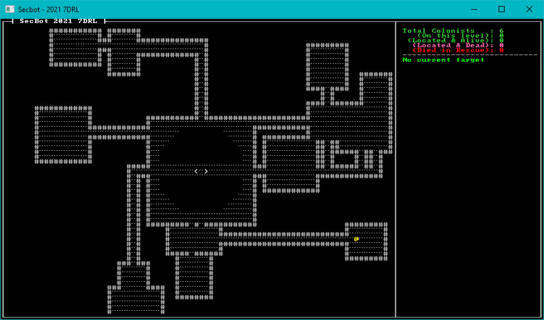

# Mapping the Mine pt 2

Let's start fleshing out the top level of the mine, and add a bit more of the mapping system.

## Adding Empty Rooms to the Mine Head

We ended the previous tutorial with a mysterious "rooms" array in the `mine_top.rs` system. The intent was hopefully clear - we're going to use a room generation algorithm on this level. It's very similar to the one in *Hands-on Rust*, but biased to create rooms outside of the existing mine-head. Open `src/map/layerbuilder/mine_top.rs` and let's get started.

### Carving Tunnels

We'll start with a couple of functions that are straight out of *Hands-on Rust* - functions to build vertical and horizontal tunnels:

~~~rust
fn apply_horizontal_tunnel(map: &mut Layer, x1:i32, x2:i32, y:i32) {
    use std::cmp::{min, max};
    for x in min(x1,x2) ..= max(x1,x2) {
        let idx = map.point2d_to_index(Point::new(x, y));
        if map.tiles[idx as usize].tile_type == TileType::Wall {
            map.tiles[idx as usize] = Tile::floor();
        }
    }
}

fn apply_vertical_tunnel(map: &mut Layer, y1:i32, y2:i32, x:i32) {
    use std::cmp::{min, max};
    for y in min(y1,y2) ..= max(y1,y2) {
        let idx = map.point2d_to_index(Point::new(x, y));
        if map.tiles[idx as usize].tile_type == TileType::Wall {
            map.tiles[idx as usize] = Tile::floor();
        }
    }
}
~~~

These do what it says on the label - they carve either a vertical or a horizontal tunnel between two points. There are no diagonals because it's often tricky to navigate diagonals with a 4-way movement scheme.

### Building Rooms

Next up is the `try_room` function. This function creates a random location for a potential room. If the room is possible (it only contains wall tiles, so it doesn't overlap any existing rooms) then it adds it to the provided `rooms` list:

~~~rust
fn try_room(rooms: &mut Vec<Rect>, map: &Layer) {
    let mut rng_lock = crate::RNG.lock();
    let rng = rng_lock.as_mut().unwrap();

    let w = rng.range(4,10);
    let h = rng.range(4,10);
    let x = rng.range(1, WIDTH - w);
    let y = rng.range(1, HEIGHT - h);

    let room_rect = Rect::with_size(x, y, w, h);
    let mut ok = true;
    room_rect.for_each(|pt| {
        let idx = map.point2d_to_index(pt);
        if map.tiles[idx].tile_type != TileType::Wall {
            ok = false;
        }
    });
    if ok {
        rooms.push(room_rect);
    }
}
~~~

With the infrastructure in place, we can extend the `mine_top` function to actually build rooms. Add this to the function, starting with the `rooms` declaration:

~~~rust
    ...
    // Start building rooms and corridors
    // Using the Hands-On Rust rooms/corridors builder slightly modified to go towards the middle
    let mut rooms = vec![Rect::with_size((WIDTH/2)-10, (HEIGHT/2)-10, 20, 20)];
    while rooms.len() < 14 {
        try_room(&mut rooms, &layer);
    }

    let mut rng_lock = crate::RNG.lock();
    let rng = rng_lock.as_mut().unwrap();
    rooms
        .iter()
        .skip(1)
        .for_each(|r| {
            r.for_each(|pt| {
                let idx = layer.point2d_to_index(pt);
                layer.tiles[idx] = Tile::floor();
            });
            let room_center = r.center();
            if rng.range(0,2) == 1 {
                apply_horizontal_tunnel(&mut layer, room_center.x, center_pt.x, room_center.y);
                apply_vertical_tunnel(&mut layer, room_center.y, center_pt.y, center_pt.x);
            } else {
                apply_vertical_tunnel(&mut layer, room_center.y, center_pt.y, room_center.x);
                apply_horizontal_tunnel(&mut layer, room_center.x, center_pt.x, center_pt.y);
            }
        }
    );

    layer
}
~~~

Run the program now, and take a look at a mine-head level:

## Wrap-Up

> You can find the source code for `mining_map2` [here](https://github.com/thebracket/secbot-2021-7drl/tree/tutorial/tutorial/mining_map2/).

The mine-head is looking pretty decent, now. Let's move on to even more mapping!
