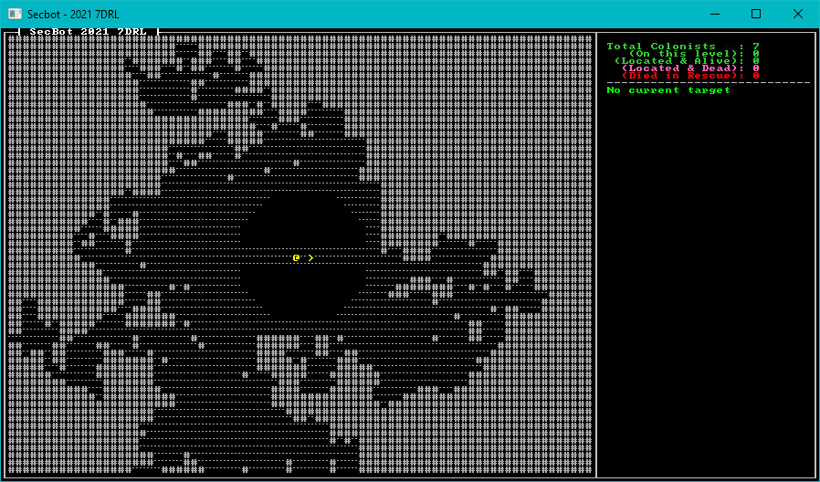

# Mapping the Mine pt 3

I visualized the second layer of the mine as being sprawling, cramped tunnels - surrounding the mine shaft proper. Drunkard's Walk (from *Hands-on Rust*) seemed like a good candidate for organically building the mine.

## Implementing Drunkard's Walk

I've written heavily about Drunkard's Walk in *Hands-on Rust* and the *Roguelike tutorial* - so I won't belabor the details here. Basically, imagine that someone gave a LOT of alcohol to an Umber Hulk and built a level around the tunnels it carved. It works in a similar fashion: diggers randomly move, and carve out walls they run into.

Open `src/map/layerbuilder/mine_middle.rs`. 

Start by adding `TILES` to the list of imported code:

~~~rust
use crate::{
    components::{Description, Door, Glyph, Position, TileTrigger},
    map::{tile::TileType, Layer, Tile, HEIGHT, WIDTH, TILES},
};
~~~

Find the line that defines `let mut rooms = ...` and delete it; replace it with the following:

~~~rust
layer.colonist_exit = down_pt;

    // Start using drunkard's walk to dig outwards
    while layer.tiles
        .iter()
        .filter(|t| t.tile_type == TileType::Floor).count() < TILES / 3
    {
        drunkard(&mut layer);
    }

    layer
}

fn drunkard(map: &mut Layer) {
    let mut rng_lock = crate::RNG.lock();
    let rng = rng_lock.as_mut().unwrap();

    let possible_starts : Vec<usize> = map
        .tiles
        .iter()
        .enumerate()
        .filter(|(_, t)| t.tile_type == TileType::Floor)
        .map(|(i,_)| i)
        .collect();

    let start = rng.random_slice_entry(&possible_starts).unwrap();
    let mut drunkard_pos = map.index_to_point2d(*start);
    let mut distance_staggered = 0;

    loop {
        let drunk_idx = map.point2d_to_index(drunkard_pos);
        if map.tiles[drunk_idx].tile_type == TileType::Wall {
            map.tiles[drunk_idx] = Tile::floor();
        }

        match rng.range(0, 4) {
            0 => drunkard_pos.x -= 1,
            1 => drunkard_pos.x += 1,
            2 => drunkard_pos.y -= 1,
            _ => drunkard_pos.y += 1,
        }
        if !map.in_bounds(drunkard_pos) {
            break;
        }

        distance_staggered += 1;
        if distance_staggered > 200 {
            break;
        }
    }
}
~~~

Run the game and navigate to layer 2 (or modify `map.rs` to start there). You'll have a nice, organic mine surrounding the mine-shaft:

## Wrap-Up

