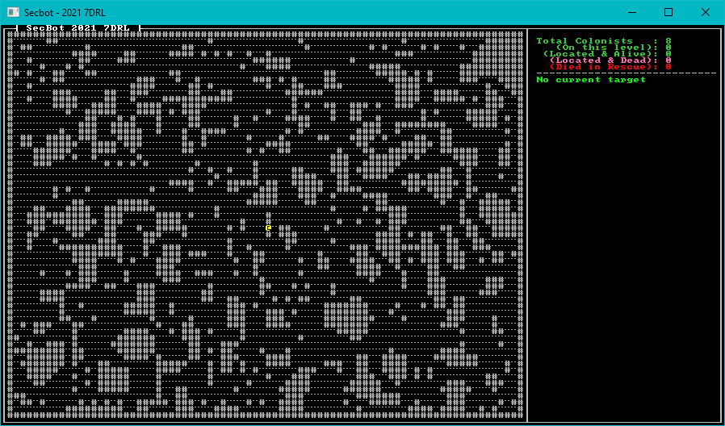
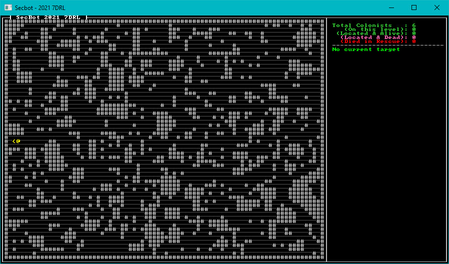

# Mapping the Mine pt 4

The bottom level of the map is meant to be a winding cavern, into which the hapless colonists drilled. They drilled too deep, monsters ate them - you know the drill. For this map, I decided to use Cellular Automata - also from *Hands-on Rust* (and the Roguelike tutorial).

## Filling in the Edges

The `entrance` builder module includes a handy `edge_filler` function for preventing gaps at the edge of the map. This function is generally useful - and solves a problem with the Drunkard's Walk maps we made in the previous section. Sometimes, the edge of the map is open - and it's confusing that you can't walk off of it. So let's promote `edge_filler` to be a generally available function.

In `src/map/layerbuilder/entrance.rs`, delete the entire `edge_filler` function (or cut it into your clipboard). Then open `src/map/layerbuilder/mod.rs` and paste the function into there:

~~~rust
fn edge_filler(map: &mut Layer) {
    for y in 0..HEIGHT {
        let idx = map.point2d_to_index(Point::new(0, y));
        if map.tiles[idx].tile_type == TileType::Floor {
            map.tiles[idx] = Tile::wall();
        }
        let idx = map.point2d_to_index(Point::new(WIDTH - 1, y));
        if map.tiles[idx].tile_type == TileType::Floor {
            map.tiles[idx] = Tile::wall();
        }
    }
    for x in 0..WIDTH {
        let idx = map.point2d_to_index(Point::new(x, 0));
        if map.tiles[idx].tile_type == TileType::Floor {
            map.tiles[idx] = Tile::wall();
        }
        let idx = map.point2d_to_index(Point::new(x, HEIGHT - 1));
        if map.tiles[idx].tile_type == TileType::Floor {
            map.tiles[idx] = Tile::wall();
        }
    }
}
~~~

Going back to `entrance.rs`, add a `use super::edge_filler` to the imports. You also need to add `use bracket_lib::prelude::{Point, Algorithm2D};` and `use super::{HEIGHT, WIDTH, tile::TileType};`.

We can now use `edge_filler` on all of our generators.

### Adding Edge Filling to the Mine Middle

Open `src/map/layerbuilder/mine_middle.rs` and add a `use super::edge_filler;` line to the import declarations. Then find the end of the `build_mine_middle` function and right before you return `layer` add a call to the new function:

~~~rust
        drunkard(&mut layer);
    }

    edge_filler(&mut layer); // <-- This is new

    layer
}
~~~

The drunkard's walk map now won't have gaps at the edges. We'll use this function again when building the caverns.

## Framework

The first thing to do is to open `src/map/layer.rs` and add a `build_caverns` call to the layer builder's `match` statement. Just like before, this will be a placeholder for a minute - but we'll dive straight into making it. So open the file, and adjust the match statement as follows:

~~~rust
impl Layer {
    pub fn new(depth: usize, ecs: &mut World) -> Self {
        let layer = match depth {
            0 => build_entrance(ecs),
            1 => build_mine_top(ecs),
            2 => build_mine_middle(ecs),
            3 => build_caverns(ecs),
            ...
~~~

You may also want to open `map.rs` and force the starting layer to `3` while you develop the level. That way, you'll start on the new level - and won't have to navigate much to see the fruits of your labor. Change `src/map/map.rs`:

~~~rust
impl Map {
    pub fn new(ecs: &mut World) -> Self {
        let mut layers = Vec::with_capacity(NUM_LAYERS);
        for i in 0..NUM_LAYERS {
            layers.push(Layer::new(i, ecs));
        }
        Self {
            current_layer: 3, // REMEMBER TO CHANGE ME BACK
            layers,
        }
    }
    ...
~~~

Now that we have the placeholder built, let's construct the caverns.

## Building the caverns

We'll be making a new file inside the layerbuilder module, so we need to remember to tell the module to include the file in the project. Open `src/map/layerbuilder/mod.rs` and add:

~~~rust
mod caverns;
pub use caverns::build_caverns;
~~~

Create a new file, `src/map/layerbuilder/caverns.rs`. Add a header, containing what we will need for the module:

~~~rust
use super::{all_wall, edge_filler, colonists::spawn_first_colonist, spawn_face_eater, spawn_random_colonist};
use crate::{
    components::{Description, Door, Glyph, Position, TileTrigger},
    map::{tile::TileType, Layer, Tile, HEIGHT, WIDTH},
};
use bracket_lib::prelude::*;
use legion::*;
~~~

### Cellular Automata

I adapted the Cellular Automata algorithm from *Hands-on Rust* to suit my needs. The first step for CA is to start with a completely random map. Add the following function:

~~~rust
fn random_noise_map(map: &mut Layer) {
    let mut rng_lock = crate::RNG.lock();
    let rng = rng_lock.as_mut().unwrap();

    map.tiles.iter_mut().for_each(|t| {
        let roll = rng.range(0, 100);
        if roll > 55 {
            *t = Tile::floor();
        } else {
            *t = Tile::wall();
        }
    });
}
~~~

This creates a random soup of walls and floors, with a slight bias towards floors. It's a good starting point for CA iterations. Each iteration needs a way to count neighbors, so add the following function:

~~~rust
fn count_neighbours(map: &Layer, x:i32, y:i32) -> usize {
    let mut neighbors = 0;
    for iy in -1 ..= 1 {
        for ix in -1 ..= 1 {
            let idx = map.point2d_to_index(Point::new(x+ix, y+iy));
            if !(ix==0 && iy == 0) && map.tiles[idx].tile_type == TileType::Wall
            {
                neighbors += 1;
            }
        }
    }
    neighbors
}
~~~

Finally, the iterations themselves. Each cell counts the number of neighboring walls, and adjusts the cell based on that count - just like in *Hands-on Rust* and the *Roguelike Tutorial*. Add the following function:

~~~rust
fn iteration(map: &mut Layer) {
    let mut new_tiles = map.tiles.clone();
    for y in 1 .. HEIGHT-1 {
        for x in 1 .. WIDTH-1 {
            let neighbors = count_neighbours(map, x as i32, y as i32);
            let idx = map.point2d_to_index(Point::new(x, y));
            if neighbors > 4 || neighbors == 0 {
                    new_tiles[idx] = Tile::wall();
                } else {
                    new_tiles[idx] = Tile::floor();
                }
        }
    }
    map.tiles = new_tiles;
}
~~~

Now that we've implemented the basics of a cellular automata generator, we can create the `build_caverns` function to actually use it:

~~~rust
pub fn build_caverns(ecs: &mut World) -> Layer {
    let mut layer = Layer::new(std::usize::MAX, ecs); // Gets a default layer
    // We're using Cellular Automata here, straight out of Hands-On Rust.
    random_noise_map(&mut layer);
    for _ in 0..15 {
        iteration(&mut layer);
    }
    edge_filler(&mut layer);

    layer
}
~~~

This is pretty much direct CA: it creates a random map, iterates the CA algorithm over it 15 times, and then fills in the edges. You have a passable cavern:

## Adding a Staircase and Fixing some Bugs

The caverns need an exit - an upwards staircase. Otherwise, poor SecBot will venture in to the caverns and never return. After the call to `edge_filler` in `build_caverns`, add the following:

~~~rust
    edge_filler(&mut layer); // Start here

    let desired_start = Point::new(2, HEIGHT/2);
    let mut possible_starts : Vec<(usize, f32)> = layer
        .tiles
        .iter()
        .enumerate()
        .filter(|(_, t)| t.tile_type == TileType::Floor)
        .map(|(idx, _)| (idx, DistanceAlg::Pythagoras.distance2d(desired_start, layer.index_to_point2d(idx))))
        .collect();
    possible_starts.sort_by(|a,b| a.1.partial_cmp(&b.1).unwrap());
    layer.starting_point = layer.index_to_point2d(possible_starts[0].0);
    layer.colonist_exit = layer.starting_point;
    layer.tiles[possible_starts[0].0] = Tile::stairs_up();
    ... // End here
    layer
}
~~~

This works by finding the closest tile to the center that doesn't contain a wall, and inserts a staircase there.

### Fixing Up Stairs on Other Levels

I made a mistake in my staircase code in previous iterations, so now's a good time to fix it. In `src/map/layerbuilder/mine_middle.rs` find `layer.colonist_exit = down_pt` and change it to read `layer.colonist_exit = up_pt`. It makes more sense for the colonists to exit via the UP stairs that leads towards the escape capsule.

The same error appears in `src/map/layerbuilder/mine_top.rs`. Once again, find `layer.colonist_exit = down_pt` and change it to read `layer.colonist_exit = up_pt`.

Finally, open `src/map/tile.rs` and fix the `stairs_up` function:

~~~rust
pub fn stairs_up() -> Self {
    Self {
        glyph: to_cp437('<'),
        color: ColorPair::new(YELLOW, BLACK),
        blocked: false,
        opaque: false,
        tile_type: TileType::StairsUp,
    }
}
~~~

Run the game now, and the caverns now feature an exit:

## Wrap-Up

> You can find the source code for `mining_map4` [here](https://github.com/thebracket/secbot-2021-7drl/tree/tutorial/tutorial/mining_map4/).

Next, we're going to start work on making staircases functional.
