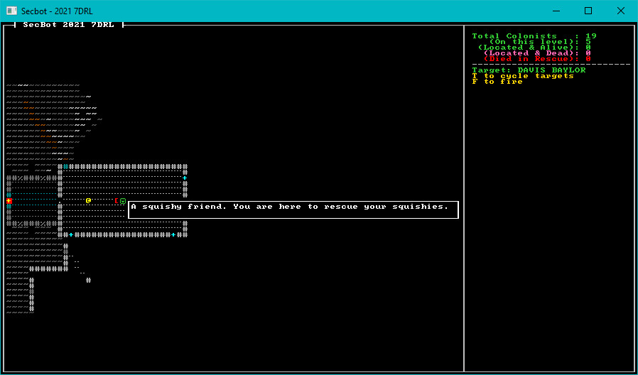

# Naming Colonists

Giving colonists names and details isn't all that important to the overall gameplay, but it gives a *feeling* of depth. Hopefully, SecBot will see that colonists' have names and be less inclined to reduce them to constituent atoms. Unless SecBot is in a bad mood, I guess. I'm a big fan of using names as "cheap flavor"---it helps with immersion when you see "Joe Bob" rather than "Colonist 12".

## Capitalizing Words

I didn't feel like writing code to handle putting words into proper-noun case, so I added a crate to `Cargo.toml`. Add the following dependency:

```toml
Inflector = "0.11.4"
```

It's an amusing feature that the crate requires a capitalized name. Irritating when it just won't compile, but a nice touch.

> Please don't do this with your crates. Lower-case works everywhere else, and consistency is more important than being clever!

## Generating Names

Years ago, while working on *Black Future* (later renamed *Nox Futura*) I downloaded a list of names from the US Census. I made a list of male and female first names, and last names (surnames). I've re-used these files in countless projects---it's a really cheap way to make names that sound real without having to try and come up with them myself.

You can find these files as `first_names_female.txt`, `first_names_male.txt` and `last_names.txt` in the accompanying source. You'll want to place them in your `src/map/layerbuilder` directory. TODO: Linky

Now open `src/map/layerbuilder/colonists.rs`. Go to the bottom, and we'll build some infrastructure for naming the colonists. The first step is to include the name lists in the program (embedded to make it easier to use WASM). Add the following three lines:

```rust
const FIRST_NAMES_1 : &str = include_str!("first_names_female.txt");
const FIRST_NAMES_2 : &str = include_str!("first_names_male.txt");
const LAST_NAMES : &str = include_str!("last_names.txt");
```

This embeds the name files in your binary. Now we're going to create a `Names` structure, which we will use to turn these lists into random names. Append the following:

```rust
#[derive(Clone, Debug)]
struct Names {
    male_first: Vec<String>,
    female_first: Vec<String>,
    last_names: Vec<String>,
}
```

The names are separated, one to a line. So turning the list of names into a vector is a relatively simple split/map/collect iterator call. Let's make a constructor for the `Names` structure:

```rust
impl Names {
    fn new() -> Self {
        Self {
            male_first: FIRST_NAMES_1.split("\n").map(|n| n.to_string()).collect(),
            female_first: FIRST_NAMES_2.split("\n").map(|n| n.to_string()).collect(),
            last_names: LAST_NAMES.split("\n").map(|n| n.to_string()).collect(),
        }
    }
```

Keep the `impl` block open, we aren't done with it yet. We still need to create the code to randomly generate names. Add a new function to the block, and give it its own RNG (to avoid locking issues; chances are, we're locking the RNG already while we build the map):

```rust
    fn random_human_name(&self) -> String {
        use inflector::Inflector;
        let mut rng = RandomNumberGenerator::new(); // Avoiding locking issues
```

Next, we need to decide if we're pulling from the male or female first name list. It makes no difference, but since the lists are separated we should pick one. So we'll roll a dice, and have a 50/50 chance of either---and store a reference to the appropriate list:

```rust
        let male = rng.range(0, 100) < 50;
        let first_source = match male {
            true => &self.male_first,
            false => &self.female_first,
        };
```

Next, we'll pick a random slice entry from first and last names---and apply title case to it using `Inflector`:

```rust
        let first_name = rng
            .random_slice_entry(first_source)
            .unwrap()
            .to_title_case();
        let last_name = rng
            .random_slice_entry(&self.last_names)
            .unwrap()
            .to_title_case();
```

Lastly, we format it in a `(first) (last)` pattern and return the resulting string. Note that we're finally closing the `impl` block:

```rust
        format!("{} {}", first_name, last_name).to_string()
    }
}
```

Now that the `Names` structure is done, we need to store it somewhere. I got lazy, and used a `lazy_static`. Yes, I know that global variables and singletons are bad---but they are also really useful if you are careful with them. Finish up the naming system with the following:

```rust
lazy_static! {
    static ref NAMES: Mutex<Names> = Mutex::new(Names::new());
}
```

Also at the top of `layerbuilder/colonists.rs` add one line to include `lazy_static` and the `Mutex`:

```rust
use lazy_static::*;
use std::sync::Mutex;
```

## Taking Names

We're still in `layerbuilder/colonists.rs`. Find the `build_base_colonist` function, and amend it to give the colonist a random name using the system we just created:

```rust
fn build_base_colonist(ecs: &mut World, location: Point, layer: u32) -> Entity {
+    let name_lock = NAMES.lock();
+    let name = name_lock.unwrap().random_human_name();
    ecs.push((
        ...
        Name(name),
        ...
```

That's all it takes to give every colonist a random name. We aren't trying to de-duplicate---you might get two John Smiths. That doesn't really matter, and with the huge names lists it's pretty unlikely.

## Displaying Names in the Targeting Panel

Open `src/render/targeting_panel.rs`. Find the block that starts with `if let Some(target_entity) = current_target {` (around line 21 if you're using the example code). Replace:

```rust
if let Some(target_entity) = current_target {
    // TODO: Retrieve target details here
    if let Ok(entry) = ecs.entry_ref(target_entity) {
        if let Ok(name) = entry.get_component::<Name>() {
            ctx.print_color(
                x,
                y,
                RED,
                BLACK,
                format!("Target: {}", name.0.to_uppercase()),
            );
```

with:

```rust
if let Some(target_entity) = current_target {
    // TODO: Retrieve target details here
    if let Ok(entry) = ecs.entry_ref(target_entity) {
        let color = if let Ok(g) = entry.get_component::<Glyph>() {
            g.color.fg
        } else {
            RGBA::named(RED)
        };
        if let Ok(name) = entry.get_component::<Name>() {
            ctx.print_color(
                x,
                y,
                color,
                BLACK,
                format!("Target: {}", name.0.to_uppercase()),
            );
```

This retrieves the target's color from the rendering description, and uses it to display the target in that color. This keeps hostiles red and friendlies green. It then prints the name in upper-case, to make it more obvious.

## Wrap-Up

This was a short sprint, but we now have named colonists.



> You can find the source code for `taking_names` [here](https://github.com/thebracket/secbot-2021-7drl/tree/tutorial/tutorial/taking_names/).

Up next... hit points. I originally wanted a complex beast with body parts, and detailed injuries---but that wasn't going to work in a 7-day sprint. So, hit points it is!