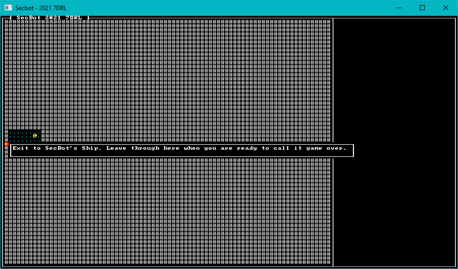

# Walking Around

Now that we have a map and tooltips, it's time to make the player respond to some input - and walk around the map. We've done most of the back-end work for this, it's largely a matter of receiving player input, parsing it, and implementing movement logic. Unlike *Hands-on Rust*, I didn't do a lot of clever systems work here - I went with something quick and functional.

## Receiving input

I wanted to support `W`/`A`/`S`/`D` as well as cursor keys, so I included that from the start. Open up `src/game/player.rs`. Extend the `player_turn` function to include input handling:

~~~rust
pub fn player_turn(ctx: &mut BTerm, ecs: &mut World, map: &mut Map) -> NewState {
    render_tooltips(ctx, ecs, map);

    // Check for input
    if let Some(key) = ctx.key {
        match key {
            VirtualKeyCode::Up | VirtualKeyCode::W => try_move(ecs, map, 0, -1),
            VirtualKeyCode::Down | VirtualKeyCode::A => try_move(ecs, map, 0, 1),
            VirtualKeyCode::Left | VirtualKeyCode::S => try_move(ecs, map, -1, 0),
            VirtualKeyCode::Right | VirtualKeyCode::D => try_move(ecs, map, 1, 0),
            _ => NewState::Wait,
        }
    } else {
        NewState::Wait
    }
}
~~~

> Can you spot the bug? I didn't, until I pushed a WASM build and let some people on the Discord try it out! I transposed `A` and `S`, causing some confusion about how to move around.

This uses the `try_move` function, which we haven't written yet. Let's fix that.

## Moving Around

The `try_move` function takes `delta_x` and `delta_y` to represent the direction in which the player is trying to move. It takes the player's current position, applies the delta and - if the move is possible - applies it. Add this after `player_turn` in `player.rs`:

~~~rust
fn try_move(ecs: &mut World, map: &mut Map, delta_x: i32, delta_y: i32) -> NewState {
    let mut find_player = <(&Player, &mut Position)>::query();
    let mut result = NewState::Wait;
    find_player.iter_mut(ecs).for_each(|(_, pos)| {
        let new_pos = pos.pt + Point::new(delta_x, delta_y);
        let new_idx = map.get_current().point2d_to_index(new_pos);
        if !map.get_current().tiles[new_idx].blocked {
            pos.pt = new_pos;
            result = NewState::Enemy;
        }
    });
    result
}
~~~

The function creates a query that looks for an entity with the `Player` and `Position` components. SecBot should be the only entity to ever match this. It sets a `result` variable, and iterates the players (hopefully, there's only one - more than one would be a bug!). It constructs `new_pos` to be the existing position plus the delta. If the current map layer doesn't have `blocked` set for this location, it applies the move.

> Can you see the other bug here? There's no bounds checking, and the game will crash spectacularly if you walk off the edge of the map.

## Extending Turn State, Again

Now that we are returning `NewState::Enemy` if the player moved - we need that to do something. Otherwise, the game will last precisely one move - and sit spinning until you find `ctrl+c` to kill it. In `main.rs`, open the `tick` function once more. For now, we'll stub out `EnemyTurn` - it just skips straight back to waiting for input:

~~~rust
let new_state = match &self.turn {
    TurnState::Modal { title, body } => render::modal(ctx, title, body),
    TurnState::WaitingForInput => game::player_turn(ctx, &mut self.ecs, &mut self.map),
    TurnState::EnemyTurn => NewState::Wait,
    _ => NewState::NoChange,
};
match new_state {
    NewState::NoChange => {}
    NewState::Wait => self.turn = TurnState::WaitingForInput,
    NewState::Enemy => self.turn = TurnState::EnemyTurn,
}
~~~

## Fixing the Capsule Floor

Open `map/tile.rs` and locate the `capsule_floor()` tile. Change `blocked` to `false` (instead of `true`). This lets SecBot navigate the escape capsule floor.

> This is why the game doesn't crash because we skipped bounds-checking! SecBot doesn't have the opportunity to leave the map, so we squeaked by without bounds-checking.

## Fixing WASD

I've shown you the silly mistake I made, let's fix WASD before I forget. In `player.rs`, reverse `A` and `S`:

~~~rust
VirtualKeyCode::Up | VirtualKeyCode::W => try_move(ecs, map, 0, -1),
VirtualKeyCode::Down | VirtualKeyCode::S => try_move(ecs, map, 0, 1),
VirtualKeyCode::Left | VirtualKeyCode::A => try_move(ecs, map, -1, 0),
VirtualKeyCode::Right | VirtualKeyCode::D => try_move(ecs, map, 1, 0),
~~~

## Oops, I Cleared the ECS at the Wrong Time

You may have noticed that the escape capsule door doesn't have a tooltip (or any other components). There was a bug in `main.rs`. In `new_game`, remove the line that says `self.ecs.clear()`. I just made a new `World` - it's empty. Clearing it after the map adds to it was a poor life choice.

## Leaving the Game

One core mechanic from the game design was the idea that if you enter the exit airlock, the game ends. Let's go ahead and make that happen.

### Decorate Position

I wanted to be able to compare `Position` components. I also thought it might be useful to be able to print debugging information for them. Open `components/position.rs` and add a `derive` to accomplish this:

~~~rust
...

#[derive(Debug, Clone, Copy, PartialEq)]
pub struct Position {
    ...
~~~

### Add a TileTrigger component

I thought it might be useful to have tiles that do something when the player enters them. Let's create a new component to indicate this. Create a new file: `src/components/tile_trigger.rs` and insert the following contents:

~~~rust
pub enum TriggerType {
    EndGame,
}

pub struct TileTrigger(pub TriggerType);
~~~

Also include `mod tile_trigger; pub use tile_trigger::*;` in `components/mod.rs`.

### Update the game exit

Open up `map/layerbuilder/entrance.rs`. Add an import for `TileTrigger` (or just use `components::*`). Then, in the `add_game_exit` function, add a `TileTrigger` to the components you are creating for the exit:

~~~rust
ecs.push((
        Position::with_pt(pt, 0),
        Description(
            "Exit to SecBot's Ship. Leave through here when you are ready to call it game over."
                .to_string(),
        ),
        TileTrigger(crate::components::TriggerType::EndGame),
    ));
~~~

The exit now has a `TileTrigger` component. Open up `map/tile.rs` and fix the exit tile:

~~~rust
pub fn game_over() -> Self {
    Self {
        glyph: to_cp437('+'),
        color: ColorPair::new(YELLOW, RED),
        blocked: false,
        opaque: false,
    }
}
~~~

Notice the change? `blocked` is now `false`, allowing SecBot to walk into the tile.

### Detecting Tile Triggers

Now that we support triggers and have one, the player needs to fire the trigger when they enter a trigger tile. Let's extend the `player_turn` function (in `game/player.rs`) some more to include an exit check. Entering an exit can change the game state, so we have to do a little dance. The code after `render_tooltips` looks like this:

~~~rust
pub fn player_turn(ctx: &mut BTerm, ecs: &mut World, map: &mut Map) -> NewState {
    render_tooltips(ctx, ecs, map);

    // Check for input
    let mut new_state = if let Some(key) = ctx.key {
        match key {
            VirtualKeyCode::Up | VirtualKeyCode::W => try_move(ecs, map, 0, -1),
            VirtualKeyCode::Down | VirtualKeyCode::A => try_move(ecs, map, 0, 1),
            VirtualKeyCode::Left | VirtualKeyCode::S => try_move(ecs, map, -1, 0),
            VirtualKeyCode::Right | VirtualKeyCode::D => try_move(ecs, map, 1, 0),
            _ => NewState::Wait,
        }
    } else {
        NewState::Wait
    };

    // Check for tile trigger effects
    tile_triggers(&mut new_state, ecs, map);

    new_state
}
~~~

See the difference? We store the result of the input `match` in a mutable variable called `new_state`. Then we call `tile_triggers`, passing it the `new_state` mutably so it has a chance to override it if it needs to.

The `tile_triggers` function needs to be added to the end of the `game/player.rs` file:

~~~rust
fn tile_triggers(new_state: &mut NewState, ecs: &mut World, map: &mut Map) {
    if *new_state != NewState::Wait {
        return;
    }
    let mut find_player = <(&Player, &Position)>::query();
    let player_pos = find_player.iter(ecs).map(|(_, pos)| *pos).nth(0).unwrap();

    let mut find_triggers = <(&TileTrigger, &Position)>::query();
    find_triggers
        .iter(ecs)
        .filter(|(_, pos)| **pos == player_pos)
        .for_each(|(tt, _)| match tt.0 {
            TriggerType::EndGame => *new_state = NewState::LeftMap,
        });
}
~~~

The function works like this:

1. If the new state isn't waiting for input, exit. This will change later - for now, I wanted to let it render once after you move into the exit tile, to help me with some debugging.
2. It runs a query to find the player's location. The "iter->map->nth->unwrap" pattern is ugly, but worked really well in *Hands-on Rust* - so I used it.
3. It iterates tile triggers, and if the trigger matches the new location, it matches on the trigger type. There's only one for now, which ends the game. So if the game is ending, we return a new `NewState` type - `LeftMap`.

### Implement LeftMap

In `main.rs`, add a `PartialEq` derivation and `LeftMap` to `NewState`:

~~~rust
#[derive(PartialEq)]
pub enum NewState {
    NoChange,
    Wait,
    Enemy,
    LeftMap,
}
~~~

I forgot to add `PartialEq` earlier. It's handy. Also, extend `TurnState` to include an additional `GameOverLeft` option:

~~~rust
enum TurnState {
    WaitingForInput,
    PlayerTurn,
    EnemyTurn,
    Modal{title: String, body: String},
    GameOverLeft,
}
~~~

Now down in the `tick` function, the matchers need updating to include the new `LeftMap` state:

~~~rust
impl GameState for State {
    fn tick(&mut self, ctx: &mut BTerm) {
        ctx.cls();
        render::render_ui_skeleton(ctx);
        self.map.render(ctx);
        render::render_glyphs(ctx, &self.ecs, &self.map);

        let new_state = match &self.turn {
            TurnState::Modal { title, body } => render::modal(ctx, title, body),
            TurnState::WaitingForInput => game::player_turn(ctx, &mut self.ecs, &mut self.map),
            TurnState::EnemyTurn => NewState::Wait,
            TurnState::GameOverLeft => render::game_over_left(ctx),
            _ => NewState::NoChange,
        };
        match new_state {
            NewState::NoChange => {}
            NewState::Player => self.turn = TurnState::EnemyTurn,
            NewState::Wait => self.turn = TurnState::WaitingForInput,
            NewState::Enemy => self.turn = TurnState::EnemyTurn,
            NewState::LeftMap => self.turn = TurnState::GameOverLeft,
        }
    }
}
~~~

Notice the new changes? `TurnState::GameOverLeft` calls a new `game_over_left` function. The `NewState::LeftMap` state puts the game into `GameOverLeft` mode.

### Rendering the End

I added the following function to `render/mod.rs`:

~~~rust
pub fn game_over_left(ctx: &mut BTerm) -> NewState {
    ctx.cls();
    ctx.print(
        1,
        1,
        "Game over. You left the map. Haven't written the stuff to show here.",
    );
    ctx.print(
        1,
        2,
        "You need to refresh or reload. Haven't done restarting yet.",
    );
    NewState::NoChange
}
~~~

Notice that the game basically apologizes that I haven't written any more functionality, yet. I do that a lot. It's good to have a place-holder for when I write the real version!

## Give it a whirl

You can walk around with WASD or the cursor keys. The escape pod airlock door has a tooltip, and ends the game. Life is good.

> You can find the source code for `hello_secbot` [here](https://github.com/thebracket/secbot-2021-7drl/tree/tutorial/tutorial/hello_secbot/).

## Onwards!

The basic skeleton of the game is now in place. We've implemented:
* A basic map.
* Turn-state.
* Modal dialogs.
* Moving around the map.
* Ending the game.
* Tooltips.

That's a pretty good start, but I still had some day remaining. So, onwards to building the basic map.