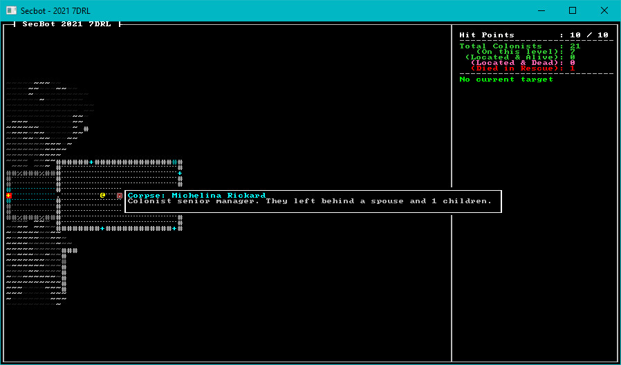

# Sad Colonists

I let a few friends play SecBot, and they were getting a little too trigger-happy with colonists. One user on the roguelikedev discord suggested adding a little flavor text to make it seem like a sad event when a colonist dies. This is a very short session, but is a good example of how to cheaply add tone to a game.

Open `src/game/combat.rs`, and find the `kill_things` function. We're going to add a `was_colonist` variable to flag if a now-dead entity used to be a colonist:

```rust
fn kill_things(ecs: &mut World, commands: &mut CommandBuffer, dead_entities : Vec<Entity>, splatter: &mut Option<RGB>) {
    dead_entities.iter().for_each(|entity| {
    if let Ok(mut er) = ecs.entry_mut(*entity) {
        let mut was_colonist = false;
        if let Ok(_colonist) = er.get_component_mut::<ColonistStatus>() {
            commands.add_component(*entity, ColonistStatus::DiedAfterStart);
            was_colonist = true;
        }
        ...
```

Now go a bit further down the function. After the `if let Ok(n) = er.get_component_mut::<Name>()` block, add a new block that uses `was_colonist`:

```rust
if was_colonist {
    if let Ok(d) = er.get_component_mut::<Description>() {
        let mut rng = RandomNumberGenerator::new();
        if rng.range(0,10) < 5 {
            d.0 = format!("{} They left behind a spouse and {} children.", d.0, rng.range(1, 8));
        }
    }
}
```

This code checks that the victim was a colonist. If there were, and it can access their `Description` component, it rolls a dice. For about half the people, it appends that they left behind some family.



## Wrap-Up

That was quick! It's amazing how little things can make a difference to a game. If the player takes the time to look at a corpse, they now have more reason to feel guilty about killing it---or angry at the monsters. Next up, we have a few tweaks to the map to make the game flow better.

> You can find the source code for `sad_colonists` [here](https://github.com/thebracket/secbot-2021-7drl/tree/tutorial/tutorial/sad_colonists/).
