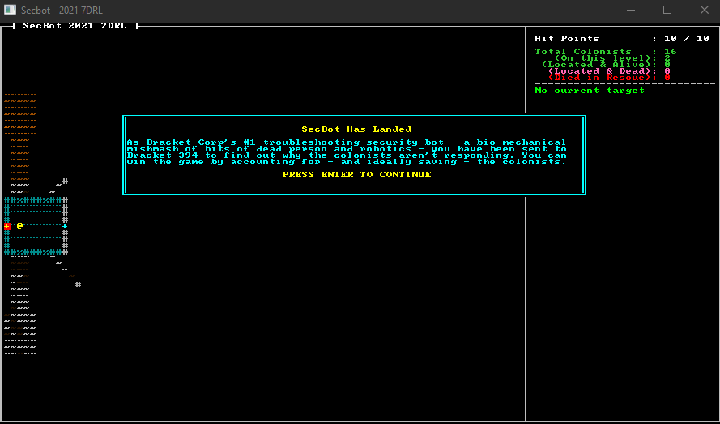

# Shooting Things

Combat is central to most roguelikes, and SecBot is no exception. So we'll revisit the combat system a few times as we race towards the finish line. In this section, we'll get the basics working. This is a smorgasboard of a section---there's a lot to process.

## Hit Probability Estimate

You'll be referencing the `game` module from places other than `main.rs` in this section. Open `src/main.rs` and change `mod game;` to `pub mod game;`. That makes it available everywhere in the project.

I ended up not keeping this in the final game, but I decided to display an approximation of success for hitting your target.

Open `src/game/player.rs`, and add a new function:

```rust
// Returns (probability, range)
pub fn hit_probability(ecs: &World, target: Entity) -> (u32, u32) {
    let mut target_pos = Point::zero();
    if let Ok(entry) = ecs.entry_ref(target) {
        if let Ok(pos) = entry.get_component::<Position>() {
            target_pos = pos.pt;
        }
    }

    let player_pos = <(&Player, &Position)>::query()
        .iter(ecs)
        .map(|(_, pos)| pos)
        .nth(0)
        .unwrap()
        .pt;

    let range = DistanceAlg::Pythagoras.distance2d(player_pos, target_pos) as u32;

    // TODO: More complexity here
    let mut hit_chance = 90;
    if range > 5 {
        hit_chance -= (range - 5) * 5;
    }

    (hit_chance, range)
}
```

The function calculates the range to the target, and calculates a probability based on this. Since we'll be removing this again in a few sections, I've left it as an after-thought.

Now that we have targeting probability, let's display it. Open `src/render/targeting_panel.rs`, and add an import for a new module at the top:

```rust
use crate::game::player::hit_probability;
```

Now in the targeting code, add the following:

```rust
let (probability, range) = hit_probability(ecs, target_entity);
ctx.print_color(x, y, WHITE, BLACK, format!("Hit probability: {}%", probability));
y += 1;
ctx.print_color(x, y, WHITE, BLACK, format!("Range          : {}", range));
y += 1;
```

## More Dependencies: Ultraviolet

I like `ultraviolet`. It provides a very thorough set of vector and matrix math libraries, and does an amazing job (via the `wide` crate) of turning them into *really* fast SIMD code. We'll use it later, so open `Cargo.toml` and add a dependency:

```toml
ultraviolet = "0.7.5"
```

We'll make use of ultraviolet's fast vector processing in the shooting section. So add it for now, and you'll be ready for when we need it.

## New Components

We're going to require a few new component types for this section. I've gathered them together, so you aren't jumping around too much while you add them.

## Bloodstains

I wanted it to be obvious that a fight had occurred in an area. One way to do this is to make wounded entities leave blood stains. That way, when you return to an area you have immediate feedback that a fight took place here. It would also be nice to have different types of critter leave varying colors of blood. To accomplish that, create a new file `src/components/blood.rs`. The file contains a simple component:

```rust
use bracket_lib::prelude::RGB;

#[derive(Debug)]
pub struct Blood(pub RGB);
```

Now open `src/components/mod.rs` and include a `mod blood; pub use blood::*;` statement to include it in your project.

### Projectiles

Since we're going to be firing projectiles, it's a good idea to represent them. Projectiles will be their own entity, with a pre-defined path. They will act like a particle, following the path until they expire. This lets us give good visual feedback that we're shooting, without slowing the game down as a whole. Create another new component file named `src/components/projectile.rs`. The file contains:

```rust
use bracket_lib::prelude::{ColorPair, FontCharType, Point};

pub struct Projectile {
    pub path: Vec<Point>,
    pub layer: usize,
}
```

Once again, you need to add a `mod projectile; pub use projectile::*;` to `src/components/mod.rs`.

### Found Component

I wasn't happy with how we were storing colonist statuses, so I made a new tag component to indicate that we'd found a colonist. This differs from "active" in that its possible to locate a colonist---but they are already dead. Open `src/components/tags.rs` and add another component to it:

```rust
pub struct Found;
```

## Shooting Things

I know you've been waiting for this. It's time to implement some death and destruction!

### The Fire Commands

Open `src/game/player.rs` and we'll add a placeholder command to the list of keys to process. Pressing `F` calls the new `open_fire_at_target` function:

```rust
VirtualKeyCode::F => open_fire_at_target(ecs, map),
```

Now find the `can_be_activated.for_each` code, and replace it as follows:

```rust
can_be_activated.for_each_mut(ecs, |(entity, _, pos)| {
    if pos.layer == map.current_layer as u32 && vt.contains(&pos.pt) {
        commands.add_component(*entity, Found {});
        if DistanceAlg::Pythagoras.distance2d(player_pos, pos.pt) < 6.0 {
            commands.remove_component::<CanBeActivated>(*entity);
            commands.add_component(*entity, Active {});
        }
    }
});
```

The changes are that if an entity is visible, we add `Found` to it. It's been located, so even if it is dead it counts on the colonist count. Then, if you are close enough to the target we remove its `CanBeActivated` and substitute an `Active` component.

Now it's time for `open_fire_at_target`! This function is added to the very end of `player.rs`. Let's start with a function signature and obtain the player entity and current target:

```rust
fn open_fire_at_target(ecs: &mut World, map: &mut Map) -> NewState {
    let mut commands = CommandBuffer::new(ecs);
    let mut player_pos = Point::zero();
    let mut target = None;
    let mut current_layer = map.current_layer as u32;
    <(&Player, &Position, &Targeting)>::query()
        .iter(ecs)
        .for_each(|(_, pos, targeting)| {
            player_pos = pos.pt;
            target = targeting.current_target;
        });

    // If there's nothing to fire at, return to waiting
    if target.is_none() {
        return NewState::Wait;
    }
```

Next we'll build a set named `pos_map` that lists everything with a `Position` and `Health` component on the map. We'll use this to determine if the projectile passes through anything that can be damaged.

```rust
    let pos_map = <(&Position, &Health)>::query()
        .iter(ecs)
        .map(|(pos, _)| pos.pt)
        .collect::<HashSet<Point>>();
```

Next, we determine where the target is. We'll create some variables for use later on, too:

```rust
    if let Some(target) = target {
        if let Ok(target_ref) = ecs.entry_ref(target) {
            if let Ok(target_position) = target_ref.get_component::<Position>() {
                let target_pos = target_position.pt;
                let mut power = 20;
                let mut range = 0;
                let mut projectile_path = Vec::new();
                let mut splatter = None;
```

We're storing the target's position in `target_pos` for easy access. Power represents how much energy is left in the projectile as it travels. We want the chance to shoot *through* targets and damage whatever is behind them. Range tracks how far the projectile has travelled so far. We make an empty vector to store the intended trajectory (we'll use this for the projectile particle effect) and set a variable called `splatter` to `None`. If we make a bloody mess en route, we'll store the bloody mess information in here.

Now we use `line2d_bresenham` to plot a line between the starting position and the target. We call `skip(1)` to miss the first tile---we don't want to allow the player to accidentally shoot themselves. Then we embark on a long `for_each` block. For each tile in the target line, we:

1. Push it into the `projectile_path` vector, tracking where the bullet went.
2. If the `pos_map` set we made earlier contains the current tile, we call `hit_tile_contents` (we'll write that in a moment) and reduce the projectile's power by the returned amount. The projectile weakens as it passes through solid objects.
3. If the `splatter` variable has contents, then we we darken the stored blood splatter.
4. We add 1 to `range`, indicating that the projectile has traveled 1 tile.
5. If `range` is greater than 5, we reduce its power by 1.

Here's the code for the this section:

```rust
                line2d_bresenham(player_pos, target_pos)
                    .iter()
                    .skip(1)
                    .for_each(|pt| {
                        projectile_path.push(*pt);
                        if pos_map.contains(&pt) {
                            power -= hit_tile_contents(
                                ecs,
                                *pt,
                                current_layer,
                                &mut commands,
                                &mut splatter,
                            );
                        }
                        if let Some(bsplatter) = &mut splatter {
                            let idx = map.get_current().point2d_to_index(*pt);
                            map.get_current_mut().tiles[idx].color.bg = bsplatter.to_rgba(1.0);
                            bsplatter.r = f32::max(0.0, bsplatter.r - 0.1);
                            bsplatter.g = f32::max(0.0, bsplatter.g - 0.1);
                            bsplatter.b = f32::max(0.0, bsplatter.b - 0.1);
                            if bsplatter.r + bsplatter.g + bsplatter.b < 0.1 {
                                splatter = None;
                            }
                        }
                        range += 1;
                        if range > 5 {
                            power -= 1;
                        }
                    });
```

When we get to the end of following the line's path, the projectile has traveled from the shooter to the intended victim. We want over-penetration to be a thing, so we need to figure out where the projectile will go next. The next two lines calculates a slope for the existing trajectory, allowing us to continue the projectile's travel:

```rust
                use ultraviolet::Vec2;
                let mut projectile_pos: Vec2 = Vec2::new(target_pos.x as f32, target_pos.y as f32);
                let slope = (projectile_pos - Vec2::new(player_pos.x as f32, player_pos.y as f32))
                    .normalized();
```

We're making use of Ultraviolet's normalize function, and using its `Vec2` types for speed. It probably didn't make a big difference, but I'm always happy to use someone else's vector math library!

Now, we continue the bullet's path while it has traveled fewer than 25 tiles and still has any power. Notice that it's basically the same steps as we used for the first part of the trajectory:

```rust
                while range < 25 && power > 0 {
                    projectile_pos += slope;
                    let pt = Point::new(projectile_pos.x as i32, projectile_pos.y as i32);
                    projectile_path.push(pt);
                    if pos_map.contains(&pt) {
                        power -=
                            hit_tile_contents(ecs, pt, current_layer, &mut commands, &mut splatter);
                    }
                    if let Some(bsplatter) = &mut splatter {
                        let idx = map.get_current().point2d_to_index(pt);
                        map.get_current_mut().tiles[idx].color.bg = bsplatter.to_rgba(1.0);
                        bsplatter.r = f32::max(0.0, bsplatter.r - 0.1);
                        bsplatter.g = f32::max(0.0, bsplatter.g - 0.1);
                        bsplatter.b = f32::max(0.0, bsplatter.b - 0.1);
                        if bsplatter.r + bsplatter.g + bsplatter.b < 0.1 {
                            splatter = None;
                        }
                    }
                    let idx = map.get_current().point2d_to_index(pt);
                    if map.get_current().tiles[idx].tile_type == TileType::Wall {
                        range += 100;
                        power = 0;
                    }
                    if !map.get_current().tiles[idx].opaque && power > 5 {
                        // TODO: End the game because you broke a window
                    }
                    range += 1;
                    if range > 5 {
                        power -= 1;
                    }
                }
```

Next, we use the command buffer to create a new projectile with the path we determined. We also close out our `if` statements, handling the cases in which the shooter couldn't pull the trigger.

```rust

                commands.push((
                    Projectile {
                        path: projectile_path,
                        layer: current_layer as usize,
                    },
                    Glyph {
                        glyph: to_cp437('*'),
                        color: ColorPair::new(RED, BLACK),
                    },
                ));
            } else {
                // Unable to fire
                return NewState::Wait;
            }
        } else {
            // Unable to fire
            return NewState::Wait;
        }
    }

    commands.flush(ecs);
    NewState::Player
}
```

We used the `hit_tile_contents` function several times. It also gets added to the end of `src/game/player.rs`. Once again, let's start with the function header:

```rust
fn hit_tile_contents(
    ecs: &mut World,
    pt: Point,
    layer: u32,
    commands: &mut CommandBuffer,
    splatter: &mut Option<RGB>,
) -> i32 {
```

We need access to the ECS, the target point and layer index, the command buffer we've been building, and the `splatter` variable. The function returns the power loss from hitting that tile's content.

Next, we obtain a random number generator lock:

```rust
    let mut rng_lock = crate::RNG.lock();
    let rng = rng_lock.as_mut().unwrap();
```

We'll need that later. We need to create variables called `power_loss` (as we total up power loss) and `dead_entities` (listing entities that were killed):

```rust
    let mut power_loss = 0;
    let mut dead_entities = Vec::new();
```
Next, we query entity locations and obtain a mutable `Health` value. If an entity is in the current target square, we reduce its health by a random amount. Then we reduce the projectile's `power` by the number of hit points they had remaining. If the entity died, we add it to the `dead_entities` list:

```rust
    <(Entity, &Position, &mut Health)>::query()
        .iter_mut(ecs)
        .filter(|(_, pos, _)| pos.layer == layer && pos.pt == pt)
        .for_each(|(entity, _, hp)| {
            let damage = rng.range(1, 5) + 10; // TODO: Complexity, please
            hp.current -= damage;
            if hp.current < 0 {
                hp.current = 0;
                dead_entities.push(*entity);
            }
            power_loss += hp.current;
        });
```

Now that we've potentially hit everything in the tile, we iterate `dead_entities`. This section removes `Health`, `Active`, `CanBeActivated`, `Blood` and `Targetable` components.  If the target was a colonist, we turn them into a corpse---retaining their former name.

```rust
    dead_entities.iter().for_each(|entity| {
        if let Ok(mut er) = ecs.entry_mut(*entity) {
            if let Ok(_colonist) = er.get_component_mut::<ColonistStatus>() {
                commands.add_component(*entity, ColonistStatus::DiedAfterStart);
            }
            if let Ok(g) = er.get_component_mut::<Glyph>() {
                g.color.bg = DARK_RED.into();
                g.color.fg = DARK_GRAY.into();
            }
            if let Ok(n) = er.get_component_mut::<Name>() {
                n.0 = format!("Corpse: {}", n.0);
            }
            if let Ok(b) = er.get_component::<Blood>() {
                *splatter = Some(b.0);
            }
        }
        commands.remove_component::<Health>(*entity);
        commands.remove_component::<Active>(*entity);
        commands.remove_component::<CanBeActivated>(*entity);
        commands.remove_component::<Blood>(*entity);
        commands.remove_component::<Targetable>(*entity);
    });

    power_loss
}
```

That finishes the first draft of the shooting system! It's pretty messy, both in terms of code and what it does to victims. :-)

## Rendering Changes

Open `src/main.rs` and find the call to `render_speech`. Add another render call after it:

```rust
render::speech::render_speech(ctx, &mut self.ecs, &self.map);
+render::projectiles::render_projectiles(ctx, &mut self.ecs, &self.map);
```

We'll write that function in a moment. While we're in `main.rs`, let's cap the game's framerate:

```rust
fn main() -> BError {
    let context = BTermBuilder::simple(112, 62)?
        .with_title("Secbot - 2021 7DRL")
        .with_fps_cap(60.0)
        .build()?;
```

We're doing this to make it easier to time projectile paths. We could read `frame_time_ms` each time, but I was in a hurry (and really should have done it properly!).

### Giving Blood to Colonists and Monsters

While colonists will doubtless need a blood transfusion after this update, we're more concerned with giving them blood at all so they participate in the splatter system. Open `src/map/layerbuilder/colonists.rs`. In `build_base_colonist` add one more component to the colonists:

```rust
commands.add_component(entity, Blood(DARK_RED.into()));
```

Monsters should also bleed, an icky dark green. Open `src/map/layerbuilder/monsters.rs` and add one more component to the face eater:

```rust
Blood(DARK_GREEN.into()),
```

### Counting Colonists

Open `src/render/colonist_panel.rs` and change `if let Ok(_) = entry.get_component::<Active>() {` to read:

```rust
if let Ok(_) = entry.get_component::<Found>() {
```

This way, we are counting colonists who have been located---alive or dead.

### Projectile Rendering

In the file `src/render/mod.rs`, add `pub mod projectiles;`. Then (predictably!), create a new file named `src/render/projectiles.rs`. It's contents are as follows:

```rust
use crate::{components::*, map::Map, map::WIDTH};
use bracket_lib::prelude::*;
use legion::*;

pub fn render_projectiles(ctx: &mut BTerm, ecs: &mut World, map: &Map) {
    let mut commands = legion::systems::CommandBuffer::new(ecs);
    let mut query = <(Entity, &Glyph, &mut Projectile)>::query();
    query.for_each_mut(ecs, |(entity, glyph, projectile)| {
        if projectile.layer == map.current_layer {
            if projectile.path.is_empty() {
                commands.remove(*entity);
            } else {
                let pt = projectile.path[0];
                projectile.path.remove(0);
                ctx.set(
                    pt.x + 1,
                    pt.y + 1,
                    glyph.color.fg,
                    glyph.color.bg,
                    glyph.glyph,
                );
            }
        }
    });
    commands.flush(ecs);
}
```

This works by rendering the projectile's first path location each frame, and then removing that from the path list---so next frame it renders the next one. When there are no path entries remaining, the projectile ceases to exist. This is very similar to how particles are generally implemented.

## Wrap-Up

Whew! That was a lot of steps. The good news is that you can now lay waste to colonists and monsters alike.



> You can find the source code for `shooting1` [here](https://github.com/thebracket/secbot-2021-7drl/tree/tutorial/tutorial/shooting1/).

Up next, we'll clean up some code warnings---and start to let the mobs fight back.