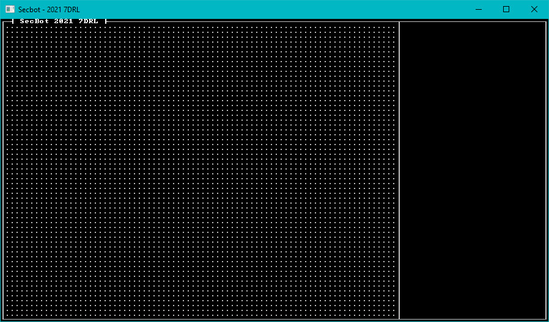

# Building the superstructure

In my mental design sketches, the map was going to be 80 tiles wide by 60 characters tall. That's probably larger than I actually needed, but it worked. I needed room for a UI, so I went with `112x62` for my initial window size. I opened up `src/main.rs` and modified the initializer:

~~~rust
fn main() -> BError {
    let context = BTermBuilder::simple(112, 62)?
        .with_title("Secbot - 2021 7DRL")
        .with_fps_cap(30.0)
        .build()?;

    main_loop(context, State::new())
}
~~~

Notice that:

* I've modified `main` to return a `BError`, just like in *Hands-on Rust*. This lets me use the question mark operator rather than throwing `expect` everywhere.
* I added a window title.
* I capped the frame rate at 30 FPS. This keeps the game from eating too much CPU, and gives a consistent render speed.
* I've added a `new` function to `State`. We'll get there in a second.

This is a pretty tried-and-true setup, so testing consisted of `cargo run` - yup, it works.

## Implementing State and Initializing Legion

I was sure that I'd be using Legion, so I extended the `use` statements at the top of `main.rs` to include it:

~~~rust
use bracket_lib::prelude::*;
pub use legion::*;
~~~

I then extended `State` to include an Entity-Component System world:

~~~rust
struct State {
    ecs: World,
}
~~~

Finally, I added a `new` function to act as a constructor for `State`:

~~~rust
impl State {
    fn new() -> Self {
        Self {
            ecs: World::default()
        }
    }
}
~~~

Once again, a quick `cargo run` was enough to see that it didn't explode.

## Finding the Map

With a pretty solid idea for how the map should work, it was clear that I'd need one. I extended the `use` statements in `main.rs` to include one:

~~~rust
mod map;
use map::Map;
~~~

Then I created a directory called `map` (`src` is the parent) and made a file called `mod.rs`. I like to keep my `mod.rs` files relatively clean - mostly just importing other things and setting module-wide constants. The `mod.rs` files looks like this:

~~~rust
pub const WIDTH: usize = 80;
pub const HEIGHT: usize = 60;
const TILES: usize = WIDTH * HEIGHT;
pub const NUM_LAYERS: usize = 5;

mod tile;
use tile::Tile;
mod layer;
use layer::Layer;
mod map;
pub use map::Map;
//mod layerbuilder;
~~~

The top part is pretty self-explanatory: it sets the `WIDTH` and `HEIGHT` constants to the map dimensions. It calculates `TILES` to be the number of tiles this requries (80x60 = 4,800). These are constants to make it easy to change them if I change my mind on some design elements later on.

The rest refers to a bunch of modules we haven't created yet! I had a good idea of what I wanted (I've used this template before), so it served as a signpost for development. It won't compile at this point.

> Notice that `LAYERS` is equal to 5. It really should have read `4`, but I missed it when I was setting this up. I've left the bug in place so that you can see the progression of development under a time crunch.

### Making Tiles

My map is going to be tile-based, so a good starting point was "what is a tile?". In the `map` directory, I created a file named `tile.rs` and created a `Tile` structure:

~~~rust
use bracket_lib::prelude::*;

#[derive(Clone)]
pub struct Tile {
    pub glyph: FontCharType,
    pub color: ColorPair,
    pub blocked: bool,
    pub opaque: bool,
}

impl Tile {
    pub fn default() -> Self {
        Self {
            glyph: to_cp437('.'),
            color: ColorPair::new(GREY, BLACK),
            blocked: false,
            opaque: false,
        }
    }
}
~~~

That's pretty much the minimum for a tile:

* `glyph` tells the game what codepage-437 character to render for the tile.
* `color` defines a foreground and background color.
* `blocked` and `opaque` will be used when movement and field-of-view come into play. If a tile is `blocked`, you can't walk into it. If its `opaque`, you can't see through it.

### Layering the Cake

I'd decided up-front that I was going to have multiple levels, and entities other than the player needed to be able to navigate them. That required that I have *all* the map layers available when the world was created - I couldn't lazily make them as needed. I also knew that the overall game map would consist of several layers (4, even though I wrote 5 in the definition file!). So I created a `layer.rs` file in the `map` directory and added in a basic description of a `Layer` type:

~~~rust
use super::{Tile, HEIGHT, TILES, WIDTH};
use bracket_lib::prelude::*;
use legion::*;

pub struct Layer {
    pub tiles: Vec<Tile>,
    pub starting_point: Point,
}
~~~

I haven't written `layerbuilder` yet, but it's coming. We'll get to that in a second. Otherwise, the layer is pretty simple: a vector of `Tile` types, and a `Point` defining where the player starts on the level. I wanted some functionality, so I started implementing things for `Layer`. First up, a constructor:

~~~rust
impl Layer {
    pub fn new(depth: usize, ecs: &mut World) -> Self {
        let layer = match depth {
            _ => Self {
                tiles: vec![Tile::default(); TILES],
                starting_point: Point::new(WIDTH / 2, HEIGHT / 2),
            },
        };
        layer
    }
}
~~~

This is a little odd at first glance. It takes the `depth` (layer number) and a mutable reference to the ECS as parameters (so we can add stuff to the game when we build the map). It just makes an empty level with no entities on it (you'll get a warning for not using the `ecs` at this point).

I also wanted some rendering code. Note that I'm offsetting all the positions by 1 - I wanted to put a border around the map. Here's the `render` function; it should look familar, it's *very* similar to that found in *Hands-On Rust*:

~~~rust
impl Layer {
    // The `new` function goes here

    pub fn render(&self, ctx: &mut BTerm) {
        let mut y = 0;
        let mut idx = 0;
        while y < HEIGHT {
            for x in 0..WIDTH {
                let t = &self.tiles[idx];
                ctx.set(x+1, y+1, t.color.fg, t.color.bg, t.glyph);
                idx += 1;
            }
            y += 1;
        }
    }
}
~~~

It iterates the map, and draws each tile. Very simple stuff.

### The Map - A structure of layers

The map is a collection of layers, with some helpers to access it. Create a new file, `map.rs` inside the `map` directory. The basic structure is:

~~~rust
use super::{Layer, NUM_LAYERS};
use bracket_lib::prelude::*;
use legion::World;

pub struct Map {
    pub current_layer: usize,
    layers: Vec<Layer>,
}
~~~

So there's an index to the currently active layer, and a vector of `Layer` types. Now, let's implement a constructor for it:

~~~rust
impl Map {
    pub fn new(ecs: &mut World) -> Self {
        let mut layers = Vec::with_capacity(NUM_LAYERS);
        for i in 0..NUM_LAYERS {
            layers.push(Layer::new(i, ecs));
        }
        Self {
            current_layer: 0,
            layers,
        }
    }
~~~

> Note that the implementation continues, keep adding to the `impl` block. 

The constructor creates a vector with capacity for the number of layers we defined in `mod.rs`. It then iterates from 0 to the number of layers, pushing a new layer - and passing in the layer number and the ECS.

I wanted a quick way to render the current layer, so the next implemented function is `render`:

~~~rust
    pub fn render(&self, ctx: &mut BTerm) {
        self.layers[self.current_layer].render(ctx);
    }
~~~

Very straightforward - it just calls `render` for the current map layer. I also needed to be able to access the individual layers:

~~~rust
    pub fn get_current(&self) -> &Layer {
        &self.layers[self.current_layer]
    }

    pub fn get_current_mut(&mut self) -> &mut Layer {
        &mut self.layers[self.current_layer]
    }
}
~~~

These just return a pointer to the requested layer.

## Minimal map drawing

Now that the map exists (albeit as a set of empty maps, consisting of just floors), we can update the `src/main.rs` function to use it. Start by adding to the `main.rs` include list:

~~~rust
use bracket_lib::prelude::*;
pub use legion::*;
pub mod map;
pub use map::*;
~~~

Then extend `State` to hold a map and initialize it:

~~~rust
struct State {
    ecs: World,
    map: map::Map,
}

impl State {
    fn new() -> Self {
        let mut ecs = World::default();
        let map = map::Map::new(&mut ecs);
        Self { ecs, map }
    }
}
~~~

### Drawing the Map

I adjusted the `tick` function in `main.rs` to render the map and draw a border around it:

~~~rust
impl GameState for State {
    fn tick(&mut self, ctx: &mut BTerm) {
        ctx.cls();
        use map::{HEIGHT, WIDTH};
        ctx.draw_hollow_box(0, 0, WIDTH+1, HEIGHT+1, GRAY, BLACK);
        ctx.print_color(2, 0, WHITE, BLACK, "┤ SecBot 2021 7DRL ├");
        ctx.draw_hollow_box(WIDTH+1, 0, 30, HEIGHT+1, GRAY, BLACK);
        ctx.set(WIDTH+1, 0, GRAY, BLACK, to_cp437('┬'));
        ctx.set(WIDTH+1, HEIGHT+1, GRAY, BLACK, to_cp437('┴'));
        self.map.render(ctx);
    }
}
~~~

You can run the game now, and see a field of `.` characters. Map rendering is working!

# Next-Up: Entities

That's not the most impressive game ever, but getting a field of dots onto the console is a great start.

> You can find the source code for `sea_of_dots` [here](https://github.com/thebracket/secbot-2021-7drl/tree/tutorial/tutorial/sea_of_dots/).
