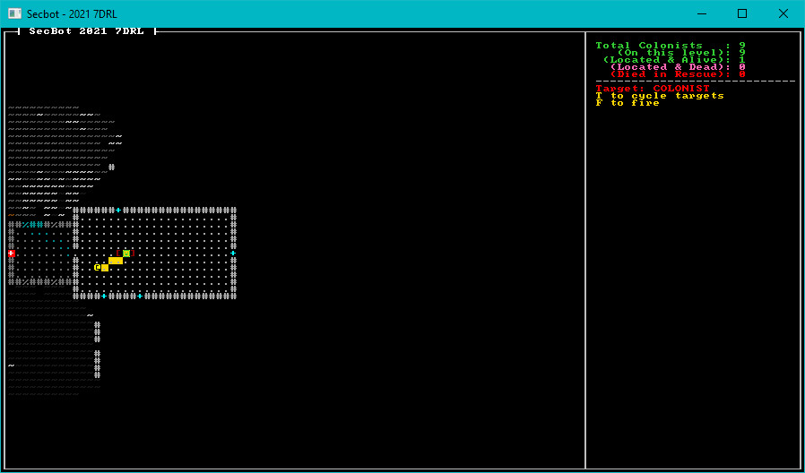

# Targetable Component

I really wanted the player to be able to interact with (shoot!) scenery, friendlies - everything. I had a vague idea that the corporation behind SecBot's adventure would fine him/her (it?) for property damage, and complain if they killed too many friendlies. As a result, having the targeting system just look for `Hostile` tag components wasn't going to cut it.

## Create a New Component

Open `src/components/tags.rs` and let's add a new component indicating that an entity can be targeted:

~~~rust
pub struct Targetable;
~~~

That's all there is to creating a new component; Legion really is great about that. Let's make some entities targetable.

## Making Entities Targetable

The obvious candidates for being targetable at this point are colonists and monsters. Open up `src/map/layerbuilder/colonists.rs` and find the function `spawn_random_colonist`. At the end of the `push` statement listing components, add the new component:

~~~rust
    ...
    Name("Colonist".to_string()),
    Targetable{},
));
~~~

Now repeat that for `spawn_first_colonist`.

Now open `src/map/layerbuilder/monsters.rs` and do the same for `spawn_face_eater(..)`:

~~~rust
    ...
    Name("Face Eater".to_string()),
    Hostile{},
    Targetable{},
    ...
~~~

Your colonists and monsters are now on the list of valid targets. The next step is to adjust the targeting code to make use of the new component.

## Targeting Entities

The final change required to the targeting system is to make `Targetable` entities available to the targeting system, rather than just `Hostile` entities. Fortunately, this isn't a large job. Open up `src/game/player.rs`. Find the `Targeting system` comment and amend the query to find `Targetable` entities rather than `Hostile` ones:

~~~rust
let mut possible_targets = <(Entity, &Targetable, &Position)>::query();
~~~

## Try it out

And that's it! You can now target colonists as well as monsters, should you wish to go on a killing spree. When we get scenic items in (useless decorations that provide flavor), they can be included in the targeting system too. Anything else we decide is worth shooting can also be included. Here's a colonist being targeted:

> You can find the source code for `targetable_colonists` [here](https://github.com/thebracket/secbot-2021-7drl/tree/tutorial/tutorial/targetable_colonists/).

Next up, we'll start building additional map layers.