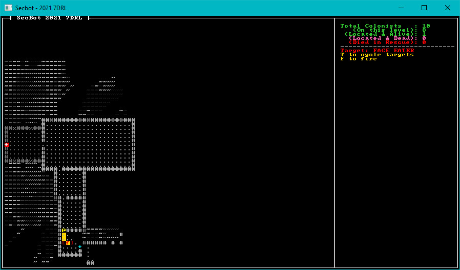

{{#include header.md}}

# Targeting

Now that you can rescue colonists, and they can tell you about their awful day - it's time to start adding an element of risk to the game. I very much see the game as a "bug hunt" - you find monsters and shoot them.

## Let's Start by Fixing a Bug

A "bug hunt" is a good description of most time-trial projects. You spend a surprising amount of time finding bugs and mistakes you made in your hasty rush to enter some code!

In the player logic, we'd carefully only run systems like field-of-view is the game state was not equal to `Wait`. In other words, only if the player was executing an action. Events weren't firing in quite the order I wanted, so I changed all instances of `if *new_state != NewState::Wait` to `if *new_state == NewState::Wait` in `player.rs` - to make them fire when the user has stopped mashing keys.

## Create a Name Component

We want to start naming things, so we have a name to display in the targeting panel. Create a new component file named `src/components/name.rs`:

~~~rust
#[derive(Debug)]
pub struct Name(pub String);
~~~

Don't forget to add `mod name; pub use name::*;` to `components/mod.rs`.

In `map/layerbuilder/colonists.rs` add a `Name` component to each of the colonists you are spawning:

~~~rust
Name("Colonist".to_string()),
~~~

It belongs in the `push` statement for both `spawn_random_colonist` and `spawn_first_colonist`.

You also want to open `main.rs` and give SecBot a name:

~~~rust
self.ecs.push((
    Player {},
    Name("SecBot".to_string()),
    ...
~~~

## Adding a Monster

The first thing we need is a way to tell the game that a monster is, in fact, a hostile entity. Open up `src/components/tags.rs` and add another blank structure:

~~~rust
pub struct Hostile;
~~~

We're already including `tags::*` in the module file, so we don't need to add any includes.

Now we want to be able to spawn a monster. We're not going to give it much detail yet, just make it exist. Create a new file, `src/map/layerbuilder/monsters.rs`. This will contain our monster spawning code:

~~~rust
use crate::components::*;
use bracket_lib::prelude::*;
use legion::*;

pub fn spawn_face_eater(ecs: &mut World, location: Point, layer: u32) {
    ecs.push((
        Name("Face Eater".to_string()),
        Hostile {},
        Position::with_pt(location, layer),
        Glyph {
            glyph: to_cp437('f'),
            color: ColorPair::new(RED, BLACK),
        },
        Description("Nasty eight-legged beastie that likes to eat faces.".to_string()),
    ));
}
~~~

The monster shares a lot of functionality with other game elements - it has a position, render information, a description, and a name. It also has the new `Hostile` tag component, to indicate that it is a baddie. Open `src/map/layerbuilder/mod.rs` and include `pub mod monsters;` - this includes the module in the game.

Open `src/map/layerbuilder/entrance.rs`. In your includes, add `use super::monsters::*` to include everything from the monsters file. Then find the `populate_rooms` function and change the random colonist spawner to sometimes spawn a monster instead:

~~~rust
ooms.iter().skip(1).for_each(|r| {
    if rng.range(0, 5) == 0 {
        spawn_random_colonist(ecs, r.center(), 0);
    } else {
        spawn_face_eater(ecs, r.center(), 0);
    }
});
~~~

That's enough that if you run the game you'll sometimes find a monster in a room. You can't interact with it, but it's there. The nasty `f` at least looks menacing!

## Targeting

I decided that the next step was to support a targeting system, ready for slaying monsters. Let's start that process.

### Create a Targeting Component

Create a new file, `src/components/targeting.rs`. Add the following code to it:

~~~rust
use legion::Entity;

pub struct Targeting {
    pub targets: Vec<(Entity, f32)>, // (entity / distance)
    pub current_target: Option<Entity>,
    pub index: usize,
}
~~~

What we're doing here is storing a vector of all possible targets; it contains tuples of the entity itself and the distance to the entity. Then we store an option for `current_target` - there might not be one, if there is we'll store its `Entity` entry. Finally, `index` stores the index of the current target in the targeting list. We'll be using that for target cycling.

Don't forget to add `mod targeting; pub use targeting::*;` to your `components/mod.rs` file.

### Rendering Target Information

Make another new file, this time named `src/render/targeting_panel.rs`. It's contains a large blob of code, so let's walk through each chunk.

~~~rust
use crate::components::*;
use bracket_lib::prelude::*;
use legion::*;

use super::WIDTH;

pub fn render_targeting_panel(
    mut y: i32,
    ctx: &mut BTerm,
    ecs: &World,
    _current_layer: usize,
) -> (i32, Option<Point>) {
~~~

This imports necessary modules, and sets up the function. We're accepting `y` to indicate where we should start rendering in the right panel. Note that `y` is *mutable* - but it isn't a reference. This allows us to change our copy of `y` inside the function without changing the original that was passed in.

We're also ignoring the `current_layer` variable. I was pretty sure I'd need it later.

The function returns a tuple containing an `i32` (which will specify where we are on the vertical axis, since targeting may be of variable size) and an `Option<Point>` which will specify *where* the target is - if one exists.

~~~rust
    let mut target_point = None;
    let x = WIDTH + 3;
    let mut tq = <(&Player, &Targeting)>::query();
    let current_target = tq.iter(ecs).map(|(_, t)| t.current_target).nth(0).unwrap();
~~~

Here we set `target_point` to `None`. We don't know if there is one, yet. Then we set `x` to `WIDTH` plus three - the `x` coordinate at which we can start adding to the panel. Then we query the ECS for entities that have both a `Player` and a `Targeting` component (we'll add that to the player soon). There should only be one, so we iterate the query, use `map` to extract just the `current_target` field, and retrieve the 1st (0) result. So now `current_target` contains either `None` or the `Entity` we are targeting.

~~~rust

    ctx.print_color(x, y, GREY, BLACK, "----------------------------");
    y += 1;

~~~

Print a line to break up the panel a bit, and increment `y`.

~~~rust

    if let Some(target_entity) = current_target {
~~~

Use `if let` (it's a single option form of `match`) to extract `target_entity` if there is one. If there isn't, this block of code won't run at all.

~~~rust
        // TODO: Retrieve target details here
        if let Ok(entry) = ecs.entry_ref(target_entity) {
            if let Ok(name) = entry.get_component::<Name>() {
~~~

Use `if let` once more, to see if `entry_ref` and `get_component` return information about our target. `entry_ref` is Legion's method of saying "I want to inspect this entity" - and returns a handle you can use to access the entity's components. `get_component` will return a reference to the `Name` component if there is one.

~~~rust
                ctx.print_color(
                    x,
                    y,
                    RED,
                    BLACK,
                    format!("Target: {}", name.0.to_uppercase()),
                );
                y += 1;
            }
            if let Ok(pos) = entry.get_component::<Position>() {
                target_point = Some(pos.pt);
            }
        }
~~~

Armed with the name, we can print the target's name (if there is one). We then use the same `get_component` setup (using the entry) to see if the target has a position. If it does, we set `target_point` to that location.

~~~rust
        ctx.print_color(x, y, GOLD, BLACK, "T to cycle targets");
        y += 1;
        ctx.print_color(x, y, GOLD, BLACK, "F to fire");
        y += 1;
    } else {
        ctx.print_color(x, y, GREEN, BLACK, "No current target");
        y += 1;
    }

    (y, target_point)
}
~~~

Lastly, we print some helpful information for the user - and return `y` and the `target_point`.

Don't forget to add `pub mod targeting_panel; pub use targeting_panel::*;` to `src/render/mod.rs`.

> Note that I initially went with `TAB` for target cycling. Running the game in Chrome showed why this was a bad idea. It would work, but also sometimes change the currently highlighted UI element to the browser navigation bar - which made pressing keys a bad idea. I changed it to `T`.

### Rendering the UI, Redux

Now that we've created our targeting panel, we need to use it. We've started down the road of creating dynamically positioned panel elements, so let's build on that. Open `main.rs` and find the `tick` function. We're going to modify the UI so that each element returns position information when it finishes - allowing the UI to flow smoothly by itself:

~~~rust
impl GameState for State {
    fn tick(&mut self, ctx: &mut BTerm) {
        ctx.cls();
        render::render_ui_skeleton(ctx);
        let y = render::render_colonist_panel(ctx, &self.ecs, self.map.current_layer);
        let (y, target_pt) = render::render_targeting_panel(y, ctx, &self.ecs, self.map.current_layer);
        self.map.render(ctx);
~~~

This requires that we modify the `render_colonist_panel` to return a `y` value. Open `src/render/colonist_panel.rs`. There are two changes to make. The first tells the function to return an `i32` (the `y` value):

~~~rust
pub fn render_colonist_panel(ctx: &mut BTerm, ecs: &World, current_layer: usize) -> i32 {
~~~

Then as the last line of the function, you want to return the `y` value we used when rendering the panel:

~~~rust
    y
}
~~~

### Giving the Player a Target

Also in `main.rs`, we want to expand the `Player` initialization to include a `Targeting` list:

TODO: Expand this snippet

~~~rust
fn new_game(&mut self) {
    use components::*;

    // Spawn the player
    self.ecs.push((
        Player {},
        Position::with_pt(self.map.get_current().starting_point, 0),
        Glyph {
            glyph: to_cp437('@'),
            color: ColorPair::new(YELLOW, BLACK),
        },
        Description("Everybody's favorite Bracket Corp SecBot".to_string()),
        FieldOfView{radius: 20, visible_tiles: HashSet::new()},
        Targeting {
            targets: Vec::new(),
            current_target: None,
            index: 0,
        },
    ));
}
~~~

We also want to correct an issue that would prevent the visible area from rendering in the first turn. Immediately after you `push` the new player, call:

~~~rust
// Trigger FOV for the first round
game::player::update_fov(&NewState::Enemy, &mut self.ecs, &mut self.map);
~~~

Pop into `game/player.rs` and change `fn update_fov` to `pub fn update_fov` to allow you to call it from `main`.

### Finding a Target when you Move

Now we need to modify player behavior to include targeting. The first step is to pick a target when the player moves; new targets may become available, and the player probably wants to shoot one. We'll start by storing some data we need when we query the player:

~~~rust
let mut visible = None;
let mut player_pos = Point::zero();
let mut player_entity = None;

// Build the player FOV
let mut query = <(Entity, &Player, &Position, &mut FieldOfView)>::query();
query.for_each_mut(ecs, |(e, _, pos, fov)| {
    player_pos = pos.pt;
    player_entity = Some(*e);
    ...
~~~

When we query the player's information, we store the entity and position for use further along in the function. There's no point in finding it twice! Next, find the `update_fov` function, and we'll add some new behavior:

~~~rust
 if let Some(vt) = visible {
    // Update colonist status
    ...

    // Targeting system
    let mut possible_targets = <(Entity, &Hostile, &Position)>::query();
    let mut targets = possible_targets
        .iter(ecs)
        .filter(|(_, _, pos)| pos.layer == map.current_layer as u32 && vt.contains(&pos.pt))
        .map(|(e, _, pos)| (*e, DistanceAlg::Pythagoras.distance2d(player_pos, pos.pt)))
        .collect::<Vec<(Entity, f32)>>();

    targets.sort_by(|a, b| a.1.partial_cmp(&b.1).unwrap());
    let mut commands = legion::systems::CommandBuffer::new(ecs);
    let current_target = if targets.is_empty() {
        None
    } else {
        Some(targets[0].0)
    };
    commands.add_component(
        player_entity.unwrap(),
        Targeting {
            targets,
            current_target,
            index: 0,
        },
    );
    commands.flush(ecs);
}
~~~

This works by querying the ECS for possible targets - those with a `Hostile` and `Position` components. It then filters them to only include entities on the current map layer, and whose position is in the player's visible tiles list. It then maps the query, transforming it into a list of `(Entity, Distance From Target)` lines. These are then "collected" into a vector.

Next, we sort the vector by distance. We'd like to default to targeting the closest hostile. To avoid borrow-checker issues, it then uses a `CommandBuffer` to replace the player's `Targeting` component with a new one containing the new target list, current target and sets the `index` to 0. You'll see why we use the `index` in a moment.

### Cycling Targets

Next, we move up to the `player_turn` function (still in `player.rs`). Let's add a new command to cycle targets:

~~~rust
pub fn player_turn(ctx: &mut BTerm, ecs: &mut World, map: &mut Map) -> NewState {
    render_tooltips(ctx, ecs, map);

    // Check for input
    let mut new_state = if let Some(key) = ctx.key {
        match key {
            VirtualKeyCode::Up | VirtualKeyCode::W => try_move(ecs, map, 0, -1),
            VirtualKeyCode::Down | VirtualKeyCode::S => try_move(ecs, map, 0, 1),
            VirtualKeyCode::Left | VirtualKeyCode::A => try_move(ecs, map, -1, 0),
            VirtualKeyCode::Right | VirtualKeyCode::D => try_move(ecs, map, 1, 0),
            VirtualKeyCode::T | VirtualKeyCode::Tab => cycle_target(ecs),
            _ => NewState::Wait,
        }
    } else {
        NewState::Wait
    };
    ...
~~~

We haven't written `cycle_target` yet. It's a new function, add it to the bottom of the `player.rs` file:

~~~rust
fn cycle_target(ecs: &mut World) -> NewState {
    let mut pq = <(&Player, &mut Targeting)>::query();
    pq.for_each_mut(ecs, |(_, targeting)| {
        if targeting.targets.is_empty() {
            targeting.current_target = None;
        } else {
            targeting.index += 1;
            if targeting.index > targeting.targets.len() - 1 {
                targeting.index = 0;
            }
            targeting.current_target = Some(targeting.targets[targeting.index].0);
        }
    });
    NewState::Wait
}
~~~

This function retrieves the player's `Targeting` component. If there are no targets, it sets `current_target` to `None`. Otherwise, it adds one to the `index`. If the index exceeds the length of the list, it resets back to zero. Then it sets the current target to the targets list entry at the index.

You can run the game now and see targeting information when you approach monsters.

## Debugging the Targeting Data

To help prove to myself that the targeting was valid, I decided to draw a line between the player and their current target. This is a useful tip in general: sometimes decorating the map can make bugs jump out at you.

We returned a target point from the rendering information for this purpose. Let's modify `tick` in `main.rs` to send this information to the glyph rendering system:

~~~rust
impl GameState for State {
    fn tick(&mut self, ctx: &mut BTerm) {
        ctx.cls();
        render::render_ui_skeleton(ctx);
        let y = render::render_colonist_panel(ctx, &self.ecs, self.map.current_layer);
        let (y, target_pt) =
            render::render_targeting_panel(y, ctx, &self.ecs, self.map.current_layer);
        self.map.render(ctx);
        render::render_glyphs(ctx, &self.ecs, &self.map, target_pt);
~~~

You probably guessed that the next step is to open `render/mod.rs` and make use of the `target_pt` we are sending. Replace the function as follows:

~~~rust
pub fn render_glyphs(ctx: &mut BTerm, ecs: &World, map: &Map, target_pt: Option<Point>) {
    let mut player_point = Point::zero();
    let mut query = <(&Position, &Glyph)>::query();
    query.for_each(ecs, |(pos, glyph)| {
        if pos.layer == map.current_layer as u32 {
            let idx = map.get_current().point2d_to_index(pos.pt);
            if map.get_current().visible[idx] {
                ctx.set(
                    pos.pt.x + 1,
                    pos.pt.y + 1,
                    glyph.color.fg,
                    glyph.color.bg,
                    glyph.glyph,
                );
                if glyph.glyph == to_cp437('@') {
                    player_point = pos.pt;
                }
            }
        }
    });

    if let Some(pt) = target_pt {
        line2d_bresenham(player_point, pt)
            .iter()
            .skip(1)
            .for_each(|pt| {
                ctx.set_bg(pt.x + 1, pt.y + 1, GOLD);
            });
        ctx.set(pt.x, pt.y + 1, DARK_RED, BLACK, to_cp437('['));
        ctx.set(pt.x + 2, pt.y + 1, DARK_RED, BLACK, to_cp437(']'));
        ctx.set_bg(pt.x + 1, pt.y + 1, GOLD);
    }
}
~~~

This is essentially the same, but when we render the `@` - we store the player position for future use. Then, if there is a `target_pt` - we plot a line from the player to the point. We skip the first tile (it will be the player) and set the background to be gold on each tile along the way.

Then we add a `[` and `]` around the target.

> It turned out that my code worked. :-) I didn't really need the debug data - but I found it useful to prove to myself that it wasn't terrible!

## Try it Out

Run the game now. You can move around, and when you encounter monsters they are targeted - with a line showing the current targeting path. Sometimes, you can see more than one monster at a time. Press `T` (or `tab`) and you can switch targets.

> You can find the source code for `hello_monsters` [here](https://github.com/thebracket/secbot-2021-7drl/tree/tutorial/tutorial/hello_monsters/).

## Next up

This concluded my second day of development. On the third day, we'll dive into shooting things, props, and starting to make staircases functional.