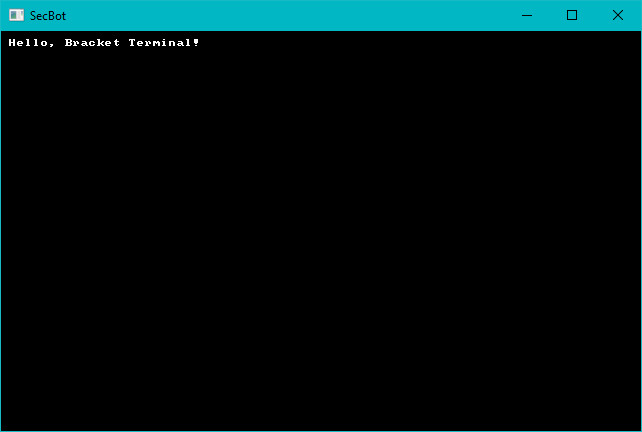

{{#include header.md}}

# Starting Template and Build

At the very start of the jam, I grabbed a handy template I like to keep around for basic ASCII/CodePage 437 based roguelikes. I wound up modifying it a bit to fit the "no systems, no threads" constraints - but the basic template lets me get started quickly. This section will go over the template and how it got me started.

## Creating a project and building dependencies

I started the project by finding my home directory, and running `cargo init secbot`. This creates the usual "Hello, World" command-line program and makes a basic `Cargo.toml` file. Very basic stuff, but a necessary start.

I then opened up `Cargo.toml` and added in the dependencies I knew I'd need, set the project name, and cleaned up the default comments. `Cargo.toml` looks like this, now:

```toml
[package]
name = "secbot"
version = "0.1.0"
authors = ["Herbert Wolverson <herberticus@gmail.com>"]
edition = "2018"

[dependencies]
bracket-lib = { git = "https://github.com/amethyst/bracket-lib.git" }
legion = { version = "0.3.1", default-features = false, features = ["wasm-bindgen"] }
lazy_static = "1.4.0"
```

> If you read the early commits in the repo, you'll notice that I goofed and committed a local path to my `bracket-lib` source code rather than the Git repo. The two are the same, and I've fixed it in the tutorial. If you're wondering why I used the git version rather than the published crate, it's because of a bug in random number generation in WASM. I have a fix for this ready to go, but didn't have time to publish the crate before the 7-day challenge started.

## Hello, Bracket-lib!

Next up was opening `src/main.rs` and pasting in "Hello, Bracket" from the *Flappy Dragon* chapter of my book. I've written this so many times now that I can do it in my sleep; one of the perks of writing a book and the library it uses. The "hello bracket" source looks like this:

~~~rust
use bracket_lib::prelude::*;

struct State {}

impl GameState for State {
    fn tick(&mut self, ctx: &mut BTerm) {
        ctx.cls();
        ctx.print(1, 1, "Hello, Bracket Terminal!");
    }
}

fn main() -> BError {
    let context = BTermBuilder::simple80x50()
        .with_title("SecBot")
        .build()?;

    main_loop(context, State{})
}
~~~

Ok, so that's not very exicting. It gets me a console window on the screen, and `Hello, Bracket Terminal!` in white on black. It's a necessary start.



> You can find the source code for `hello_bracket` [here](https://github.com/thebracket/secbot-2021-7drl/tree/tutorial/tutorial/hello_bracket/).

## WASM Building

I knew from the start that I wanted to support Web Assembly as a target. `Bracket-lib` WASM builds require a tool called `wasm-bindgen`, so I made sure that was installed by typing: `cargo install wasm-bindgen`. It takes a while to compile, time for coffee!

Once that was in place, I pulled up a template Windows batch file I use for this:

~~~batch
@ECHO OFF
cargo build --target wasm32-unknown-unknown --release

wasm-bindgen .\target\wasm32-unknown-unknown\release\secbot.wasm --out-dir .\wasm_help\staging --no-modules --no-typescript
copy .\wasm_help\index.html .\wasm_help\staging\index.html

REM Send to server. Not included on Github so I'm not giving you server details. Sorry.
./webglbuild2.bat
~~~

The file `webglbuild2.bat` is excluded from Github so I don't give you access to my server. It's pretty simple: it copies the `wasm_help\staging` directory to the deployment folder on my server.

> Note that you need a web server to serve up your WASM build. Chrome and Firefox *really* don't like serving WASM builds from a `file://` path for security reasons.

If you're using a platform other than Windows, the commands are the same - just replace `copy` with `cp` and change `@ECHO OFF` to `#/bin/bash` or whatever your platform needs.

Anyway, before this will work you need some helpers. Create a new folder called `wasm_help`. Inside that folder, make a `staging` directory - this will hold the build to send to the server. You also need to put an `index.html` file into your `wasm_help` folder.

The final structure looks like this:

* project folder
    * src
    * target
    * wasm_help
        * staging
        * index.html
    * Cargo.toml

The contents of the `index.html` file are:

~~~html
<html>
  <head>
    <meta content="text/html;charset=utf-8" http-equiv="Content-Type" />
  </head>
  <body style="background-color: black;">
    <h1 style="color: white; font-family: 'Courier New', Courier, monospace; font-size: 10pt;">SecBot (2021 7DRL) - by Herbert Wolverson</h1>
    <canvas id="canvas" width="896" height="496"></canvas>
    <script src="./secbot.js"></script>
    <script>
      window.addEventListener("load", async () => {
        await wasm_bindgen("./secbot_bg.wasm");
      });
    </script>
  </body>
</html>
~~~

As you can tell, I'm not great at HTML/CSS. This is designed to be the bare minimum: it creates a canvas, loads the `wasm` file and runs it. It's derived from the various `wasm-bindgen` tutorials out there.

> Why 896 by 496 for the canvas? I'd decided on a 112x62 console (8x8 font). So I went with the natural size from there. You'll see this in a moment.

With that in place, it was time to start expanding the game's basic structure into the beginnings of something useful.
