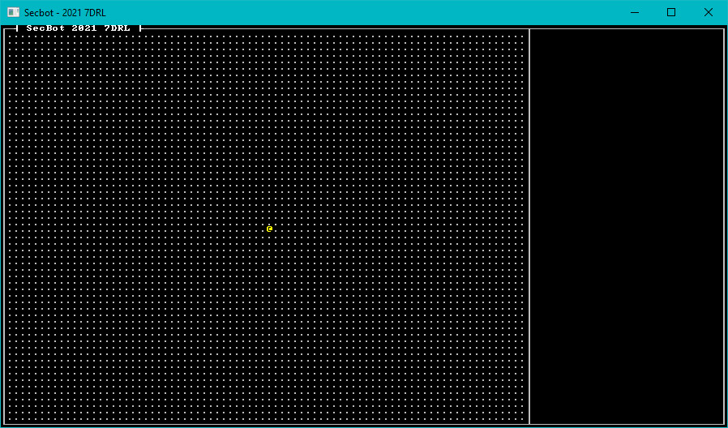

{{#include header.md}}

# Adding a Player Entity

Now that we have a rendered map - albeit one showing just open spaces - it's time to add `SecBot` onto it. It's a good idea to get this in early; it forces you to make the basic game structure, implement turn-based movement, and setup the infrastructure to render and move entities.

## Components

We're using an ECS for a data-store (`Legion`), so `SecBot` will be the sum of their parts - described by a series of components. Create a new folder, `src/components` and add a `mod.rs` file to it. Once again, I went with a slim `mod` file that describes the components found in other files. The initial `mod.rs` file looks like this:

~~~rust
mod description;
mod glyph;
mod position;
mod tags;

pub use description::Description;
pub use glyph::Glyph;
pub use position::Position;
pub use tags::*;
~~~

Now open `src/main.rs` and add `mod components;` to the include list. It's really easy to forget to do this and wonder why nothing works.

### The Description Component

I wanted a text description of entities for tooltips. It also gives me a creative outlet, letting me write some text! I really enjoy writing, so that helps keep me happy. Anyway, create a file called `description.rs`. It contains a one-line component:

~~~rust
pub struct Description(pub String);
~~~

That's it. Just a string. 

> Why didn't I just add `String` as a component (that works with `Legion`)? It makes it really tricky to differentiate between what string is serving what purpose. Names are also string-like! So I wrapped it in a `struct`. It has the nice side-effect of making accessing the contents easier; Legion likes to return `&ComponentType` references, and it's easier to remember `desc.0` than `*desc` and dealing with `String` not being copyable.

### The Glyph Component

Make another file, `components/glyph.rs`. This is where you store the information required to know what the entity looks like. It's pretty simple:

~~~rust
use bracket_lib::prelude::*;

pub struct Glyph {
    pub glyph: FontCharType,
    pub color: ColorPair,
}
~~~

### The Position Component

Another file, this time named `components/position.rs`. Again, it's relatively straightforward:

~~~rust
use bracket_lib::prelude::Point;

pub struct Position {
    pub pt: Point,
    pub layer: u32,
}

impl Position {
    pub fn with_pt(pt: Point, layer: u32) -> Self {
        Self { pt, layer }
    }
}
~~~

The `Position` component contains a `Point` (an x/y position) and the current layer. I made the layer a `u32`, and regretted it later due to the number of `u32` to `usize` conversions I wound up using. I figured I'd be making a lot of positions, so I added a constructor.

### Tag Components

Legion used to *require* that you have a tag component for every entity. It doesn't do that anymore, but I still find them useful. A "tag" component is a component with no data - it's mere existence tells you something useful. I started out with a single tag, `Player`. Create the `components/tags.rs` file:

~~~rust
pub struct Player;
~~~

Now that we have some component types, lets put them to use.

# Building SecBot

Open up `main.rs`. Extend State's `new` function to call a `new_game` function on creation:

~~~rust
impl State {
    fn new() -> Self {
        let mut ecs = World::default();
        let map = map::Map::new(&mut ecs);
        let mut state = Self { ecs, map };
        state.new_game();
        state
    }
~~~

Then add (implemented as part of `State`) the new function:

~~~rust
    fn new_game(&mut self) {
        use components::*;
        self.ecs.clear();

        // Spawn the player
        self.ecs.push((
            Player {},
            Position::with_pt(self.map.get_current().starting_point, 0),
            Glyph {
                glyph: to_cp437('@'),
                color: ColorPair::new(YELLOW, BLACK),
            },
            Description("Everybody's favorite Bracket Corp SecBot".to_string()),
        ));
    }
}
~~~

The `new_game` function clears the ECS (in case we are starting over), and spawns a single entity with one of each of the components we created. I wrote about `push` a lot in *Hands-On Rust*, so I won't repeat all of that here. Think of it as being like `push` for a vector - but in this case you are adding to the game world. It adds all of the components contained in the tuple you push to a single entity (and returns the entity, but I didn't use that here).

# Render the Bot

Now that you have a player entity, you have everything you need to render it. We'll make a `render_glyphs` function to find all entities on the map and render them. Add this to the `State` implementation:

~~~rust
fn render_glyphs(&self, ctx: &mut BTerm) {
    use components::{Glyph, Position};
    let mut query = <(&Position, &Glyph)>::query();
    query.for_each(&self.ecs, |(pos, glyph)| {
        if pos.layer == self.map.current_layer as u32 {
            ctx.set(
                pos.pt.x + 1,
                pos.pt.y + 1,
                glyph.color.fg,
                glyph.color.bg,
                glyph.glyph,
            );
        }
    });
}
~~~

Now you need to call it. Find your `tick` function (in `main.rs`) and after `self.map.render` add:

~~~rust
self.render_glyphs(ctx);
~~~

Run the game now - and you'll see a field of open space with an `@` on it.

> You can find the source code for `hello_entity` [here](https://github.com/thebracket/secbot-2021-7drl/tree/tutorial/tutorial/hello_entity/).