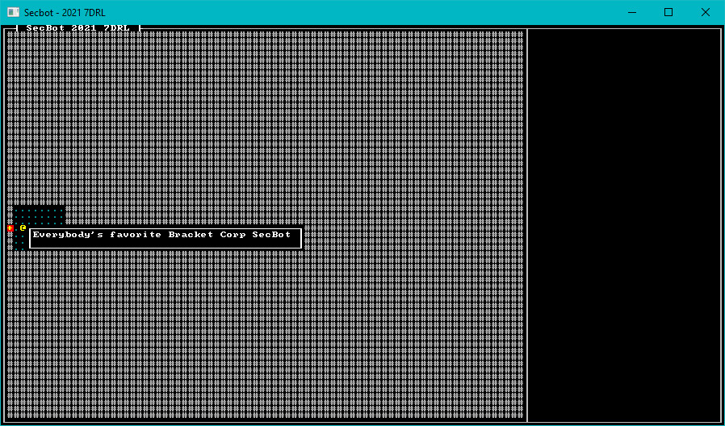

# Tooltips

Whenever I play a pure-ASCII roguelike, I *need* a "look" function. It's all very well to turn a corner and find yourself facing a see of `g` characters, but that triggers my brain into trying to remember what `g` stands for! It could be a goblin, a gnu, a ghost, a gargoyle or all manner of other uses of the letter `g`. I'd much rather be able to glance (ugh, another "g"!) at it and know what I'm up against!

Some games - I'm looking at you, `Nethack` - take this a little too far in my opinion. You can use a look at command to identify things, read the manual, or the in-game help. It's *great* that the options are all there - but looking at Medusa can be really bad for your health. That's a good joke, but terrible design: the first time you encounter Medusa, you may not remember what the glyph means. Instantly turning the player to stone because they didn't memorize the (huge) list of possible symbols is funny the first time. It's downright annoying the second, especially if you don't have players with eidetic memory (and limiting your player-base to those with perfect memories is just mean!).

So, I wanted tooltips. Mouse over a glyph and see a description. It also gives me a chance to do some writing (you may have noticed by now that I love writing).

## Escaping from the Modal

The first thing I wanted to do was to let the player get out of the modal we created in the last section. I was certain that I'd need some game logic (it wouldn't be much of a game without it), so I created a `game` module:

1. Create a new directory, `src/game`.
2. Create a new file `src/game/mod.rs`.
3. Try to keep `mod.rs` as a directory of other content.

I wanted to start adding player logic, so I added the following to `game/mod.rs`:

~~~rust
pub mod player;
pub use player::player_turn;
~~~

Then I created another new file: `src/game/player.rs` and added some really simple player code to it:

~~~rust
use crate::{components::*, render::tooltips::render_tooltips};
use crate::{
    map::{Map, HEIGHT, WIDTH},
    NewState,
};
use bracket_lib::prelude::*;
use legion::*;

pub fn player_turn(ctx: &mut BTerm, ecs: &mut World, map: &mut Map) -> NewState {
    render_tooltips(ctx, ecs, map);
    NewState::Wait
}
~~~

I hadn't made `NewState` yet, but the idea is that game functions can return an enumeration indicating where the game should go next. Open up `main.rs` and add:

~~~rust
mod game;
~~~

This adds the new game module to the program. Add a new enum for `NewState`:

~~~rust
pub enum NewState {
    NoChange,
    Wait,
    Player,
    Enemy,
}
~~~

Finally, replace the `tick` function as follows:

~~~rust
impl GameState for State {
    fn tick(&mut self, ctx: &mut BTerm) {
        ctx.cls();
        render::render_ui_skeleton(ctx);
        self.map.render(ctx);
        render::render_glyphs(ctx, &self.ecs, &self.map);

        let new_state = match &self.turn {
            TurnState::Modal { title, body } => render::modal(ctx, title, body),
            TurnState::WaitingForInput => game::player_turn(ctx, &mut self.ecs, &mut self.map),
            _ => NewState::NoChange,
        };
        match new_state {
            NewState::NoChange => {}
            NewState::Wait => self.turn = TurnState::WaitingForInput,
            NewState::Player => self.turn = TurnState::PlayerTurn,
            NewState::Enemy => self.turn = TurnState::EnemyTurn,
        }
    }
}
~~~

We now have a solid pattern for game state progression: it renders dependent upon the turn state, and calls game logic. The game logic can indicate that a new mode is necessary (or return `NoChange` to keep spinning) and trigger the new mode.

The game won't quite compile. The `new_state` matcher is expecting every arm to return a `NewState`. The `modal` renderer doesn't do that yet. So open up `render/mod.rs` and adjust the modal rendering code:

~~~rust
use crate::NewState;

pub fn modal(ctx: &mut BTerm, title: &String, body: &String) -> NewState {
    let mut draw_batch = DrawBatch::new();
    draw_batch.draw_double_box(Rect::with_size(19, 14, 71, 12), ColorPair::new(CYAN, BLACK));
    let mut buf = TextBuilder::empty();
    buf.ln()
        .fg(YELLOW)
        .bg(BLACK)
        .centered(title)
        .fg(CYAN)
        .bg(BLACK)
        .ln()
        .ln()
        .line_wrap(body)
        .ln()
        .ln()
        .fg(YELLOW)
        .bg(BLACK)
        .centered("PRESS ENTER TO CONTINUE")
        .reset();

    let mut block = TextBlock::new(21, 15, 69, 11);
    block.print(&buf).expect("Overflow occurred");
    block.render_to_draw_batch(&mut draw_batch);
    draw_batch.submit(0).expect("Batch error");
    render_draw_buffer(ctx).expect("Render error");

    if let Some(key) = ctx.key {
        match key {
            VirtualKeyCode::Return => NewState::Wait,
            VirtualKeyCode::Space => NewState::Wait,
            _ => NewState::NoChange,
        }
    } else {
        NewState::NoChange
    }
}
~~~

The new code is all at the bottom. If checks to see if a key is pressed, and if its `Return` or `Space` returns `NewState::Wait` - indicating that it should move the game state to `WaitingForInput`. Otherwise, it returns `NoChange` and keeps spinning.

If you run the game now (you'd need to comment out `render_tooltips` in `player.rs`), you can see the modal popup from before - but pressing enter dismisses it (and the game then does nothing of much at all).

## Adding tooltips

Create a new file, `src/render/tooltips.rs`:

~~~rust
use bracket_lib::prelude::*;
use legion::*;
use crate::{components::{Description, Position}, map::{HEIGHT, Map, WIDTH}};

pub fn render_tooltips(ctx: &mut BTerm, ecs: &World, map: &Map) {
    let (mx, my) = ctx.mouse_pos();
    let map_x = mx -1;
    let map_y = my - 1;
    if map_x >= 0 && map_x < WIDTH as i32 && map_y >= 0 && map_y < HEIGHT as i32 {
        let mut lines = Vec::new();
        let mut query = <(&Position, &Description)>::query();
        query.for_each(ecs, |(pos, desc)| {
            if pos.layer == map.current_layer as u32 && pos.pt.x == map_x && pos.pt.y == map_y {
                lines.push(desc.0.clone());
            }
        });

        if !lines.is_empty() {
            let height = lines.len() + 1;
            let width = lines.iter().map(|s| s.len()).max().unwrap() + 2;
            let tip_x = if map_x < WIDTH as i32/2 {
                mx+1
            } else {
                mx - (width as i32 +1)
            };
            let tip_y = if map_y > HEIGHT as i32/2 {
                my - height as i32
            } else {
                my
            };
            ctx.draw_box(tip_x, tip_y, width, height, WHITE, BLACK);
            let mut y = tip_y + 1;
            lines.iter().for_each(|s| {
                ctx.print_color(tip_x+1, y, WHITE, BLACK, s);
                y += 1;
            });
        }
    }
}
~~~

This is a messy function, but quite straightforward:

1. It obtains the mouse position as `(mx, my)` with `mouse_pos()` from the context.
2. It sets `map_x` and `map_y` to `mx-1` and `my-1` respectively. This offsets the mouse position into the map's coordinates - we have a 1 tile border around the map.
3. It checks that the map coordinates are within the map boundaries. With hindsight, `in_bounds` would have done this with less typing.
4. It runs a Legion ECS query for all entities with a `Position` and `Description` component. If they are on the current layer, and at the current `map_x/may_y` coordinates it adds their descriptions to a `lines` vector.
5. If lines isn't empty:
    1. Calculate the total length of the tooltip in lines. Add 2 to support the box around the tip.
    2. Calculate the width by looking the longest string. Add 2 to support the box around the tip.
    3. If the mouse is on the left half of the screen, set `tip_x` to be just to the right of the cursor. Otherwise, set it to be (length+1) tiles left of the cursor.
    4. Draw a box around the total tooltip.
    5. Iterate the lines vector, and draw each line.

Still messy (and replaced later), but it works. :-)

## Using the Tooltips

In `render/mod.rs` add the following line:

~~~rust
pub mod tooltips;
~~~

You can run the game now and see a tooltip for the player:

> You can find the source code for `hello_tooltip` [here](https://github.com/thebracket/secbot-2021-7drl/tree/tutorial/tutorial/hello_tooltip/).

## Onwards!

Next, we'll let SecBot's `@` walk around the map.
