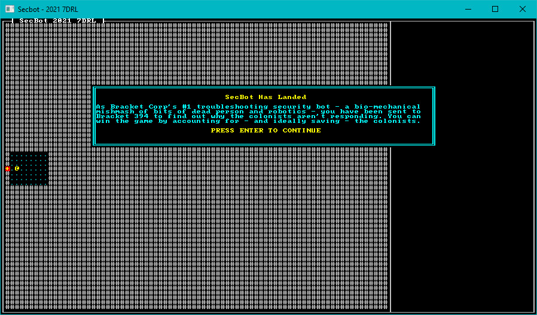

# Turn State and Modal Announcements

It's a funny old world. It took me a couple of hours to hammer out the tutorial thus-far, including screenshots and examples. In Jam-time, I was about 30 minutes in! The template code is based on code I had available, and it didn't take long to cut and paste everything together.

Pretty much every game I write with `bracket-lib` has a `TurnState` enumeration. You can find it in the *Rust Roguelike Tutorial*, in *Hands-on Rust* and in pretty much every example. It really is the best way I've found to manage global state in simple projects with a game loop that ticks over and over again (I sometimes use a stack of states for really complicated projects).

## Initial Turn State

In `main.rs`, I added an enumeration:

~~~rust
enum TurnState {
    WaitingForInput,
    PlayerTurn,
    EnemyTurn,
    Modal{title: String, body: String},
}
~~~

These states are intended to work as follows:

* `WaitingForInput` is just that - spinning, checking for user input and deciding where to go next.
* `PlayerTurn` - the player is doing something.
* `EnemyTurn` - the other entities are doing something.
* `Modal` - I'm announcing something to the player. I decided that announcements needed a title and a body text.

## Tracking Turn State

Having an `enum` isn't enough, you need to store it and initialize it. I added it to `State`:

~~~rust
struct State {
    ecs: World,
    map: map::Map,
    turn: TurnState
}
~~~

In `State`'s `new` function, I added initialization for the state:

~~~rust
let mut state = Self { ecs, map, turn: TurnState::Modal{title: "SecBot Has Landed".to_string(), body: text::INTRO.to_string()} };
~~~

Wait - what's this? `INTRO` hasn't been defined!

## Storing Text

I didn't want to fill up my main module with stored body text. With hindsight, I should have done more of this! Anyway, in the `src` directory, I created a new file: `text.rs`. The entire body of the file is:

~~~rust
pub const INTRO : &str = "As Bracket Corp's #1 troubleshooting security bot - a bio-mechanical mishmash of bits of dead person and robotics - you have been sent to Bracket 394 to find out why the colonists aren't responding. You can win the game by accounting for - and ideally saving - the colonists.";
~~~

It defines a constant called `INTRO` - storing my greeting text. I went back to `main.rs` and added `mod text` to the imports list.

## Rendering Modal Dialogs

I wanted a bit of flexibility in rendering modal text. I honestly thought that I'd use it more frequently (it ended up barely used). So I added the following to `render/mod.rs`:

~~~rust
pub fn modal(ctx: &mut BTerm, title: &String, body: &String) {
    let mut draw_batch = DrawBatch::new();
    draw_batch.draw_double_box(Rect::with_size(19, 14, 71,12), ColorPair::new(CYAN, BLACK));
    let mut buf = TextBuilder::empty();
    buf.ln()
        .fg(YELLOW)
        .bg(BLACK)
        .centered(title)
        .fg(CYAN)
        .bg(BLACK)
        .ln()
        .ln()
        .line_wrap(body)
        .ln()
        .ln()
        .fg(YELLOW)
        .bg(BLACK)
        .centered("PRESS ENTER TO CONTINUE")
        .reset();

    let mut block = TextBlock::new(20, 15, 70, 11);
    block.print(&buf).expect("Overflow occurred");
    block.render_to_draw_batch(&mut draw_batch);
    draw_batch.submit(0).expect("Batch error");
    render_draw_buffer(ctx).expect("Render error");
}
~~~

That's a bit of a mouthful! It starts by creating a `DrawBatch`. These are primarily a multi-threading tool in `bracket-lib`: you can start and submit a batch in any thread. As long as you remember to `render_draw_buffer` in the render thread, everything is applied. You don't really need it, but there are some performance advantages to doing it all in a batch. The `TextBuilder` functionality in `bracket-lib` works best when applied to a batch, so I pretty much *had* to have one. `TextBuilder` is a really handy utility for batching large amounts of text, applying word-wrapping, and placing the nicely formatted result on the screen.

The function starts by creating a new batch and `TextBuilder`. Then it goes line-by-line setting colors, formatting text, and finally calling `reset` to clear any state back to its original value. Then it makes a block - I had to play with the dimensions/location a bit until it looked right - and renders it.

## Applying Turn State

In `main.rs`, go back to the `tick` function. We'll add a `match` function to use `TurnState` to direct program flow:

~~~rust
impl GameState for State {
    fn tick(&mut self, ctx: &mut BTerm) {
        ctx.cls();
        render::render_ui_skeleton(ctx);
        self.map.render(ctx);
        render::render_glyphs(ctx, &self.ecs, &self.map);

        match &self.turn {
            TurnState::Modal { title, body } => render::modal(ctx, title, body),
            _ => {} // Do nothing
        }
    }
}
~~~

The `tick` function now clears the screen, renders the UI skeleton, renders the map and glyphs, and queries `turn` (the turn state) to see what to do. At this point, it only knows how to draw the modal we've built.

Run the program now, and you'll be greeted with a game starting modal dialog:

> You can find the source code for `hello_modal` [here](https://github.com/thebracket/secbot-2021-7drl/tree/tutorial/tutorial/hello_modal/).

## Onwards!

Next, we'll start supporting some tool-tips.
