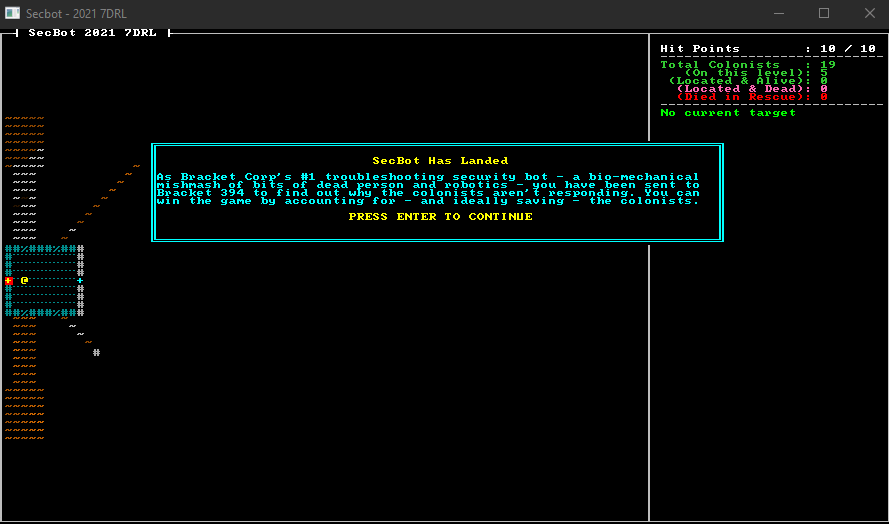

# Warnings and Hostiles

At this point, I decided it was high time for a quick code cleanup. So I started out by fixing a whole bunch of warnings.

## Fixing Some Warnings

Some easy ones:

* In `src/components/colonist.rs`, I didn't need `use bracket_lib::prelude::Point;`---so I removed it.
* In `src/components/projectile.rs`, I didn't need to import `ColorPair` or `FontCharType`---removed.
* In `src/game/player.rs`, I could remove `WIDTH` and `HEIGHT` from the imports. Also, `mut current_layer` in `open_fire_at_target` doesn't need to be mutable. I marked `map` as unused by renaming it `_map` in the signature for `tile_triggers`.
* In `src/map/layerbuilder/caverns.rs`, `mine_middle.rs` and `mine_top.rs` I replaced the imports with wildcard `*` imports. I'll need the functionality later. Components remains an unused import, but I'm pretty sure I'll need it later.
* `src/map/layerbuilder/entrance.rs` no longer needs `TILES` in its imports. I left the warnings about `map` and `ecs` being unused, because I'm pretty sure I'll want them later.
* In `src/map/render/projectiles.rs`, I removed `WIDTH` from the import list.
* In `src/main.rs` I removed a couple of unused imports---`render::speech::render_speech` and `render::targeting_panel::*`.
* Also in `main.rs`, I replaced `let (y, target_pt) = render::render_targeting_panel` with `let (_y...`.

In `main.rs`, the `match` statement for state was broken. It read:

```rust
match new_state {
    NewState::NoChange => {}
    NewState::Player => self.turn = TurnState::EnemyTurn,
    NewState::Wait => self.turn = TurnState::WaitingForInput,
    NewState::Enemy => self.turn = TurnState::EnemyTurn,
    NewState::LeftMap => self.turn = TurnState::GameOverLeft,
    NewState::Player => self.turn = TurnState::PlayerTurn,
}
```

Two `Player` entries isn't going to work, so I removed the first one.

With those changes made, compilation was a lot more friendly with only a couple of warnings.

## Format the Code

I then decided that it was time to run `cargo fmt` and make the code pretty. I really should have done that before.

## Starting on Hostiles

Now that we've done some cleaning (never a bad idea), it's time to start adding in some hostile behavior to the monsters. This is the big remaining item: hostiles currently stand there and let you shoot them. That's really not much of a game!

### Known Hostility

I decided to try for a relatively complicated hostile AI---and ended up not quite achieving it. We'll include the steps here anyway, hopefully you can gain inspiration from the failure. The first step is to make some components indicating that a monster is hostile, and how it behaves. Create a new file, `src/components/hostile.rs` and paste in the following:

```rust
pub enum AggroMode {
    Nearest,
    Player
}

pub struct Hostile{
    pub aggro: AggroMode,
    pub melee: Vec<Melee>,
    pub ranged: Vec<Ranged>,
}

pub struct Melee {
    pub damage: i32
}

pub struct Ranged {
    pub range: i32,
    pub power: i32,
}
```

You'll need to add a `mod hostile` and `pub use hostile::*;` to `src/components/mod.rs` to activate these types. The basic idea is that if a monster is hostile, it has a `Hostile` tag. The `AggroMode` indicates its preferred type of snack (the nearest target or the player). The `melee` and `ranged` vectors list how the monster attacks. It can have more than one attack.

You also want to open `src/components/tags.rs` and remove `Hostile` as a tag. We replaced it with more complexity.

This prevents the monster spawning code in `src/map/layerbuilder/monsters.rs` from compiling. So open that file, and replace the `Hostile` component for the `spawn_face_eater` function with:

```rust
pub fn spawn_face_eater(ecs: &mut World, location: Point, layer: u32) {
    ecs.push((
        Name("Face Eater".to_string()),
        Hostile { 
            aggro: AggroMode::Nearest,
            ranged: Vec::new(),
            melee: vec![ Melee{ damage: 1 } ],
        },
        Targetable {},
        Position::with_pt(location, layer),
        Glyph {
```

Now that we have monsters with the new tag, let's start making them useful.


### Monster Turns

In `src/game/mod.rs` add `pub mod monsters; pub use monsters::monsters_turn;` to the import list at the top. Predictably enough, we'll then make the file `src/game/monsters.rs`.

```rust
use crate::components::*;
use crate::map::Map;
use bracket_lib::prelude::{a_star_search, Algorithm2D};
use legion::{systems::CommandBuffer, *};

pub fn monsters_turn(ecs: &mut World, map: &mut Map) {
    let mut commands = CommandBuffer::new(ecs);
    let current_layer = map.current_layer;
    <(Entity, &Active, &Hostile, &Position)>::query()
        .iter(ecs)
        .for_each(|(entity, _, hostile, pos)| {
            // Can I melee?
            // If so, is there anything within reach?

            // Can I shoot?
            // If so, is there anything in range?

            // What's my aggro target?
            // If its the player, follow them
            // If its nearest, look for something to kill
        }
    );
    commands.flush(ecs);
}
```

This is a placeholder: it has all the structure needed, and comments indicating how we'll proceed. I was short of time, but mapping out future development is always a good idea. You should get the basic idea of how we plan to handle monsters here: check for combat conditions, and execute combat if appropriate. Otherwise, move and chase the player or colonists. That's a very basic AI outline, but it should be enough to make the game fun: you wake up monsters and have to deal with them before they kill you or the hapless colonists.

The new monster AI won't do anything until we call it. AI is called from the file `src/main.rs`, so open that file. Find the line `let new_state = match &self.turn {` (it's line 105 in the sample source code) and insert the lines denoted with a `+`:

```rust
        let new_state = match &self.turn {
            TurnState::Modal { title, body } => render::modal(ctx, title, body),
            TurnState::WaitingForInput => game::player_turn(ctx, &mut self.ecs, &mut self.map),
+           TurnState::PlayerTurn => NewState::Enemy, // Placeholder
            TurnState::EnemyTurn => {
                game::colonists_turn(&mut self.ecs, &mut self.map);
+                game::monsters_turn(&mut self.ecs, &mut self.map);
                NewState::Wait
            }
            TurnState::GameOverLeft => render::game_over_left(ctx),
            TurnState::GameOverDecompression => render::game_over_decompression(ctx),
        };
```

This calls the monsters AI. If you run the game now, you won't see any real changes---the monster AI is being called, but since it's just a placeholder it doesn't *do* anything. Still, a good time to take a break (my day was made busy by the day-job) and then resume the task.

> At this point, I had to go and find food. Development resumed some time later that day.

## Refactor combat

Combat so far has been player-specific (and located in the player's logic). That works for figuring out how to do things, but isn't what we want---we want a generic combat system so that the player, monsters, and eventually some of the more heroic colonists can perform combat with the same system.

Open `src/game/mod.rs` and add a `pub mod combat; pub use combat::*` pair of imports. Then create a new file named `src/game/combat.rs`. This is where we'll add the generic combat code. Much of it is just moving over from the `player.rs` file. We'll have to make some changes to make it generic.

Open the new `combat.rs` file, and let's get started. The first thing you need are some imports---using various libraries and other modules that will be needed:

```rust
use legion::*;
use legion::systems::CommandBuffer;
use crate::components::*;
use crate::NewState;
use crate::map::*;
use bracket_lib::prelude::*;
use std::collections::HashSet;
```

Now take the function `player_open_fire_at_target` out of `game/player.rs` and place it in the new file:

```rust
pub fn player_open_fire_at_target(ecs: &mut World, map: &mut Map) -> NewState {
    let mut commands = CommandBuffer::new(ecs);
    let mut player_pos = Point::zero();
    let mut target = None;
    let current_layer = map.current_layer as u32;
    <(&Player, &Position, &Targeting)>::query()
        .iter(ecs)
        .for_each(|(_, pos, targeting)| {
            player_pos = pos.pt;
            target = targeting.current_target;
        });

    // If there's nothing to fire at, return to waiting
    if target.is_none() {
        return NewState::Wait;
    }

    let pos_map = <(&Position, &Health)>::query()
        .iter(ecs)
        .map(|(pos, _)| pos.pt)
        .collect::<HashSet<Point>>();

    if let Some(target) = target {
        if let Ok(target_ref) = ecs.entry_ref(target) {
            if let Ok(target_position) = target_ref.get_component::<Position>() {
                let target_pos = target_position.pt;
                let mut power = 20;
                let mut range = 0;
                let mut projectile_path = Vec::new();
                let mut splatter = None;

                line2d_bresenham(player_pos, target_pos)
                    .iter()
                    .skip(1)
                    .for_each(|pt| {
                        projectile_path.push(*pt);
                        if pos_map.contains(&pt) {
                            power -= hit_tile_contents(
                                ecs,
                                *pt,
                                current_layer,
                                &mut commands,
                                &mut splatter,
                            );
                        }
                        if let Some(bsplatter) = &mut splatter {
                            let idx = map.get_current().point2d_to_index(*pt);
                            map.get_current_mut().tiles[idx].color.bg = bsplatter.to_rgba(1.0);
                            bsplatter.r = f32::max(0.0, bsplatter.r - 0.1);
                            bsplatter.g = f32::max(0.0, bsplatter.g - 0.1);
                            bsplatter.b = f32::max(0.0, bsplatter.b - 0.1);
                            if bsplatter.r + bsplatter.g + bsplatter.b < 0.1 {
                                splatter = None;
                            }
                        }
                        range += 1;
                        if range > 5 {
                            power -= 1;
                        }
                    });
                use ultraviolet::Vec2;
                let mut projectile_pos: Vec2 = Vec2::new(target_pos.x as f32, target_pos.y as f32);
                let slope = (projectile_pos - Vec2::new(player_pos.x as f32, player_pos.y as f32))
                    .normalized();
                while range < 25 && power > 0 {
                    projectile_pos += slope;
                    let pt = Point::new(projectile_pos.x as i32, projectile_pos.y as i32);
                    projectile_path.push(pt);
                    if pos_map.contains(&pt) {
                        power -=
                            hit_tile_contents(ecs, pt, current_layer, &mut commands, &mut splatter);
                    }
                    if let Some(bsplatter) = &mut splatter {
                        let idx = map.get_current().point2d_to_index(pt);
                        map.get_current_mut().tiles[idx].color.bg = bsplatter.to_rgba(1.0);
                        bsplatter.r = f32::max(0.0, bsplatter.r - 0.1);
                        bsplatter.g = f32::max(0.0, bsplatter.g - 0.1);
                        bsplatter.b = f32::max(0.0, bsplatter.b - 0.1);
                        if bsplatter.r + bsplatter.g + bsplatter.b < 0.1 {
                            splatter = None;
                        }
                    }
                    let idx = map.get_current().point2d_to_index(pt);
                    if map.get_current().tiles[idx].tile_type == TileType::Wall {
                        range += 100;
                        power = 0;
                    }
                    if !map.get_current().tiles[idx].opaque && power > 5 {
                        // TODO: End the game because you broke a window
                    }
                    range += 1;
                    if range > 5 {
                        power -= 1;
                    }
                }

                commands.push((
                    Projectile {
                        path: projectile_path,
                        layer: current_layer as usize,
                    },
                    Glyph {
                        glyph: to_cp437('*'),
                        color: ColorPair::new(RED, BLACK),
                    },
                ));
            } else {
                // Unable to fire
                return NewState::Wait;
            }
        } else {
            // Unable to fire
            return NewState::Wait;
        }
    }

    commands.flush(ecs);
    NewState::Player
}
```

This function is essentially unchanged---it's just now in the right file. We'll expand it to handle entities other than the player shooting when we need that functionality. We'll also move over the `hit_tile_contents` function from the same file:

```rust
fn hit_tile_contents(
    ecs: &mut World,
    pt: Point,
    layer: u32,
    commands: &mut CommandBuffer,
    splatter: &mut Option<RGB>,
) -> i32 {
    let mut rng_lock = crate::RNG.lock();
    let rng = rng_lock.as_mut().unwrap();

    let mut power_loss = 0;
    let mut dead_entities = Vec::new();
    <(Entity, &Position, &mut Health)>::query()
        .iter_mut(ecs)
        .filter(|(_, pos, _)| pos.layer == layer && pos.pt == pt)
        .for_each(|(entity, _, hp)| {
            let damage = rng.range(1, 5) + 10; // TODO: Complexity, please
            hp.current -= damage;
            if hp.current < 0 {
                hp.current = 0;
                dead_entities.push(*entity);
            }
            power_loss += hp.current;
        });

    kill_things(ecs, commands, dead_entities, splatter);

    power_loss
}
```

You'll notice that we've refactored some of the death code into its own function---`kill_things`. The functionality is the same, but it's a bit cleaner to use a separate function. We can also reuse the content.

Now for something new: melee combat. We'll start with the function header:

```rust
pub fn melee(ecs: &mut World, map: &mut Map, attacker: Entity, victim: Entity, melee_power: i32) {
```

It's a public function, and relies on knowing who the attacker and victim are, as well as "melee_power" - indicating how hard the melee hit is.

Next, we determine where the two battling entities are:

```rust
    // Check that range < 1.3 (no diagonals)
    let mut attacker_pos = None;
    let mut defender_pos = None;

    if let Ok(e) = ecs.entry_ref(attacker) {
        if let Ok(pos) = e.get_component::<Position>() {
            attacker_pos = Some(*pos);
        }
    }

    if let Ok(e) = ecs.entry_ref(victim) {
        if let Ok(pos) = e.get_component::<Position>() {
            defender_pos = Some(*pos);
        }
    }
    if attacker_pos.is_none() || defender_pos.is_none() {
        return; // Bail out - invalid data arrived
    }
```

Notice the safety code: if either the attacker or defender doesn't have a valid position, we bail out of the function. That shouldn't happen, but defensive coding like this can save you hours of debugging when your preconditions turn out to be less true than you expected. 

Next, we use the positions to check that the combatants are on the same map layer (no fighting through floors!) and are within melee range of one another.

```rust
    let apos = attacker_pos.unwrap();
    let dpos = defender_pos.unwrap();
    if apos.layer != dpos.layer {
        return; // Bail out - can't attack across layers
    }
    let d = DistanceAlg::Pythagoras.distance2d(apos.pt, dpos.pt);
    if d > 1.2 {
        return; // Too far away, bail
    }
```

Again, if the layer or range conditions aren't met---the function simply bails out. That's preferable to having something really weird happen. Worst case, the entity just sits there and doesn't accomplish anything this turn.

Next, we reduce the health of the victim, add a bloodstain (to show that combat ocurred here) and call `kill_things` if the victim died. This is why we refactored `kill_things` into its own function---so it could be re-used.

```rust
    // Inflict damage upon the hapless victim
    let mut dead_entities = Vec::new();
    if let Ok(mut v) = ecs.entry_mut(victim) {
        if let Ok(hp) = v.get_component_mut::<Health>() {
            hp.current = i32::max(0, hp.current - melee_power);
            if hp.current == 0 {
                dead_entities.push(victim);
            }
        }
        if let Ok(blood) = v.get_component::<Blood>() {
            let idx = map.get_layer(dpos.layer as usize).point2d_to_index(dpos.pt);
            map.get_layer_mut(dpos.layer as usize).tiles[idx].color.bg = blood.0.into();
        }
    }

    // If necessary, kill them.
    let mut commands = CommandBuffer::new(ecs);
    let mut splatter = None;
    kill_things(ecs, &mut commands, dead_entities, &mut splatter);
}
```

Finally (for the combat system), here's the refactored `kill_things` function:

```rust
fn kill_things(ecs: &mut World, commands: &mut CommandBuffer, dead_entities : Vec<Entity>, splatter: &mut Option<RGB>) {
    dead_entities.iter().for_each(|entity| {
    if let Ok(mut er) = ecs.entry_mut(*entity) {
        if let Ok(_colonist) = er.get_component_mut::<ColonistStatus>() {
            commands.add_component(*entity, ColonistStatus::DiedAfterStart);
        }
        if let Ok(g) = er.get_component_mut::<Glyph>() {
            g.color.bg = DARK_RED.into();
            g.color.fg = DARK_GRAY.into();
        }
        if let Ok(n) = er.get_component_mut::<Name>() {
            n.0 = format!("Corpse: {}", n.0);
        }
        if let Ok(b) = er.get_component::<Blood>() {
            *splatter = Some(b.0);
        }
    }
    commands.remove_component::<Health>(*entity);
    commands.remove_component::<Active>(*entity);
    commands.remove_component::<CanBeActivated>(*entity);
    commands.remove_component::<Blood>(*entity);
    commands.remove_component::<Targetable>(*entity);
    });
}
```

Now that the skeleton is in place, let's work on making face eaters hungry---and eating faces through melee combat.

### Monster Melee

It's time to flesh out the placeholder code in `src/game/monsters.rs`. The headings describe what we want to do---now lets expand the code and make it do something. Open `src/game/monsters.rs`. Start by adding one more entry into the header:

```rust
use bracket_lib::prelude::*;
```

Next, we'll start by building a target list for the monster. We'll list all colonists who are still alive, and collect them into a `targets` vector. Then we'll look up the player's position and add that as a target, too.

```rust
pub fn monsters_turn(ecs: &mut World, map: &mut Map) {
    let mut targets : Vec<(Position, Entity)> = <(Entity, &Colonist, &Health, &Position)>::query()
        .iter(ecs)
        .map(|(e, _, _, pos)| (*pos, *e))
        .collect();
    let ppos = <(Entity, &Player, &Position)>::query()
        .iter(ecs)
        .map(|(e, _, pos)| (*pos, *e))
        .nth(0)
        .unwrap();
    targets.push(ppos);
```

We now have a list of everything that monsters *could* target. We're doing this once so we can re-use subsets of the list for each monster we process.

Next, the function will need a `CommandBuffer` to store ECS changes. So we add one:

```rust
    let mut commands = CommandBuffer::new(ecs);
```

Now we create a `melee_buffer` vector. This lists melee combats in pairs---the attacker, victim and damage. Again, we're storing and processing them together to keep performance up:

```rust
    let mut melee_buffer = Vec::<(Entity, Entity, i32)>::new();
```
The next thing to do is to iterate potentially melee-attacking monsters. We start by building a query that gives us the information we need about each monster, and only includes them if they are `Active`---we don't want inactive monsters killing people:

```rust
    <(Entity, &Active, &Hostile, &Position, &mut FieldOfView)>::query()
        .iter_mut(ecs)
        .for_each(|(entity, _, hostile, pos, fov)| {
```

Then we build the visible tiles set, using `bracket-lib`'s `field_of_view_set` functionality---just like we did for the player's visibility set. We're storing this in the monster's `FieldOfView` component.

```rust
            // What can I see?
            fov.visible_tiles = field_of_view_set(pos.pt, fov.radius, map.get_layer(pos.layer as usize));
```

So now we know what the monster can see, and where all the possible targets are. We can combine this information to make a subset of possible targets that the monster *can* attack. It's quite possible that there aren't any, and that's ok.

We build the target subset by iterating the `targets` list we made earlier, filtering out anything not on the same layer, and mapping it to store the target's location, distance to the target, and target entity itself. We don't need to store the attacker's entity---we already have that. Lastly, we sort the target list by distance.

```rust
            let mut target_subset : Vec<(Point, f32, Entity)> = targets
                .iter()
                .filter(|p| p.0.layer == pos.layer)
                .map(|p| (
                    p.0.pt, 
                    DistanceAlg::Pythagoras.distance2d(pos.pt, p.0.pt),
                    p.1,
                )
                )
                .collect();
            target_subset.sort_by(|a,b| a.1.partial_cmp(&b.1).unwrap());
```

What do we know now? If `target_subset` is empty, there's nothing appropriate to attack. Otherwise, the first potential target is the closest. So we can check if the vector isn't empty, and if the first entry is adjacent to the attacker--we can call the attack code. We're adding attack commands to the `melee_buffer`---rather than running them immediately, we'll process them all at once at the end.

```rust
            if !target_subset.is_empty() {
                // Can I melee?
                // If so, is there anything within reach?
                if target_subset[0].1 < 1.4 && !hostile.melee.is_empty() {
                    hostile.melee.iter().for_each(|m| {
                        melee_buffer.push((*entity, target_subset[0].2, m.damage));
                    });
                }
```

We'll close out our target subset check by looking at the `hostile.ranged` list and moving the "Fire" placeholder into it if a hostile can shoot. We haven't written ranged hostiles yet, but it's good to be prepared.

```rust
                // Can I shoot?
                // If so, is there anything in range?
                hostile.ranged.iter().for_each(|ranged| {
                    // Fire!
                });
            }
```

Finally, we close out the loops, flush the command buffer, and call the `melee` function we wrote above for each of the melee attacks we buffered.

```rust
            // What's my aggro target?
            // If its the player, follow them
            // If its nearest, look for something to kill
        }
    );
    commands.flush(ecs);

    melee_buffer.iter().for_each(|(a,d,dmg)| {
        super::combat::melee(ecs, map, *a, *d, *dmg);
    });
}
```

Now we'll clean up the player a bit.

#### Cleaning up the Player

We refactored a lot of combat code, so we need to take a moment to clean up the file `src/game/player.rs`. There's no point in repeating ourselves.

In the file's imports, add the following:

```rust
use super::combat::player_open_fire_at_target;
```

This tells the file to use the version we wrote in `combat` instead of a local function. Now adjust the `player_turn` function to call the player shooting when `F` is pressed. The change is marked with a `+`:

```rust
pub fn player_turn(ctx: &mut BTerm, ecs: &mut World, map: &mut Map) -> NewState {
    ...
            VirtualKeyCode::Comma => go_up(ecs, map),
            VirtualKeyCode::Period => go_down(ecs, map),
            VirtualKeyCode::Space => NewState::Player, // Wait action
+           VirtualKeyCode::F => player_open_fire_at_target(ecs, map),
            _ => NewState::Wait,
        }
    } else {
```

Now remove the `open_fire_at_target` and `hit_tile_contents` functions. We want to use the generic versions.

You can play the game now and stand next to monsters---and they will attack you.

> Time for another break! This is a big section, and this was where I went for a stroll. It's a good idea to clear your head during long sessions.

#### Allowing Diagonal Melee

After taking a break, I wanted to tweak a couple of things. Diagonal melee makes sense - it looks weird for monsters to rearrange themselves to try and get a cardinal direction strike going. So I opened up `src/game/combat.rs` and tweaked two lines (marked with a `+`):

```rust
pub fn melee(ecs: &mut World, map: &mut Map, attacker: Entity, victim: Entity, melee_power: i32) {
+    // Check range and validity
    let mut attacker_pos = None;
    let mut defender_pos = None;

...

   let d = DistanceAlg::Pythagoras.distance2d(apos.pt, dpos.pt);
+    if d > 1.5 {
        return; // Too far away, bail
    }
```

#### Monsters that Chase You

Face-eaters and their ilk aren't really nightmare fuel if they stand still and only attack you when you come nearby---especially since you have a gun, and they don't. Let's fix that, and make activated monsters come after you.

First, a quick bug-fix. Open `src/game/monsters.rs`, and on line 17 replace `targets.push(ppos)` with `targets.push(ppos.clone())`. Not overly important, but it ensures we won't run into borrowing issues when we use the player's position.

Next, we want to denote if a monster launched an attack---so we don't have monsters move and attack in the same turn. We'll need a boolean variable for this. The inserted line (still in `monsters.rs`) is highlighted with a plus symbol:

```rust
    let mut commands = CommandBuffer::new(ecs);
    let mut melee_buffer = Vec::<(Entity, Entity, i32)>::new();
    <(Entity, &Active, &Hostile, &Position, &mut FieldOfView)>::query()
        .iter_mut(ecs)
        .for_each(|(entity, _, hostile, pos, fov)| {
+            let mut attacked = false;
            // What can I see?
            ...

```

Now, when we add an attacker to the `melee_buffer` we want to set `attacked` to true:

```rust
            if !target_subset.is_empty() {
                // Can I melee?
                // If so, is there anything within reach?
                if target_subset[0].1 < 1.6 && !hostile.melee.is_empty() {
+                    attacked = true;
                    ...
```

Now go to the `}` closing out the `if !target_subset.is_empty() {` block (line 54 in the example code). You want to add a new section that moves towards the player if they are on the same layer as the monster---and if no attack was performed.

```rust
            // Movement
            if !attacked {
                // What's my aggro target?
                match hostile.aggro {
                    AggroMode::Player => {
                        if ppos.0.layer != pos.layer {
                            // TODO: Path a staircase! For now, sit there.
                        } else {
                            // Path at the player
                            let start = map.get_current().point2d_to_index(pos.pt);
                            let end = map.get_current().point2d_to_index(ppos.0.pt);
                            let path = a_star_search(start, end, map.get_layer(pos.layer as usize));
                            if path.success && path.steps.len() > 2 {
                                let next = map.get_current().index_to_point2d(path.steps[1]);
                                commands.add_component(*entity, Position::with_pt(next, pos.layer));
                            }
                        }
                    }
                    AggroMode::Nearest => {

                    }
                }
                // If its the player, follow them
                // If its nearest, look for something to kill
            }
        }
    );
    commands.flush(ecs);
```

Note that we're ignoring `AggroMode::Nearest` for now. This works by checking that the layer is correct, and running an A-Star search (using `bracket-lib`'s path-finding code). If the path succeeds, the monster moves towards the player.

Since we decided not to implement `Nearest` yet, let's change the monster spawning code in `src/map/layerbuilder/monsters.rs` to the mode we *are* using. We also need to work-around Legion's annoying limitation on the number of components we can add in one `ecs.push` call. Here's the completed file:

```rust
use crate::components::*;
use bracket_lib::prelude::*;
use legion::*;
use std::collections::HashSet;

pub fn spawn_face_eater(ecs: &mut World, location: Point, layer: u32) {
    let entity = ecs.push((
        Name("Face Eater".to_string()),
        Hostile {
            aggro: AggroMode::Player,
            ranged: Vec::new(),
            melee: vec![ Melee{ damage: 1 } ],
        },
        Targetable {},
        Position::with_pt(location, layer),
        Glyph {
            glyph: to_cp437('f'),
            color: ColorPair::new(RED, BLACK),
        },
        Description("Nasty eight-legged beastie that likes to eat faces.".to_string()),
        Health { max: 3, current: 3 },
        Blood(DARK_GREEN.into()),
    ));
    let mut commands = legion::systems::CommandBuffer::new(ecs);
    commands.add_component(entity, FieldOfView{ radius: 6, visible_tiles: HashSet::new() });
    commands.add_component(entity, CanBeActivated{});
    commands.flush(ecs);
}

```

Monsters can now chase you.



## Wrap-Up

That was quite the session! When I was making the game, I kept getting interrupted. Customers would want service, and I have to keep them happy (I like having food on the table). So there were a lot of breaks, a bit of meandering---but we got there. That's a BIG section of game code; monsters are now a threat, and the game is basically playable. Most of the rest is dedicated to taking a playable game and turning it into a fun game.

Next up: a losing condition, running out of hit points and dying.

> You can find the source code for `warnings_hostiles` [here](https://github.com/thebracket/secbot-2021-7drl/tree/tutorial/tutorial/warnings_hostiles/).
