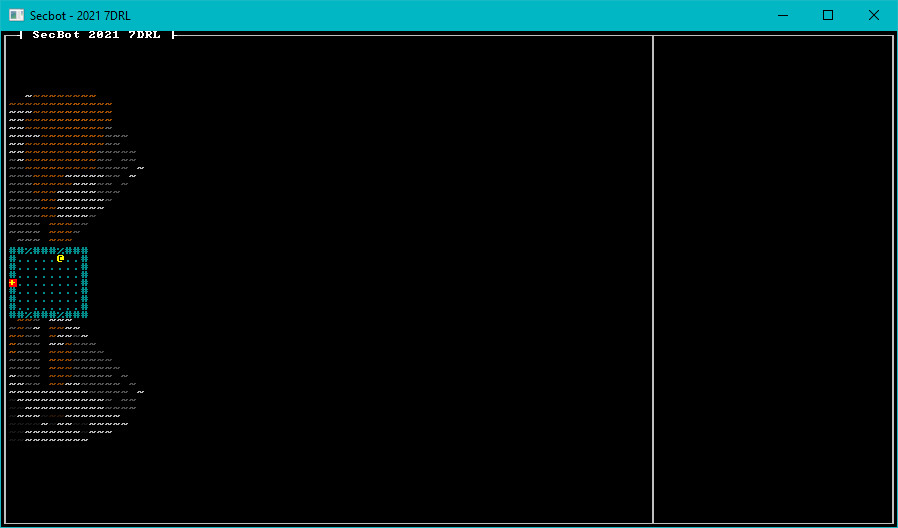

{{#include header.md}}

# Walls, Windows and Field-of-View

Now that we have a nice landscape, intended to be viewed out of the window - lets add some walls, a window, and the ability to look through the window. We've already done the hard part for this, so it's relatively plain sailing.

## Add some tile types

I went ahead and fleshed out a bunch of tile types. In `map/tile.rs`, the constructors look like this now:

~~~rust
use bracket_lib::prelude::*;

#[derive(Clone)]
pub struct Tile {
    pub glyph: FontCharType,
    pub color: ColorPair,
    pub blocked: bool,
    pub opaque: bool,
}

impl Tile {
    pub fn default() -> Self {
        Self {
            glyph: to_cp437('.'),
            color: ColorPair::new(GREY, BLACK),
            blocked: false,
            opaque: false,
        }
    }

    pub fn empty() -> Self {
        Self {
            glyph: to_cp437('#'),
            color: ColorPair::new(DARK_GRAY, BLACK),
            blocked: true,
            opaque: false,
        }
    }

    pub fn floor() -> Self {
        Self {
            glyph: to_cp437('.'),
            color: ColorPair::new(DARK_GRAY, BLACK),
            blocked: false,
            opaque: false,
        }
    }

    pub fn wall() -> Self {
        Self {
            glyph: to_cp437('#'),
            color: ColorPair::new(DARK_GRAY, BLACK),
            blocked: true,
            opaque: true,
        }
    }

    pub fn capsule_floor() -> Self {
        Self {
            glyph: to_cp437('.'),
            color: ColorPair::new(DARK_CYAN, BLACK),
            blocked: false,
            opaque: false,
        }
    }

    pub fn capsule_wall() -> Self {
        Self {
            glyph: to_cp437('#'),
            color: ColorPair::new(DARK_CYAN, BLACK),
            blocked: true,
            opaque: true,
        }
    }

    pub fn capsule_window() -> Self {
        Self {
            glyph: to_cp437('%'),
            color: ColorPair::new(DARK_CYAN, BLACK),
            blocked: true,
            opaque: false,
        }
    }

    pub fn game_over() -> Self {
        Self {
            glyph: to_cp437('+'),
            color: ColorPair::new(YELLOW, RED),
            blocked: false,
            opaque: false,
        }
    }

    pub fn alien_landscape(height: f32) -> Self {
        let fg = if height < 0.0 {
            if height < -0.25 {
                (40, 20, 0)
            } else {
                GRAY
            }
        } else {
            (
                (height * 128.0) as u8 + 128,
                ((height * 128.0) as u8 + 128) / 2,
                0,
            )
        };

        Self {
            glyph: to_cp437('~'),
            color: ColorPair::new(fg, BLACK),
            blocked: height <= -0.255,
            opaque: false,
        }
    }
}
~~~

# Flesh out the Docking Capsule

Open `map/layerbuilder/entrance.rs`. Replace the `add_docking_capsule` function as follows:

~~~rust
fn add_docking_capsule(map: &mut Layer, ecs: &mut World) {
    const MIDDLE: usize = HEIGHT / 2;
    const TOP: usize = MIDDLE - 3;
    const BOTTOM: usize = MIDDLE + 3;
    const LEFT: usize = 1;
    const RIGHT: usize = 8;

    // Floor
    for y in TOP..=BOTTOM {
        for x in LEFT..=RIGHT {
            let idx = map.point2d_to_index(Point::new(x, y));
            map.tiles[idx] = Tile::capsule_floor();
        }
    }

    // Encasing Walls
    for x in LEFT - 1..=RIGHT + 1 {
        let idx = map.point2d_to_index(Point::new(x, TOP - 1));
        map.tiles[idx] = Tile::capsule_wall();
        let idx = map.point2d_to_index(Point::new(x, BOTTOM + 1));
        map.tiles[idx] = Tile::capsule_wall();
    }
    for y in TOP - 1..=BOTTOM + 1 {
        let idx = map.point2d_to_index(Point::new(LEFT - 1, y));
        map.tiles[idx] = Tile::capsule_wall();
        let idx = map.point2d_to_index(Point::new(RIGHT + 1, y));
        map.tiles[idx] = Tile::capsule_wall();
    }

    // Add some windows
    let x_middle = (LEFT + RIGHT) / 2;
    let idx = map.point2d_to_index(Point::new(x_middle - 2, TOP - 1));
    map.tiles[idx] = Tile::capsule_window();
    let idx = map.point2d_to_index(Point::new(x_middle - 2, BOTTOM + 1));
    map.tiles[idx] = Tile::capsule_window();
    let idx = map.point2d_to_index(Point::new(x_middle + 2, TOP - 1));
    map.tiles[idx] = Tile::capsule_window();
    let idx = map.point2d_to_index(Point::new(x_middle + 2, BOTTOM + 1));
    map.tiles[idx] = Tile::capsule_window();

    // Spawn the game exit
    add_game_exit(map, ecs, Point::new(LEFT - 1, MIDDLE));

    map.starting_point = Point::new(LEFT + 1, MIDDLE);
}
~~~

There's a lot in this function, so I commented the sections. It draws the floor as it did previously, and then encases that region with walls. I added some windows (the window tile being blocked but not opaque - so you can't walk through it, but it doesn't block vision), and then call the existing game exit, door and starting point code.

## Adding a Field-of-View

I didn't feel like reinventing any wheels, so I used `bracket-lib`'s built-in field of view system. That's part of why I implemented the `BaseMap` and `Algorithm2D` traits when defining the map: so I wouldn't have to write a full recursive shadow-casting function from scratch. This is pretty much the same as the way *Hands-on Rust* implements FoV.

### Map Memory

Open `map/layer.rs`. The definition of `Layer` is extended to include a list of visible and revealed tiles. (A "visible" tile is currently in view. A "revealed" tile is one we've seen at some point, so the player knows what's there):

~~~rust
pub struct Layer {
    pub tiles: Vec<Tile>,
    pub revealed: Vec<bool>,
    pub visible: Vec<bool>,
    pub starting_point: Point,
}
~~~

The `new` function needs to be expanded to set these vectors to be `false`, with an entry for each map tile:

~~~rust
pub fn new(depth: usize, ecs: &mut World) -> Self {
    let layer = match depth {
        0 => build_entrance(ecs),
        _ => Self {
            tiles: vec![Tile::default(); TILES],
            starting_point: Point::new(WIDTH / 2, HEIGHT / 2),
            visible: vec![false; TILES],
            revealed: vec![false; TILES],
        },
    };
    layer
}
~~~

Add a new implemented function to clear the visible set (we'll do this each time we calculate field-of-view, so tiles don't remain visible from our previous position):

~~~rust
impl Layer {
    ...

    pub fn clear_visible(&mut self) {
        self.visible.iter_mut().for_each(|b| *b = false);
    }
~~~

### Add a FoV Component

Create a new file, `src/components/fov.rs` and add the following to it:

~~~rust
use std::collections::HashSet;

use bracket_lib::prelude::Point;

pub struct FieldOfView {
    pub radius: i32,
    pub visible_tiles: HashSet<Point>
}
~~~

Now add `mod fov; pub use fov::*;` to `src/components/mod.rs` to make the component available.

### Adding FoV to the Player Entity

In `main.rs`, find the part where you `push` the player entity. Add a new `FieldOfView` component, making the player construction look like this:

~~~rust
// Spawn the player
self.ecs.push((
    Player {},
    Position::with_pt(self.map.get_current().starting_point, 0),
    Glyph {
        glyph: to_cp437('@'),
        color: ColorPair::new(YELLOW, BLACK),
    },
    Description("Everybody's favorite Bracket Corp SecBot".to_string()),
    FieldOfView{radius: 20, visible_tiles: HashSet::new()},
));
~~~

We're giving the player a very large view range. That will be useful later on, I promise. At the top of the file, add a line to include the `HashSet` type:

~~~rust
use std::collections::HashSet;
~~~

### Updating the Player Game Logic

Open `game/player.rs`. After the call to `tile_triggers` (and before returning `new_state`) add:

~~~rust
update_fov(&new_state, ecs, map);
~~~

Now add an `update_fov` function to the module:

~~~rust
fn update_fov(new_state: &NewState, ecs: &mut World, map: &mut Map) {
    if *new_state != NewState::Wait {
        return;
    }

    let mut query = <(&Player, &Position, &mut FieldOfView)>::query();
    query.for_each_mut(ecs, |(_, pos, fov)| {
        fov.visible_tiles = field_of_view_set(pos.pt, fov.radius, map.get_current());
        let current_layer = map.get_current_mut();
        current_layer.clear_visible();
        fov.visible_tiles.iter().for_each(|pt| {
            let idx = current_layer.point2d_to_index(*pt);
            current_layer.revealed[idx] = true;
            current_layer.visible[idx] = true;
        });
    });

}
~~~

Once again, if we aren't waiting - we bail out. Then we query entities with a `Player`, `Position` and `FieldOfView` component (which should be one entity). We call `field_of_view_set` to build the visibility list, and store it in the `FieldOfView` component's `visible_tiles` list. We clear the existing visible list. Then we iterate the set, making every tile we can see both visible and revealed.

### Render the FoV

Still in `map/layer.rs`, we amend the `render` function to not display tiles we have never seen - and grey out tiles we remember but can't currently see:

~~~rust
pub fn render(&self, ctx: &mut BTerm) {
    let mut y = 0;
    let mut idx = 0;
    while y < HEIGHT {
        for x in 0..WIDTH {
            if self.visible[idx] {
                let t = &self.tiles[idx];
                ctx.set(x + 1, y + 1, t.color.fg, t.color.bg, t.glyph);
            } else if self.revealed[idx] {
                let t = &self.tiles[idx];
                ctx.set(x + 1, y + 1, t.color.fg.to_greyscale(), t.color.bg, t.glyph);
            }
            idx += 1;
        }
        y += 1;
    }
}
~~~

## Give it a Spin

If you run the program now, you can peek out of the windows.

> You can find the source code for `hello_asteroid` [here](https://github.com/thebracket/secbot-2021-7drl/tree/tutorial/tutorial/hello_windows/).

## Up Next

Next, we're going to add some basic buildings to the mining colony.
